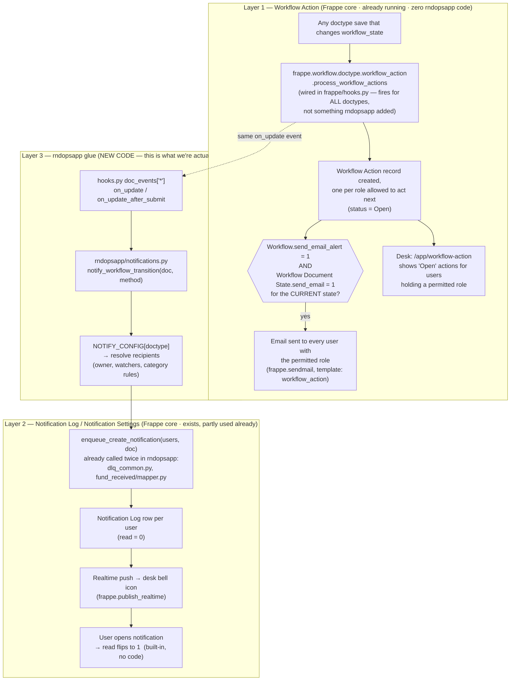
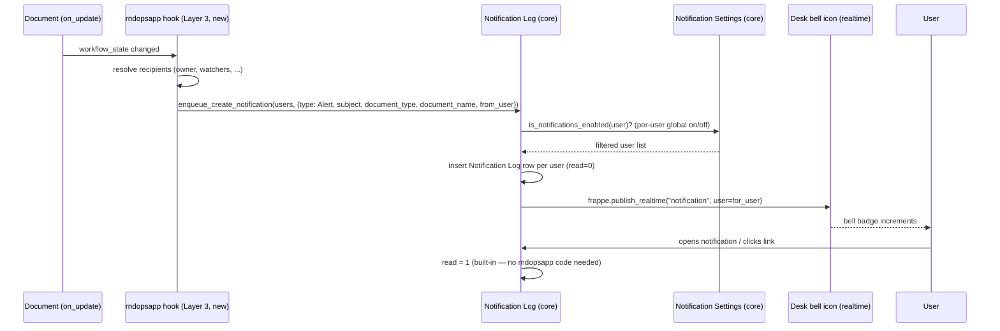
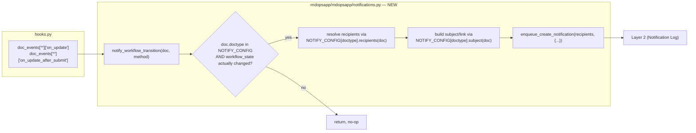

# Notification System — Implementation Plan

Status: **Draft for review — not implemented**
Scope: All doctypes in the `rndopsapp` module (145 doctypes across 3 doctype
folders), with read/unread tracking, a notification inbox, and automatic
alerts on workflow state changes.

---

## 1. The full picture — three layers, not one

The most important finding in this research: there is not one notification
system to build, there are **three layers**, two of which already exist in
Frappe core and are *already running* on every rndopsapp workflow doctype
today, without a single line of rndopsapp code. The only layer that needs
new code is the third one.



**Why this matters for the plan:** Layer 1 already tells approvers "you have
something to act on" — as an email and a to-do-style list — for every one of
the 24 workflow doctypes, right now, purely through Workflow configuration
(no code). Layer 2 gives read/unread storage and the bell icon, and this app
already has the calling pattern for it. **Layer 3 is the only genuinely new
work**: deciding who else (beyond "the next approver") gets notified — most
importantly, the person who *submitted* the document, so they learn their
request was approved/rejected instead of having to keep checking.

---

## 2. Layer 1 in detail — Workflow Action (already running)

`frappe.workflow.doctype.workflow_action.workflow_action.process_workflow_actions`
is registered in **`frappe/hooks.py`** (core, lines ~153–170) against
`on_update`, `on_update_after_submit`, `on_cancel`, `on_trash` — for every
doctype in every app. Confirmed no rndopsapp code touches this; it is pure
Frappe framework behavior already firing on all 24 `workflow_state`
doctypes.

What it does on every workflow transition (`workflow_action.py`):

1. `get_next_possible_transitions()` — reads `Workflow Transition` rows
   whose `state` matches the doc's *new* `workflow_state`, skips any whose
   `next_state` is flagged `is_optional_state`, evaluates each transition's
   Python `condition` against the doc.
2. `create_workflow_actions_for_roles()` — creates one `Workflow Action`
   document (status `Open`) with a child row per `allowed` role from those
   transitions.
3. If `Workflow.send_email_alert` is checked **and** the *current*
   `Workflow Document State.send_email` is checked → enqueues
   `send_workflow_action_email`, which emails every user holding a
   permitted role (via `get_users_with_role`), each with a signed one-click
   action link (`apply_action` → `confirm_action`), using the
   `workflow_action` email template (or the state's
   `next_action_email_template` if set).
4. When someone acts, `update_completed_workflow_actions()` flips the
   matching `Workflow Action` to `status = Completed`.

Where a user sees this today: **`/app/workflow-action`** list (filtered to
their roles, `status = Open` — see `get_permission_query_conditions` in
`workflow_action.py`). There is no bell/read-unread integration for this
layer — it's a to-do list, not an inbox.

**Owner is not automatically included.** `send_email_to_creator` exists on
`Workflow Transition`, but only prevents *removing* the owner from the
recipient list if the owner happens to already hold the `allowed` role for
that transition — it does not add the owner as a recipient on its own. So
the person who *submitted* the document is never notified by this layer
when it moves — that gap is exactly what Layer 3 needs to fill.

### Layer 1 field reference

**`Workflow`** (parent, one per doctype with a workflow)
| Field | Type | Notes |
|---|---|---|
| `workflow_name` | Data | |
| `document_type` | Link → DocType | |
| `workflow_state_field` | Data | usually `workflow_state` |
| `send_email_alert` | Check | **master switch** for Layer 1 email — currently unknown/unset per-workflow in rndopsapp, worth auditing |
| `override_status` | Check | |
| `states` | Table → `Workflow Document State` | |
| `transitions` | Table → `Workflow Transition` | |

**`Workflow Document State`** (child, one row per state)
| Field | Type | Notes |
|---|---|---|
| `state` | Link → Workflow State | |
| `doc_status` | Select (0/1/2) | Draft/Submitted/Cancelled |
| `allow_edit` | Link → Role | who can edit doc while in this state |
| `send_email` | Check | **per-state** switch — email only fires when leaving states that have this checked |
| `next_action_email_template` | Link → Email Template | overrides the default "Workflow Action" email body |
| `is_optional_state` | Check | if next_state is optional, no Workflow Action/email is created for it |

**`Workflow Transition`** (child, one row per action)
| Field | Type | Notes |
|---|---|---|
| `state` | Link → Workflow State | from-state |
| `action` | Link → Workflow Action Master | e.g. Approve/Reject/Forward |
| `next_state` | Link → Workflow State | to-state |
| `allowed` | Link → Role | **who can perform this action — the recipient set for Layer 1** |
| `allow_self_approval` | Check | |
| `send_email_to_creator` | Check | only matters if owner also holds `allowed` role (see above) |
| `condition` | Code (Python) | e.g. `doc.grand_total > 0` |

**`Workflow Action`** (created automatically, one per pending approval step)
| Field | Type | Notes |
|---|---|---|
| `reference_doctype` / `reference_name` | Link / Dynamic Link | the document awaiting action |
| `workflow_state` | Data | state it's pending at |
| `status` | Select: Open / Completed | |
| `user` | Link → User | legacy, back-compat only |
| `completed_by` / `completed_by_role` | Link | filled in when actioned |
| `permitted_roles` | Table MultiSelect → `Workflow Action Permitted Role` | the role(s) that can close this |

**Actionable near-term step (no code):** audit the 24 workflow_state
doctypes' `Workflow` records — check `send_email_alert`, and per-state
`send_email` — and turn them on where approver emails are wanted. This
alone gets approvers notified today.

---

## 3. Layer 2 in detail — Notification Log / Notification Settings

Already Frappe core, Frappe 15.74.2. Already called from
`rndopsapp/kafka/consumer/dlq_common.py:137` and
`rndopsapp/kafka/consumer/fund_received/mapper.py:241` via
`enqueue_create_notification(users, doc)`.



### Layer 2 field reference

**`Notification Log`**
| Field | Type | Notes |
|---|---|---|
| `subject` | Text | shown in the bell dropdown |
| `for_user` | Link → User, hidden | recipient — this is the read/unread scope |
| `type` | Select: *(blank)* / Mention / Energy Point / Assignment / Share / **Alert** | rndopsapp's existing calls use `Alert` — note there is **no "Workflow" or "Comment" option** in core; `Alert` is the closest fit and is what to keep using |
| `email_content` | Text Editor | body for the notification email (if sent) |
| `document_type` / `document_name` | Link / Data | powers "Open Reference Document" |
| `from_user` | Link → User, hidden | who triggered it |
| `read` | Check, hidden, default 0 | **the read/unread flag** — flips via `frappe.db.set_value` when the user opens it, entirely built-in |
| `link` | Small Text, hidden | overrides the default document link if set |

**`Notification Settings`** (one per user, `autoname: Prompt` = named by user id)
| Field | Type | Notes |
|---|---|---|
| `enabled` | Check, default 1 | global on/off — `is_notifications_enabled()` gates ALL in-app notification creation, including Alert |
| `subscribed_documents` | Table MultiSelect | documents the user has open (for "seen" tracking) |
| `enable_email_notifications` | Check, default 1 | master email switch |
| `enable_email_mention` / `_assignment` / `_energy_point` / `_share` | Check | **per-type email toggles — note: there is no `enable_email_alert`.** |
| `enable_email_event_reminders`, `enable_email_threads_on_assigned_document` | Check | unrelated to this project |
| `seen` | Check, hidden | |

**Critical gotcha confirmed in `notification_log.py`/`notification_settings.py`:**
```python
def is_email_notifications_enabled_for_type(user, notification_type):
    if not is_email_notifications_enabled(user):
        return False
    if notification_type == "Alert":
        return False   # <-- hard-coded: Alert-type notifications NEVER email
    ...
```
So the existing `enqueue_create_notification(..., {"type": "Alert", ...})`
pattern already used in this app is **in-app / bell-icon only — it will
never send an email**, by Frappe core design, regardless of any
`Notification Settings` toggle. If email delivery is wanted for the
owner-facing "your request was approved" case, that must be sent
separately (e.g. `frappe.sendmail(...)` alongside the
`enqueue_create_notification` call) — it will not come from this API.

Also note in `make_notification_logs`:
```python
if notification.for_user != notification.from_user or doc.type in ("Energy Point", "Alert"):
    notification.insert(...)
```
`Alert` type is explicitly allowed to self-notify (`for_user == from_user`)
— relevant since some rndopsapp actions are performed by a system/service
user (`ACCOUNT_PORTAL_USER`) rather than the doc owner, so this isn't a
concern here, but matters if a user ever triggers their own transition.

---

## 4. Layer 3 in detail — the new code (this is what we build)



### 4.1 `NOTIFY_CONFIG` schema (proposed)

```python
# rndopsapp/rndopsapp/notifications.py

NOTIFY_CONFIG = {
    "Miscellaneous Commit": {
        # states that trigger a notification; "*" = any workflow_state change
        "transitions": {"Approved", "Rejected"},
        # callable(doc) -> list[str] of user emails
        "recipients": lambda doc: [doc.owner],
        # callable(doc) -> str
        "subject": lambda doc: f"{doc.doctype} {doc.name} moved to {doc.workflow_state}",
    },
    # ... one entry per doctype, or generated from activity_logger.TRACKED_DOCTYPES
    # for doctypes where the rule is "notify the owner on every transition"
}
```

Fields inside each config entry:

| Key | Type | Purpose |
|---|---|---|
| `transitions` | `set[str]` or `"*"` | which `workflow_state` values trigger a notification; `"*"` = every change |
| `recipients` | `callable(doc) -> list[str]` | resolves the notified user(s); see §4.2 for the resolver library |
| `subject` | `callable(doc) -> str` | notification subject line |
| `link` *(optional)* | `callable(doc) -> str` | overrides the default `/app/{doctype}/{name}` link |

### 4.2 Recipient resolver helpers (proposed, to live alongside `NOTIFY_CONFIG`)

| Function | Behavior |
|---|---|
| `get_doc_owner(doc)` | `[doc.owner]` — simplest case |
| `get_users_with_role(role)` | reuse `frappe.utils.user.get_users_with_role` — same helper Layer 1 uses internally, so results stay consistent with who Workflow Action already notifies |
| `get_next_state_roles(doc)` | mirrors `workflow_action.get_next_possible_transitions` — only needed if we want to *duplicate* Layer 1's recipient set into the bell icon too, instead of just linking to `/app/workflow-action` |
| `get_watchers(doc)` *(if added)* | reads a new watcher field/child table — only needed if Decision §5.1 calls for explicit watchers |

### 4.3 What actually needs to be net-new vs. reused

| Need | Reuse from Layer 1/2? | New code needed |
|---|---|---|
| "Approver X, you have something to review" | **Yes** — Layer 1, just needs `send_email_alert`/`send_email` configured | None |
| "Requester Y, your document was approved/rejected" | No — Layer 1 doesn't cover this | Layer 3 hook + `enqueue_create_notification` |
| Read/unread storage, bell icon | Yes — Layer 2, already built | None |
| Notification inbox UI | Yes — stock desk bell + `/app/notification-log` | None, unless a custom portal page is wanted |
| Email on requester-facing alerts | No — `Alert` type never emails (confirmed above) | `frappe.sendmail()` call alongside `enqueue_create_notification`, if wanted |

---

## 5. Open decisions (need your input before implementation)

1. **Recipients per doctype for Layer 3.** Given Layer 1 already covers
   "who needs to act next," Layer 3's main job is almost certainly "notify
   the submitter." Confirm: is submitter-only sufficient, or do specific
   doctypes need extra watchers (e.g. a finance team distribution beyond
   the workflow's `allowed` roles)?
2. **Audience: desk users only, or Account Portal (external) users too?**
   Both Layer 1 and Layer 2 are desk-only. If Account Portal users need
   notifications, Phase 5 (below) is required regardless of the above
   decisions.
3. **Scope: all 145 doctypes, or the 24 workflow doctypes first?**
   Recommend the 24 first (see §6 phasing) — Layer 3 has no signal to act
   on for the other ~121 without `workflow_state`.
4. **Should Layer 3 also send email**, given `Alert` type structurally
   can't? If yes, decide the trigger discipline (e.g. only on terminal
   states like Approved/Rejected, not every intermediate hop) to avoid
   inbox fatigue.
5. **Layer 1 email audit**: who owns turning on `send_email_alert` /
   per-state `send_email` on the 24 `Workflow` records? This is config,
   not code, and could ship independently of everything else here.

---

## 6. Phased implementation

### Phase 0 — Layer 1 audit (no code, can start today)
- For each of the 24 workflow doctypes, open its `Workflow` record and
  check `send_email_alert`; check `send_email` on the states that should
  notify approvers.
- Verify `/app/workflow-action` correctly surfaces pending approvals per
  role for a couple of test users.
- Zero rndopsapp code changes.

### Phase 1 — Layer 3 infrastructure (no behavior change yet)
- Create `rndopsapp/rndopsapp/notifications.py` with `NOTIFY_CONFIG`,
  `notify_workflow_transition`, and the resolver helpers from §4.2.
- Wire into `hooks.py` `doc_events["*"]["on_update"]` **and**
  `doc_events["*"]["on_update_after_submit"]` (the second is required —
  see the `e32f86c` cherry-pick already on `pragati-bk_v0.01`, which fixed
  the exact same "submitted docs don't fire on_update" gap for cancellation
  approvals and action comments; this hook point should mirror that fix).
- Patch to backfill `Notification Settings` for all users (logic already
  exists in `fix_users.py`).
- `NOTIFY_CONFIG` empty/inert at first — deploy, verify no `on_update`
  regression.

### Phase 2 — Pilot (2–3 doctypes)
- Enable `NOTIFY_CONFIG` for `Miscellaneous Commit` and `Direct Purchase`.
- Validate: owner gets exactly one notification per real transition (not
  per save), `read` flips correctly, bell realtime push works, and that
  this doesn't visually duplicate what Layer 1's `/app/workflow-action`
  already shows to approvers.

### Phase 3 — Roll out to remaining workflow doctypes
- Extend `NOTIFY_CONFIG` to the rest of the 24, grouped by the existing
  `activity_logger.TRACKED_DOCTYPES` categories (Purchase, Financial,
  Project, HR-Staff, Deposits, Travel, IPR, Other) so most doctypes share
  one rule instead of 24 bespoke ones.

### Phase 4 — Non-workflow doctypes (optional)
- Case-by-case only; most of the remaining ~121 doctypes (DLQ logs, child
  tables, etc.) have no natural "state changed" signal to notify on.

### Phase 5 — Portal-facing notifications (only if Decision §5.2 requires it)
- Whitelisted API (`get_unread_notifications`, `mark_notification_read`)
  for the external Java Account Portal to poll, backed by the same
  `Notification Log` rows filtered by `for_user` — or push into the portal
  via its own REST pattern (see `DOCTYPE_TO_COMMENT_CATEGORIES` in
  `api.py:206-290` for the existing integration style).

### Phase 6 — UI polish (only if the stock desk bell isn't enough)
- Custom notifications page grouped by doctype/category.
- Optional unread-count badge outside the standard desk shell.

---

## 7. Files to touch

| File | Change |
|---|---|
| `rndopsapp/rndopsapp/notifications.py` | **New.** Layer 3 core logic (§4). |
| `rndopsapp/hooks.py` | Add `notify_workflow_transition` to `on_update` and `on_update_after_submit`. |
| `rndopsapp/rndopsapp/activity_logger.py` | Reference point for `TRACKED_DOCTYPES` categorization (Phase 3) — no change required, just reused. |
| `rndopsapp/rndopsapp/patches/...` | New patch: backfill `Notification Settings`. |
| `rndopsapp/rndopsapp/api.py` | Only touched if Phase 5 portal API is needed. |
| *(Workflow records, via desk, not source-controlled here)* | Phase 0 email-alert audit — config only. |

---

## 8. Testing plan

- **Layer 1 (config, not code):** submit a doc through a transition as a
  test approver-role user; confirm a `Workflow Action` row appears with
  `status = Open` and the right `permitted_roles`; confirm email fires only
  if `send_email_alert` + state `send_email` are both on.
- **Layer 3 (new code):** submit/transition `Miscellaneous Commit`; assert
  exactly one `Notification Log` row is created for the owner with
  `read=0`; assert `read=1` after simulating the frontend's open action;
  assert no notification fires on a save that doesn't change
  `workflow_state`.
- **Load:** `on_update`/`on_update_after_submit` fire on every save —
  recipient resolution must avoid N+1 queries (cache role→user lookups per
  request, same pattern Layer 1's `user_has_permission` already uses via
  `@frappe.request_cache`).

---

## 9. Next step

Phase 0 (Layer 1 audit) can start immediately — it's pure configuration.
Phase 1 (Layer 3 infra) is also decision-agnostic and can start in
parallel. Answering §5's 5 decisions unblocks Phase 2 onward.
