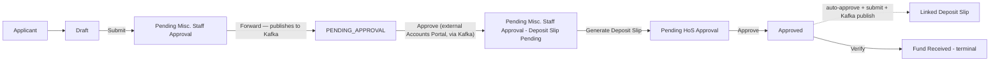
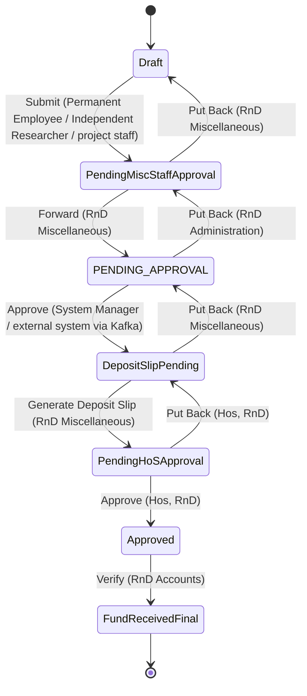

# Fund Received User Manual

> This manual documents the **Fund Received** DocType as it is actually configured in this Frappe/ERPNext installation (module `Rndopsapp`). It is based directly on the DocType schema, the controller (`fund_received.py`, 1737 lines), the live Workflow configuration, the site's Role/Custom DocPerm records, and the Kafka producer **and consumer** integration that connects this DocType to an external "Accounts Portal" system. Wherever the system's actual behavior is incomplete, inconsistent, or not enforced, this is called out explicitly with an **Important** or **Note** block instead of being assumed away.

---

## Table of Contents

1. [Overview](#1-overview)
2. [Business Process](#2-business-process)
3. [Workflow States](#3-workflow-states)
4. [Workflow Diagram](#4-workflow-diagram)
5. [Roles and Responsibilities](#5-roles-and-responsibilities)
6. [Permission Matrix](#6-permission-matrix)
7. [Navigation](#7-navigation)
8. [Getting Started](#8-getting-started)
9. [Creating a New Record](#9-creating-a-new-record)
10. [Screen-by-Screen Guide](#10-screen-by-screen-guide)
11. [Field Reference](#11-field-reference)
12. [Buttons and Actions](#12-buttons-and-actions)
13. [Approval Process](#13-approval-process)
14. [Notifications](#14-notifications)
15. [Attachments](#15-attachments)
16. [Reports](#16-reports)
17. [Audit Trail](#17-audit-trail)
18. [Business Rules](#18-business-rules)
19. [Frequently Asked Questions](#19-frequently-asked-questions)
20. [Common Errors](#20-common-errors)
21. [Best Practices](#21-best-practices)
22. [User Checklist](#22-user-checklist)
23. [Administrator Guide](#23-administrator-guide)
24. [Security](#24-security)
25. [Glossary](#25-glossary)
26. [Appendix](#26-appendix)

---

## 1. Overview

**Fund Received** records that money sanctioned for a project (tracked in **Fund Sanction**) has actually arrived in the institute's bank account. It captures the amount, the receiving bank account, transaction references, and a budget-head breakup of the received amount — and, once verified, it **automatically generates a Deposit Slip** so the funds can be formally credited into the project's account.

- **What it is:** A submittable request document (`Fund Received` DocType) that a project applicant files to declare a fund receipt, which then goes through staff/HoS verification and — uniquely among the modules documented so far — synchronizes bidirectionally with an external Accounts Portal system over Kafka.
- **Why it exists:** A Fund Sanction only records that money was *approved*; Fund Received records that it was *actually credited*, ties it to real bank transaction numbers, and triggers the internal Deposit Slip paperwork needed to post it against the project's budget heads.
- **Business purpose:** Reconcile external bank/accounts-system data with the project's internal budget records, and hand off to the Deposit Slip process automatically once verified.
- **Who should use it:** Permanent Employees, Independent Researchers, and Project Staff filing on behalf of a project; RnD Miscellaneous staff and Head of Section (HoS) as verifiers/approvers; RnD Accounts for final sign-off.
- **When it should be used:** After a Fund Sanction exists and the sanctioned money has actually landed in a bank account.
- **Typical use case:** A PI's project receives a bank credit against a sanctioned grant; someone files a Fund Received with the transaction number and amount, RnD Miscellaneous staff forward it, the external Accounts Portal approves it, a Deposit Slip is auto-generated, HoS approves it, and the linked Deposit Slip is auto-submitted and published to Kafka.

> **Important — this is a two-way integration, unlike every other module documented so far**
>
> Reimbursement, Temporary Advance, and (as covered separately) Fund Sanction only ever **send** data out to Kafka. Fund Received is different: a real, actively-running Kafka **consumer** (topic `accounts-fundreceived-update`) lets the external Accounts Portal push updates — including workflow-state advances — directly into live Fund Received documents, bypassing normal Frappe validation and permission hooks (`frappe.db.set_value`/raw child-table SQL). See [§13](#13-approval-process) and [§23](#23-administrator-guide).

---

## 2. Business Process

### 2.1 Written explanation

A Fund Received starts as a **Draft**, filed by a Permanent Employee, Independent Researcher, or Project Staff member against a Project Registration. On **Submit**, it goes to **Pending Misc. Staff Approval**, where a user with the **RnD Miscellaneous** role reviews it and **Forward**s it to **PENDING_APPROVAL**.

`PENDING_APPROVAL` is where the record hands off to the external Accounts Portal system: the **Forward** action is exactly when this app publishes a `FUND_RECEIVED` event to Kafka (topic `fund-received-events`). The external system reviews the bank data and, when it approves, publishes back to `accounts-fundreceived-update`; this app's Kafka consumer then advances the document straight to **Pending Misc. Staff Approval(Deposit Slip Pending)**.

RnD Miscellaneous staff then click **Generate Deposit Slip**, supplying the deposit-slip details; this creates a linked record in one of six possible Deposit Slip doctypes (see [§13](#13-approval-process)) and moves the Fund Received to **Pending HoS Approval**. When the **Hos, RnD** role **Approve**s it:

1. The document moves to **Approved**.
2. The system finds the linked Deposit Slip and **auto-sets it to "Approved," auto-submits it, and publishes it to Kafka** — all as a side effect of the Fund Received approval, with no separate action needed on the Deposit Slip itself.

A final **Verify** action (role **RnD Accounts**) moves the document to the terminal **Fund Received** state.

> **Important**
>
> The **Generate Deposit Slip** step only actually creates a linked Deposit Slip if the data passed to it looks meaningful (an internal heuristic check for non-empty key fields). If it doesn't, the code prints a warning and lets the workflow **advance anyway** — a Fund Received can reach "Pending HoS Approval," and even "Approved," with **no linked Deposit Slip at all**. In that case, the auto-approve-and-publish step at "Approved" silently does nothing (it just logs that no linked slip was found). **Always confirm a Deposit Slip was actually generated before relying on downstream automation.**

### 2.2 Numbered process

1. Applicant creates a Fund Received against a Project Registration, with amount, bank account, and transaction details.
2. Submits → **Pending Misc. Staff Approval**.
3. RnD Miscellaneous staff Forward → **PENDING_APPROVAL** (this is also when the Kafka `FUND_RECEIVED` event is published to the Accounts Portal).
4. External Accounts Portal approves via Kafka → document auto-advances to **Pending Misc. Staff Approval(Deposit Slip Pending)**.
5. RnD Miscellaneous staff click Generate Deposit Slip (supplying deposit-slip data) → a Deposit Slip is created and the document moves to **Pending HoS Approval**.
6. HoS Approves → document moves to **Approved**; the linked Deposit Slip is auto-approved, auto-submitted, and published to Kafka.
7. RnD Accounts Verifies → document reaches the terminal **Fund Received** state.

### 2.3 Mermaid flowchart

---

## 3. Workflow States

Active workflow: **`fund_received_with_kafka`**. (A second record, `Fund_Received_Workflow`, exists but is inactive — ignore it.)

| State | `doc_status` | `allow_edit` Role | Notes |
|---|---|---|---|
| Draft | 0 | Permanent Employee / Independent Researcher / project staff | Three rows, one per role, same state |
| Pending Misc. Staff Approval | 0 | RnD Miscellaneous | |
| PENDING_APPROVAL | 0 | System Manager | Nominally System-Manager-edited, but in practice advanced by the **external Accounts Portal via Kafka**, not a human — see [§13](#13-approval-process) |
| Pending Misc. Staff Approval(Deposit Slip Pending) | 0 | RnD Miscellaneous | Reached automatically once the external system approves |
| Pending HoS Approval | 0 | Hos, RnD (Head of Section, RnD) | |
| Approved | **1 (Submitted)** | RnD Accounts | Triggers the Deposit Slip auto-approve/submit/publish side effect |
| Fund Received | **1 (Submitted)** | System Manager | Terminal |

> **Note**
>
> The state literally named **`PENDING_APPROVAL`** (all-caps, underscore-separated) breaks from every other state's "Pending X Approval" naming convention in this app — this is intentional and matches the external Accounts Portal's own status vocabulary (see the Kafka payload's `fundReceivedStatus` field in [§23](#23-administrator-guide)), not a typo.

---

## 4. Workflow Diagram

> **Note**
>
> `DepositSlipPending` above is the state named **"Pending Misc. Staff Approval(Deposit Slip Pending)"**; `FundReceivedFinal` is the state literally named **"Fund Received"** (same name as the DocType itself — be careful not to confuse the terminal *state* with the *document type* when reading logs or the workflow_state field).

---

## 5. Roles and Responsibilities

| Role | Responsibility | Grants Base DocType Access? |
|---|---|---|
| Permanent Employee | Files Draft; submits. | Yes (Custom DocPerm) |
| Independent Researcher | Files Draft; submits. | **No** — see the Important note below |
| project staff | Files Draft; submits. | **No** — see the Important note below |
| RnD Miscellaneous | Forwards to Accounts Portal; generates the Deposit Slip; can Put Back at two points. | Yes (Custom DocPerm) |
| RnD Administration | Named as the `allowed` role for `PENDING_APPROVAL → Put Back`. | **No** — see the Important note below |
| Hos, RnD (Head of Section, RnD) | Final internal approval; triggers the Deposit Slip auto-approve/publish side effect. | Yes (Custom DocPerm) |
| RnD Accounts | Final Verify step to the terminal state. | Yes (Custom DocPerm) |
| System Manager | Administrative; nominal editor of `PENDING_APPROVAL`. | Yes |
| All_ProRnd_User | Generic broad-access role (base DocPerm only, no Custom DocPerm override). | Yes |

> **Important — recurring permission gap, same pattern as Temporary Advance and Fund Sanction**
>
> `Independent Researcher`, `project staff`, and `RnD Administration` are all named as workflow `allowed`/`allow_edit` roles but have **no `DocPerm` or `Custom DocPerm` row** for Fund Received. A user holding only one of these roles cannot open/list a Fund Received document through the standard Frappe permission system unless they also hold `All_ProRnd_User` or `System Manager`. Since `All_ProRnd_User` appears to be broadly assigned in this app, this gap may be masked in practice — but verify it before relying on role-only access.

---

## 6. Permission Matrix

| Role | Read | Write | Create | Submit | Cancel | Amend | Delete | Print | Email | Report | Export | Share |
|---|---|---|---|---|---|---|---|---|---|---|---|---|
| System Manager | ✔ | ✔ | ✔ | ✔ | ✘ | ✘ | ✔ | ✔ | ✔ | ✔ | ✔ | ✔ |
| All_ProRnd_User | ✔ | ✔ | ✔ | ✔ | ✔ | ✔ | ✔ | ✔ | ✔ | ✔ | ✔ | ✔ |
| Hos, RnD (Head of Section, RnD) | ✔ | ✔ | ✔ | ✔ | ✔ | ✔ | ✔ | ✔ | ✘ | ✘ | ✔ | ✔ |
| Permanent Employee | ✔ | ✔ | ✔ | ✔ | ✔ | ✔ | ✔ | **✘** | ✘ | ✘ | ✔ | ✔ |
| RnD Miscellaneous | ✔ | ✔ | ✔ | ✔ | ✔ | ✔ | ✔ | ✔ | ✔ | ✔ | ✔ | ✔ |
| RnD Accounts | ✔ | ✔ | ✔ | ✔ | ✔ | ✔ | ✔ | ✔ | ✔ | ✔ | ✔ | ✔ |

> **Note**
>
> `Permanent Employee`'s `Custom DocPerm` row explicitly sets `print = 0`, narrowing what the base DocType JSON originally granted (`print = 1`) — an applicant filing their own Fund Received cannot print it, only staff/accounts/HoS/System-Manager roles can. `System Manager`'s Custom DocPerm row also drops `cancel`/`amend` to 0 versus the base JSON's `1`/`1`.
>
> No `permission_query_conditions` (delegation) hook and no custom `has_permission()` function exist for this doctype — access is governed purely by the table above plus the workflow's `allowed` roles.

---

## 7. Navigation

- Fund Received is a standard DocType in the **Rndopsapp** module — reachable at `/app/fund-received`.
- **Search:** Global Search / Awesomebar → "Fund Received".

> **Important**
>
> **There is no active client-side logic for this DocType at all.** The on-disk `fund_received.js` is entirely commented out, and no `Client Script` DB record exists for `Fund Received` (unlike Temporary Advance, which had an active DB-stored script). This strongly suggests the real, working UI for Fund Received is an **external frontend application** calling the whitelisted Python APIs directly — not the standard Frappe Desk form. If you're only using the Desk UI, buttons/behavior described in this manual (deposit slip prompts, dynamic workflow actions) may not appear; use whatever dedicated frontend your organization provides.

---

## 8. Getting Started

**Prerequisites**

- A role from [§6](#6-permission-matrix) with base access.
- A Project Registration and, normally, an existing **Fund Sanction** for that project (the controller looks one up automatically — see [§9](#9-creating-a-new-record)).
- Bank transaction details for the amount received.

**Master data required**

| Master Data | DocType | Purpose |
|---|---|---|
| Project Registration | `Project Registration` | The project the fund was received for; `prjreg_title` is a required Link. |
| Fund Sanction | `Fund Sanction` | Server-side code tries to auto-populate `sanctioned_letter_no`/`sanctioned_letter_date` from the matching Fund Sanction — see [§9](#9-creating-a-new-record). |
| Budget Head | `Budget Head` | Source for `received_amt_breakup.account_head` (a real Link field here, unlike Fund Sanction's equivalent free-text field). |

---

## 9. Creating a New Record

### Step 1 — Reference Details

- `prjreg_title` — **required** Link to Project Registration.
- `fund_received_ref_number` — read-only, described as coming "from Accounts Portal" — expect this to be populated by the external system/API flow, not typed by hand.
- `sanction_ref_no` — **free text**, not a Link, even though it conceptually refers to a Fund Sanction document.

> **Important**
>
> On `validate()`, the controller tries to auto-fill `sanctioned_letter_no`/`sanctioned_letter_date` by looking up a matching **Fund Sanction** for the project (first via `sanction_ref_no`, falling back to matching the project via `refnum_prj_num`/`project_proposal`) — but **`sanctioned_letter_no`/`sanctioned_letter_date` are not fields on this DocType's schema** (per the reviewed JSON). The lookup code defensively checks `hasattr`/field-existence before setting them, so this logic is effectively a no-op on the current schema; don't expect those values to appear automatically. `sanction_ref_no` itself **is** auto-filled from the matched Fund Sanction if it was blank.
>
> Because `sanction_ref_no` is free text, **type it exactly as the Fund Sanction document's name** (not the sanction letter number) if you want the Kafka publish step to succeed — see the Important note in [§13](#13-approval-process).

### Step 2 — Received Amount & Invoice

- `fund_received_amt` — **required** Currency.
- `bank_account` — **required** Data field: "Bank Account Number / Scheme - (Name / Number)."
- `gst_invoice_issued` / `invoice_no` — conditional fields.

> **Note**
>
> `gst_invoice_issued`'s visibility condition (`doc.prj_type == "Consultancy"`) references a field, `prj_type`, that **does not exist anywhere on this DocType**. With no active client script to set it either, this condition can never evaluate true through the standard Desk form — meaning `gst_invoice_issued` (and, in turn, `invoice_no`) may be effectively unreachable there. Your external frontend (per [§7](#7-navigation)) may set these fields directly via the API regardless of this condition.

### Step 3 — Transaction & Budget Breakups

- **Sanction Transaction Details** (`fund_transactions`, table → Project Fund Transaction): `transaction_number` (required), `transaction_date` (required, defaults to today), `amount` (required), `attachment`.
- **Budget Breakup of the Received Amount** (`received_amt_breakup`, table → Project Received Budget): `account_head` (required Link → Budget Head), `amount_received` (required), `remarks`.
- `document_upload` — a single supporting-document attachment for the whole record.

### Step 4 — Save and Submit

Save the Draft, then Submit to enter the workflow (routes to Pending Misc. Staff Approval).

> **Warning**
>
> An `update_fund_received()` endpoint exists for editing an *existing* record (uploads attachments to a MinIO folder named `"fundreceived"`), while the *create* path (`save_fund_received()`) uses a differently-named folder, `"fund_received"`. This is a naming inconsistency in the underlying file storage, not something you can control from the form — flagged here in case attachments for the same project ever appear "missing" from one view but not another; they may simply be filed under a different MinIO prefix.

---

## 10. Screen-by-Screen Guide

| Screen Area | What It Shows |
|---|---|
| **Reference Details** | Amended From, Project Title, Fund Received Ref No., Sanction Ref No. |
| **Received Amount & Invoice** | Fund Received Amount, Bank Account, GST Invoice fields. |
| **Transaction & Budget Breakups** | The two child tables described in [§9](#9-creating-a-new-record). |
| **Attachments** | `document_upload` plus per-transaction-row `attachment`. |
| **Status** | `workflow_state`. |
| **Print** | No custom Print Format exists for this DocType — uses Frappe's generic default layout. |

> **Note**
>
> As covered in [§7](#7-navigation), there is no active client script — whatever dynamic buttons/behavior your organization's frontend shows are not part of the Frappe Desk form itself.

---

## 11. Field Reference

| Field | Fieldname | Required | Data Type | Description | Editable By |
|---|---|---|---|---|---|
| Amended From | `amended_from` | No | Link → Fund Received (hidden, read-only) | Standard amend history. | System |
| Project Title | `prjreg_title` | **Yes** | Link → Project Registration | The project this fund receipt belongs to. | Applicant (Draft) |
| Fund Received Ref No. | `fund_received_ref_number` | No | Data (read-only) | "Receiving from Accounts Portal." | System |
| Sanction Ref No. | `sanction_ref_no` | No | Data (free text, not a Link) | Should hold the exact Fund Sanction document name — see [§9](#9-creating-a-new-record). | Applicant (Draft), or auto-filled |
| Fund Received Amount | `fund_received_amt` | **Yes** | Currency | Amount received. | Applicant (Draft) |
| Bank Account Number / Scheme | `bank_account` | **Yes** | Data | Where the money was received. | Applicant (Draft) |
| Is GST Invoice Issued? | `gst_invoice_issued` | No | Select (Yes/No) | Visibility condition references a non-existent field — see [§9](#9-creating-a-new-record). | Applicant (Draft) |
| Invoice Number | `invoice_no` | No | Data | Shown when `gst_invoice_issued == "Yes"`. | Applicant (Draft) |
| Sanction Transaction Details | `fund_transactions` | No | Table → Project Fund Transaction | Bank transaction line items. | Applicant (Draft) |
| Budget Breakup of the Received Amount | `received_amt_breakup` | No | Table → Project Received Budget | Account-head-wise breakup. | Applicant (Draft) |
| Upload Supporting Document | `document_upload` | No | Attach | | Applicant (Draft) |
| Workflow State | `workflow_state` | No | Data (read-only) | | System (workflow engine) |

### Child tables

**Project Fund Transaction** (`fund_transactions`): `transaction_number` (Data, required), `transaction_date` (Date, required, default Today), `amount` (Currency, required), `attachment` (Attach).

**Project Received Budget** (`received_amt_breakup`): `account_head` (**Link → Budget Head**, required), `amount_received` (Currency, required), `remarks` (Small Text).

> **Note**
>
> The autoname pattern is `format:REC_{DD}{MM}{YY}{###}-{prjreg_refnum}` — but **`prjreg_refnum` is not an actual fieldname on this DocType** (the real field is `prjreg_title`). Confirm with your administrator what the generated document names actually look like in practice (the `{prjreg_refnum}` token may render as literal/empty text) before relying on the naming pattern described elsewhere in this app's documentation.

---

## 12. Buttons and Actions

| Action | Shown When | Result |
|---|---|---|
| Submit | Draft | → Pending Misc. Staff Approval |
| Forward | Pending Misc. Staff Approval | → PENDING_APPROVAL; **publishes the Kafka `FUND_RECEIVED` event** |
| Put Back | Pending Misc. Staff Approval | → Draft |
| Approve | PENDING_APPROVAL (nominally System Manager; in practice the external Accounts Portal via Kafka) | → Pending Misc. Staff Approval(Deposit Slip Pending) |
| Put Back | PENDING_APPROVAL (RnD Administration) | → Pending Misc. Staff Approval |
| Generate Deposit Slip | Pending Misc. Staff Approval(Deposit Slip Pending) | Creates a linked Deposit Slip (if data is sufficient — see [§2](#2-business-process)) and → Pending HoS Approval |
| Put Back | Pending Misc. Staff Approval(Deposit Slip Pending) | → PENDING_APPROVAL |
| Approve | Pending HoS Approval | → Approved; auto-approves/submits/publishes the linked Deposit Slip |
| Put Back | Pending HoS Approval | → Pending Misc. Staff Approval(Deposit Slip Pending) |
| Verify | Approved | → Fund Received (terminal) |

---

## 13. Approval Process

- **Approval hierarchy:** Applicant → RnD Miscellaneous → (external Accounts Portal, via Kafka) → RnD Miscellaneous (Deposit Slip generation) → Hos, RnD → RnD Accounts.
- **The external system's approval is real, not cosmetic.** The Kafka consumer (`kafka/consumer/manager.py`, topic `accounts-fundreceived-update`) is actively running — kept alive via a `before_request` hook (`ensure_consumer_running()`, registered in `hooks.py`) with Redis-based dedup so it survives across worker processes. When the Accounts Portal publishes `kafka_status == "APPROVED"`, this app advances the document straight to **Pending Misc. Staff Approval(Deposit Slip Pending)** using raw `frappe.db.set_value` calls — **bypassing normal document validation and permission checks**, with a priority-ordered guard to prevent the state from moving backward.
- **Escalation/Delegation:** None implemented; no `condition` expressions gate any transition (unlike Temporary Advance's amount-based branching).
- **Rejection:** No `Reject` transition exists anywhere in this workflow — only `Put Back` (returns to an earlier state) is available; there is no way to terminate a Fund Received as rejected through this workflow.

> **Important**
>
> The Kafka publish that hands off to the Accounts Portal (triggered by the **Forward** action, at `next_state == "PENDING_APPROVAL"`) will **silently fail** if `sanctionLetterNo` cannot be resolved. That resolution treats your `sanction_ref_no` **free-text** value as if it were an exact Fund Sanction document name and looks up its `sanctioned_letter_no` — if you typed anything else (a letter number, a typo, extra whitespace), the lookup returns nothing, the whole Kafka publish is aborted, and you'll see only `"Kafka sync returned False"` with no further detail. **Double-check `sanction_ref_no` contains the exact Fund Sanction document name before clicking Forward.**

---

## 14. Notifications

- No `Notification`/email-alert record exists for this DocType; the workflow's `send_email_alert` flag is off.
- **Mattermost notifications** are sent (via `notify_mattermost()`) at several points: Kafka publish success/failure when Forwarding, and Deposit Slip auto-approve/publish success/failure/error when reaching **Approved** — these go to a Mattermost channel, not to individual users' email, and are primarily for administrators/ops monitoring rather than end-user notification.

---

## 15. Attachments

- `document_upload` — one supporting document for the whole record, uploaded to MinIO (not Frappe's local file storage).
- Per-row `attachment` on each `fund_transactions` line — also uploaded to MinIO, but (per [§9](#9-creating-a-new-record)) under a folder name that differs between create and update flows.

---

## 16. Reports

No custom Report exists for Fund Received. Standard List/Report View only, subject to [§6](#6-permission-matrix).

---

## 17. Audit Trail

- Standard Frappe Timeline/Version history.
- Because the Kafka consumer path updates documents via raw SQL (`frappe.db.set_value`, direct child-table inserts), those specific updates **bypass the normal document save flow** and may not generate the same Timeline entries a manual save would — check the Frappe Error Log and Mattermost history, not just the document Timeline, when investigating an externally-driven change.
- Errors are logged under `Fund Received Save Error`, `Fund Received Action Error`, `Fund Received Save/Submit Error (non-fatal)`, `Deposit Slip Kafka Publish Error`, and `Auto Deposit Slip Sync Error`.

---

## 18. Business Rules

| Rule | Enforced by System? |
|---|---|
| `prjreg_title`, `fund_received_amt`, `bank_account` are mandatory | **Yes** (`reqd = 1` in schema). |
| Deposit Slip is generated automatically at the right stage | **Only if** the supplied data passes a non-empty heuristic — otherwise silently skipped, workflow still advances. |
| Deposit Slip is auto-approved/submitted/published when Fund Received reaches Approved | **Yes**, but only if a linked slip actually exists (see above). |
| GST invoice number required when GST invoice issued | Field-level `depends_on` only — not server-validated as mandatory, and the parent condition (`gst_invoice_issued`'s own visibility) references a non-existent field, so this entire mini-flow may not be reachable via the Desk UI at all. |
| `sanction_ref_no` must be a valid Fund Sanction name | **Not validated** — an incorrect value doesn't block saving, it just silently breaks the Kafka publish later (see [§13](#13-approval-process)). |

---

## 19. Frequently Asked Questions

1. **What's the difference between Fund Sanction and Fund Received?** Fund Sanction records that funding was *approved*; Fund Received records that the money *actually arrived* in the bank.
2. **Do I need a Fund Sanction before filing a Fund Received?** The system tries to auto-match one via `sanction_ref_no`/project, but doesn't hard-require it — however, without a valid, exact Fund Sanction name in `sanction_ref_no`, the Kafka sync to the Accounts Portal will fail silently (see [§13](#13-approval-process)).
3. **Why did my Forward action not seem to sync?** Check that `sanction_ref_no` is the *exact* Fund Sanction document name, not the sanction letter number — see [§13](#13-approval-process).
4. **Who approves my Fund Received after RnD Miscellaneous forwards it?** The external Accounts Portal system, via a Kafka message — not a person clicking a button in this app.
5. **Do I need to do anything to get a Deposit Slip created?** RnD Miscellaneous staff trigger "Generate Deposit Slip" with the relevant data once the Accounts Portal has approved; if the data doesn't look complete enough, no slip is created and the process can silently continue without one.
6. **Can my Fund Received be rejected?** No — this workflow only has "Put Back" (send back a step), not a "Reject" transition.
7. **Is there a Print Format for this document?** No, it uses Frappe's default layout.
8. **Will I get an email at each stage?** No email notifications exist; only internal Mattermost alerts for Kafka/Deposit-Slip events.

---

## 20. Common Errors

| Problem | Cause | Solution |
|---|---|---|
| "Kafka sync returned False" on Forward | `sanction_ref_no` doesn't resolve to a valid Fund Sanction document name. | Re-enter the exact Fund Sanction docname; verify in the Fund Sanction list. |
| Document reaches "Pending HoS Approval" or "Approved" with no Deposit Slip | Deposit slip data was judged insufficient by the intent-check heuristic when Generate Deposit Slip was clicked. | Re-check the Deposit Slip data was fully filled in before generating; ask an administrator to verify. |
| Approval seems to succeed but data looks unsaved | Save/submit failures inside `perform_fund_received_action` are treated as non-fatal — the workflow state is force-written regardless. | Check the Frappe Error Log for `Fund Received Save/Submit Error (non-fatal)`. |
| GST Invoice fields never appear | `gst_invoice_issued`'s visibility condition depends on a non-existent field (`prj_type`). | Use your organization's external frontend if it sets this field directly via the API. |
| Attachments seem to disappear between create and edit | Create and update flows upload to differently-named MinIO folders (`fund_received` vs `fundreceived`). | Check both folders/ask your administrator; this is a backend inconsistency, not user error. |

---

## 21. Best Practices

- Always double-check `sanction_ref_no` is the exact Fund Sanction docname before Forwarding.
- Confirm a Deposit Slip actually exists once the document reaches Pending HoS Approval — don't assume it was generated.
- Use your organization's dedicated frontend rather than the raw Frappe Desk form, since there is no active client script driving this DocType's UI.

---

## 22. User Checklist

- [ ] Project Title is correct.
- [ ] Fund Received Amount and Bank Account are filled in.
- [ ] Sanction Ref No. is the exact Fund Sanction document name.
- [ ] Transaction details (number, date, amount) are complete.
- [ ] Budget breakup rows sum correctly against the received amount.
- [ ] Supporting document is attached.

---

## 23. Administrator Guide

**Configuration**

- DocType: `rndopsapp/rndopsapp/doctype/fund_received/fund_received.json`
- Controller: `rndopsapp/rndopsapp/doctype/fund_received/fund_received.py` (1737 lines)
- Active Workflow: `fund_received_with_kafka` (hardcoded by name in the controller, not looked up dynamically)
- Logging helper: `deposit_logger.py` — a self-contained rotating file logger (`deposit.log`, `error.log`), purely diagnostic, no DB/external writes.

**Key server-side APIs**

| API | Purpose |
|---|---|
| `get_fund_received_fields(doc_name)` | Field metadata + prefill from a Project Registration. |
| `get_fund_received_by_prjreg(prjreg_title, limit, start)` | Lists Fund Received docs for a project; supports a trusted-gateway header (`X-Internal-Auth`, matched against `bruno_internal_secret` in site config) that bypasses per-user permission checks. |
| `save_fund_received(doc_data, prjreg_title, project_reg)` | Creates a new record, uploads to MinIO, appends child rows. |
| `update_fund_received(docname, doc_data, project_reg)` | Updates an existing record in place; re-applies `workflow_state` via `db_set` as a workaround for a known Frappe save/workflow interaction. |
| `submit_fund_received(docname, save, doc_data, ...)` | Optionally saves, then performs the "Submit" transition. |
| `get_fund_received_workflow_actions(docname)` / `perform_fund_received_action(docname, action, deposit_slip_data, deposit_slip_type)` | Workflow engine; the latter contains all the Deposit-Slip-creation and Kafka side effects described in [§2](#2-business-process)/[§13](#13-approval-process). |

**Kafka**

- Producer: `publish_fund_received(doc)` → topic `fund-received-events` (DLQ `fund-received-events-dlq`), triggered only when `next_state == "PENDING_APPROVAL"`.
- Consumer: topic `accounts-fundreceived-update`, handled in `kafka/consumer/manager.py`, kept alive via a `before_request` hook. Applies updates via raw `frappe.db.set_value`/child-table SQL — bypasses document hooks/validation. A priority-ordered guard prevents workflow state from moving backward.
- **Dead code:** `send_fund_received_to_api()` (a legacy direct REST POST to `172.16.134.81:18080`) is defined but never called anywhere in the codebase — fully superseded by the Kafka path.
- `apps/rndopsapp/rndopsapp/rndopsapp/consume_fund_received.py` is an unrelated, standalone debug CLI script that listens on the *producer's own* topic (`fund-received-events`) — it would just echo this app's own outbound events, is not imported anywhere, and is not part of the running consumer.

**Known gaps to review with the workflow/product owner**

1. `Independent Researcher`, `project staff`, and `RnD Administration` have no base DocType permission despite being workflow-critical roles.
2. `gst_invoice_issued`'s visibility condition references a non-existent `prj_type` field.
3. The autoname pattern references `prjreg_refnum`, which isn't a real fieldname (should likely be `prjreg_title`).
4. MinIO folder-name inconsistency (`fund_received` vs `fundreceived`) between create and update paths.
5. Deposit Slip generation can be silently skipped, letting the workflow advance without one.
6. Save/submit failures inside `perform_fund_received_action` are swallowed as "non-fatal," potentially masking real persistence problems from the end user.
7. No `Reject` transition exists in this workflow.

---

## 24. Security

- Access is governed by [§6](#6-permission-matrix) plus workflow `allowed` roles; no delegation hook, no custom `has_permission()`.
- `get_fund_received_by_prjreg` has a trusted-gateway bypass via a shared-secret HTTP header — ensure `bruno_internal_secret` in `site_config.json` is kept confidential, since a correct header value skips per-user permission checks entirely.
- The Kafka consumer path writes directly to the database, bypassing Frappe's permission and validation layers by design (it represents a trusted system-to-system integration, not a user action) — treat the Kafka topic credentials/network boundary as the actual security control here, not DocType permissions.

---

## 25. Glossary

| Term | Meaning |
|---|---|
| **PENDING_APPROVAL** | The state representing hand-off to the external Accounts Portal — advanced via Kafka, not a Desk button click in practice. |
| **Deposit Slip** | One of six related DocTypes (Research / Research Consultancy / D Consultancy / E Non Routine / Other Event / T Testing Deposit Slip) auto-created from a Fund Received once it's ready for HoS approval. |
| **Accounts Portal** | The external system this DocType exchanges Kafka events with. |
| **Kafka consumer** | A background process in this app that listens for and applies external updates to live documents. |

---

## 26. Appendix

**Related Modules:** Project Registration, Fund Sanction (see `FUND_SANCTION_USER_MANUAL.md`), Budget Head, and the six Deposit Slip DocTypes (not separately documented here).

**References:**
- `apps/rndopsapp/rndopsapp/rndopsapp/doctype/fund_received/fund_received.json` / `.py` / `deposit_logger.py`
- `apps/rndopsapp/rndopsapp/rndopsapp/kafka/producer/fund_received/*.py`, `apps/rndopsapp/rndopsapp/rndopsapp/kafka/consumer/fund_received/*.py`, `apps/rndopsapp/rndopsapp/rndopsapp/kafka/consumer/manager.py`
- `apps/rndopsapp/loan_fund_received_implementation_doc.md` (pre-implementation design doc for a *future, not-yet-built* "Loan Fund Received" doctype — not current behavior)
- Live `Workflow`, `Workflow Document State`, `Workflow Transition`, `Custom DocPerm` records for `Fund Received` in this site's database.

**Support Contact:** *(Assumption: add your organization's actual ERP support contact/desk here.)*
