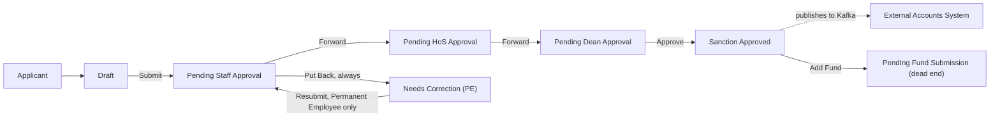
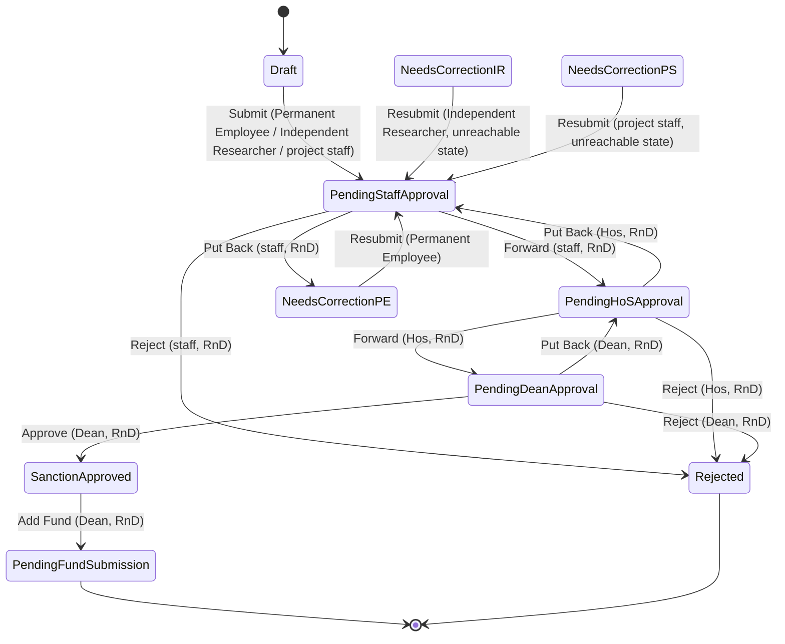

# Fund Sanction User Manual

> This manual documents the **Fund Sanction** DocType as it is actually configured in this Frappe/ERPNext installation (module `Rndopsapp`). It is based directly on the DocType schema, the controller (`fund_sanction.py`), a duplicate/legacy API surface in `api.py`, the live Workflow configuration, the site's Custom DocPerm records, and the DB-stored Client Script. Wherever the system's actual behavior is incomplete, inconsistent, or not enforced, this is called out explicitly with an **Important** or **Note** block instead of being assumed away.

---

## Table of Contents

1. [Overview](#1-overview)
2. [Business Process](#2-business-process)
3. [Workflow States](#3-workflow-states)
4. [Workflow Diagram](#4-workflow-diagram)
5. [Roles and Responsibilities](#5-roles-and-responsibilities)
6. [Permission Matrix](#6-permission-matrix)
7. [Navigation](#7-navigation)
8. [Getting Started](#8-getting-started)
9. [Creating a New Record](#9-creating-a-new-record)
10. [Screen-by-Screen Guide](#10-screen-by-screen-guide)
11. [Field Reference](#11-field-reference)
12. [Buttons and Actions](#12-buttons-and-actions)
13. [Approval Process](#13-approval-process)
14. [Notifications](#14-notifications)
15. [Attachments](#15-attachments)
16. [Reports](#16-reports)
17. [Audit Trail](#17-audit-trail)
18. [Business Rules](#18-business-rules)
19. [Frequently Asked Questions](#19-frequently-asked-questions)
20. [Common Errors](#20-common-errors)
21. [Best Practices](#21-best-practices)
22. [User Checklist](#22-user-checklist)
23. [Administrator Guide](#23-administrator-guide)
24. [Security](#24-security)
25. [Glossary](#25-glossary)
26. [Appendix](#26-appendix)

---

## 1. Overview

**Fund Sanction** records that funding has been formally **approved** for a project — the sanction letter, the sanctioned amount, and a year-wise budget-head breakup. It is the upstream counterpart to **Fund Received** (which records the money actually arriving) — see `FUND_RECEIVED_USER_MANUAL.md`.

- **What it is:** A submittable request document (`Fund Sanction` DocType) tied to a `Project Registration`, carrying a unique sanction letter number, sanctioned amount, a year-by-year budget breakup, and supporting files.
- **Why it exists:** Projects need a formal record of what was sanctioned — by whom, how much, against which budget heads, and over what multi-year schedule — before any money is expected to arrive.
- **Business purpose:** Multi-level internal approval of a sanction record, followed by publishing it to an external Accounts system once approved.
- **Who should use it:** Permanent Employees, Independent Researchers, and Project Staff filing the sanction; staff/RnD, Head of Section, and Dean as the approval chain.
- **When it should be used:** As soon as a sanction letter for project funding is received/issued, before the money itself arrives (which is then tracked separately in Fund Received).

> **Note**
>
> `sanctioned_letter_no` must be unique across all Fund Sanction records — this is checked both when the document is validated normally and again inside the main save API (since that API bypasses normal validation for other reasons). See [§18 Business Rules](#18-business-rules) for the important caveat about a *third* save path that skips this check entirely.

---

## 2. Business Process

### 2.1 Written explanation

A Fund Sanction starts as **Draft**. Unusually, the moment it is **Submit**ted out of Draft, `docstatus` immediately becomes **1 (Submitted)** — every state from `Pending Staff Approval` onward is already a "submitted" document, not just the terminal state. This is why several fields (`sanctioned_letter_no`, `sanctioned_budget_breakup`, `sanction_related_files`) are explicitly flagged `allow_on_submit` in the schema — they're expected to keep being edited throughout the approval chain, well after the document is technically "submitted."

The approval chain is strictly sequential: **staff, RnD** (Forward) → **Hos, RnD** (Forward) → **Dean, RnD** (Approve) → **Sanction Approved**. Any of the three approvers can instead **Reject**, or **Put Back** to the previous stage. Once **Sanction Approved**, this app publishes a `FUND_SANCTION` event to Kafka for the external Accounts system, and the Dean can additionally click **Add Fund** to move it to a state called **"PendIng Fund Submission"** (note the stray capital "I" — a literal typo baked into the live workflow data) — which is a **dead end**: no further transition exists out of it.

> **Important**
>
> "Put Back" from `Pending Staff Approval` **always** routes to a single state, **"Needs Correction (PE)"** — regardless of whether the original applicant was a Permanent Employee, Independent Researcher, or Project Staff. The workflow *does* define separate "Needs Correction (IR)" and "Needs Correction (PS)" states with their own `Resubmit` transitions, but **no transition in the workflow ever routes a document into them** — they are configured but unreachable. Practically: if an Independent Researcher's or Project Staff applicant's sanction is Put Back, it lands in "Needs Correction (PE)," whose only `Resubmit` transition is `allowed` for the **Permanent Employee** role only. An applicant who holds only the Independent Researcher or Project Staff role has **no way to resubmit their own corrected document** through this workflow.

### 2.2 Numbered process

1. Applicant creates a Draft Fund Sanction against a Project Registration (via `project_proposal`), with the sanctioned letter number/date and year-wise budget breakup.
2. Submits → **Pending Staff Approval** (already `docstatus = 1`).
3. staff, RnD Forwards → **Pending HoS Approval**.
4. Hos, RnD Forwards → **Pending Dean Approval**.
5. Dean, RnD Approves → **Sanction Approved** (this is also when the Kafka `FUND_SANCTION` event is published).
6. Optionally, Dean clicks **Add Fund** → **"PendIng Fund Submission"** (dead end — no further action defined).

### 2.3 Mermaid flowchart

---

## 3. Workflow States

Active workflow: **`fund_sanction_workflow`** (the only Workflow record for this DocType — no inactive duplicates to worry about).

| State | `doc_status` | `allow_edit` Role | Notes |
|---|---|---|---|
| Draft | 0 | Permanent Employee / Independent Researcher / project staff | Three rows, one per role |
| Pending Staff Approval | **1** | staff, RnD | Already "submitted" the moment it leaves Draft |
| Pending HoS Approval | 1 | Hos, RnD (Head of Section, RnD) | |
| Pending Dean Approval | 1 | Dean, RnD | |
| Needs Correction (PE) | 1 | Permanent Employee | The **only** reachable correction state — see [§2](#2-business-process) |
| Needs Correction (IR) | 1 | Independent Researcher | **Unreachable** — nothing transitions into it |
| Needs Correction (PS) | 1 | project staff | **Unreachable** — nothing transitions into it |
| Sanction Approved | 1 | System Manager | Triggers the Kafka publish |
| Rejected | **2 (Cancelled)** | System Manager | Set via raw DB write, bypassing `doc.cancel()` — see [§13](#13-approval-process) |
| PendIng Fund Submission | 1 | Dean, RnD | Dead end — no outgoing transition (note the literal typo in the state name) |

---

## 4. Workflow Diagram

---

## 5. Roles and Responsibilities

| Role | Responsibility | Grants Base DocType Access? |
|---|---|---|
| Permanent Employee | Files Draft; resubmits from Needs Correction (PE). | Yes (Custom DocPerm) |
| Independent Researcher | Files Draft. | **No** — see the Important note below |
| project staff | Files Draft. | **No** — see the Important note below |
| staff, RnD | First-line approver; Forward/Put Back/Reject. | Yes (Custom DocPerm, but `submit = 0` — see [§6](#6-permission-matrix)) |
| Hos, RnD (Head of Section, RnD) | Second-line approver. | **No** — see the Important note below |
| Dean, RnD | Final approver; also triggers "Add Fund." | **No** — see the Important note below |
| System Manager | Administrative; nominal editor of terminal states. | Yes |
| All_ProRnd_User | Generic broad-access role. | Yes |
| head_approver_1 | Has full Custom DocPerm access. | Yes — but **not used anywhere in this workflow**; appears to be a copy-paste leftover from another doctype's permission setup (it's the approval role for `Indent Cum Sanction Sheet`/`Top Up Fellowship`, not Fund Sanction). |

> **Important — the same recurring permission gap seen in Temporary Advance and Fund Received**
>
> `Independent Researcher`, `project staff`, `Hos, RnD`, and `Dean, RnD` are all named as workflow `allowed`/`allow_edit` roles but have **no `Custom DocPerm` row** for Fund Sanction. Since `Custom DocPerm`'s presence for a doctype restricts access to exactly the listed roles (unlike the base DocType JSON, which only listed `System Manager`/`All_ProRnd_User`), a user holding only `Hos, RnD` or `Dean, RnD` cannot open/act on a Fund Sanction unless they also hold `All_ProRnd_User` or `System Manager`. **Given that both approval stages depend entirely on these two roles, this is a strong candidate for a broken approval chain — verify with your administrator before relying on it.**

---

## 6. Permission Matrix

| Role | Read | Write | Create | Submit | Cancel | Amend | Delete | Print | Email | Report | Export | Share |
|---|---|---|---|---|---|---|---|---|---|---|---|---|
| System Manager | ✔ | ✔ | ✔ | ✔ | ✘ | ✘ | ✔ | ✔ | ✔ | ✔ | ✔ | ✔ |
| All_ProRnd_User | ✔ | ✔ | ✔ | ✔ | ✘ | ✘ | ✔ | ✔ | ✔ | ✔ | ✔ | ✔ |
| Permanent Employee | ✔ | ✔ | ✔ | ✔ | ✔ | ✔ | ✔ | ✔ | ✔ | ✔ | ✔ | ✔ |
| staff, RnD | ✔ | ✔ | ✔ | **✘** | ✔ | ✔ | ✔ | **✘** | ✔ | ✔ | ✔ | ✔ |
| head_approver_1 | ✔ | ✔ | ✔ | ✔ | ✔ | ✔ | ✔ | ✔ | ✔ | ✔ | ✔ | ✔ |

> **Note**
>
> `staff, RnD` has `submit = 0` and `print = 0` despite being the state-1 approver role — this doesn't block their Forward/Reject/Put Back actions (those are implemented via direct `frappe.db.set_value` writes in `perform_fund_sanction_action`, not the ORM `doc.submit()`), but it does mean they cannot print the document or manually trigger a standard Frappe submit outside the custom workflow API.
>
> **No delegation support:** unlike Reimbursement/Temporary Advance, `Fund Sanction` does not appear in `delegate_user.py`'s application registry or in `hooks.py`'s `permission_query_conditions` — there is no list-visibility expansion mechanism for this doctype at all. Access is purely the flat table above (no `if_owner` restriction, so any role holder sees every record).

---

## 7. Navigation

- Fund Sanction is a standard DocType in the **Rndopsapp** module — reachable at `/app/fund-sanction`.
- **Search:** Global Search / Awesomebar → "Fund Sanction".

---

## 8. Getting Started

**Prerequisites**

- A role from [§6](#6-permission-matrix) with base access (noting the HoS/Dean gap in [§5](#5-roles-and-responsibilities)).
- A Project Registration (`project_proposal`) to sanction funds against.
- The sanction letter number and date, and a year-wise budget breakup.

**Master data required**

| Master Data | DocType | Purpose |
|---|---|---|
| Project Registration | `Project Registration` | The project being sanctioned; despite the field label reading "Project Registered," `project_proposal` is a real, required Link to `Project Registration`. |
| Budget Head | `Budget Head` | Only used by the *sibling* child table `Project Received Budget` (part of a currently-dead "have you received fund" section — see [§9](#9-creating-a-new-record)); the main `Project Sanctioned Budget` table uses free-text account heads. |

---

## 9. Creating a New Record

### Step 1 — Reference and Project

- `project_proposal` — **required** Link to Project Registration.
- `refnum_prj_num` — hidden reference field.

> **Important**
>
> `refnum_prj_num` is **never set server-side** — no `validate()`/`before_save()`/`fetch_from` populates it. It relies entirely on the calling frontend passing the Project Registration name as `prefill_data["refnum_prj_num"]` and echoing it back on save. Multiple downstream consumers — the Kafka mapper's project-number resolution, the legacy REST push, and Fund Received's reverse lookup of Fund Sanctions by project — all trust this field to be correct. If your frontend doesn't set it, expect broken project-linking in those integrations.

### Step 2 — Sanction Details

- `sanctioned_letter_no` — must be **unique** across all Fund Sanction records; a realtime duplicate-check API (`check_sanctioned_letter_no`) is available and returns a suggested alternative (`-SL00001`-style suffix) if a duplicate is detected.
- `sanctioned_letter_date`.
- `total_sanctioned_amount` — recomputed from the budget breakup rows (client-side, when the working part of the Client Script runs — see [§10](#10-screen-by-screen-guide)).

### Step 3 — Sanctioned Budget Breakup

- `sanctioned_budget_breakup` (table → **Project Sanctioned Budget**): `account_head` (**free text**, not a Link — unlike Fund Received's equivalent field), `first_year_budget` through `fifth_year_budget` plus `sixth_year_budget` (all Currency), `total_proposal_of_heads` (read-only, computed per row).

> **Important**
>
> A DB-stored **Client Script** (`fund_sanction_client_script`, enabled) is attached to this form and is **badly out of sync with the current schema** — it references fields (`project_proposal_link`, `total_first_year_budget_1`, `grand_total_proposal_1`, `project_duration_months`, etc.) that **do not exist** on this DocType (they look like leftovers from a `Project Proposal` field set). Concretely:
> - Its `refresh` handler checks `!frm.doc.project_proposal_link` — which is **always true** (that field never exists) — so **every time you open a Fund Sanction form, the script clears the `sanctioned_budget_breakup` table and zeroes `total_sanctioned_amount` on screen**, even for a document that already has saved data. This is a display-only reset (nothing is persisted unless you then save), but it can look alarming and has caused confusion in the past — **don't panic and don't re-save** if you see this; reload the record instead of assuming your data was lost.
> - A related bug means only the **first-year budget column** is ever shown in the budget-breakup grid — 2nd through 5th year columns are hidden because the visibility logic depends on `project_duration_months`, which is never populated.
> - The **totals calculation itself does work** — `calculate_sanctioned_totals()` correctly sums the real year-budget columns into `total_proposal_of_heads` and `total_sanctioned_amount` when rows are added/edited, because it's wired to the child grid's real events, not the broken `refresh` logic above.

### Step 4 — Supporting Files

- `sanction_related_files` (table → **Project Sanction File**): `sanction_file` (required Attach), `description`.

### Step 5 — Save and Submit

Save the Draft, then Submit to enter the approval chain.

> **Note**
>
> Fields under a section literally labeled **"have you received fund"** (`have_fund_details`, `is_gst_invoice_issued`, `invoice_details`, `amount_received`, `fund_transactions`, `iitg_bank_account_number`, `received_amount_breakup`) exist on this DocType's schema but have **no live backend wiring** — the only code that reads/writes them is inside a commented-out, superseded version of the save function. This entire section duplicates the purpose of the separate **Fund Received** DocType but doesn't actually do anything here. If your form shows these fields, treat them as vestigial — use Fund Received to record money actually arriving.

---

## 10. Screen-by-Screen Guide

| Screen Area | What It Shows |
|---|---|
| **Header** | Sanction Workflow Status (`sanction_workflow_status`, kept in sync with `workflow_state` on every save), docstatus. |
| **Sanction Details** | Letter number/date, total sanctioned amount. |
| **Budget Breakup grid** | Only the first-year column visible in practice — see the Important note in [§9](#9-creating-a-new-record). |
| **Files** | Attached sanction letter/supporting documents. |
| **"Have you received fund" section** | Present on the form but functionally dead — see [§9](#9-creating-a-new-record). |
| **Print** | No custom Print Format exists — uses Frappe's default layout. |

> **Note**
>
> The on-disk `fund_sanction.js` (32 lines) **is** real and functional — separate from the stale DB-stored Client Script above — and correctly toggles `is_gst_invoice_issued`'s visibility based on the linked Project Proposal's `project_type` being "Consultancy." It's a small, working script that matches the current schema.

---

## 11. Field Reference

| Field | Fieldname | Required | Data Type | Notes |
|---|---|---|---|---|
| Amended From | `amended_from` | No | Link → Fund Sanction (hidden, read-only) | |
| Project Registered | `project_proposal` | **Yes** | Link → Project Registration | Label doesn't match the field's real target — it links to Project Registration, not a "Project Proposal" doctype. |
| (hidden ref) | `refnum_prj_num` | No | Data (hidden) | **Never set server-side** — see [§9](#9-creating-a-new-record). |
| Sanction Workflow Status | `sanction_workflow_status` | No | Data | Kept in sync with `workflow_state` via `before_save()`. |
| (legacy dupe) | `workflow_status` | No | Data (hidden) | Orphaned — nothing writes to it. |
| Total Sanctioned Amount | `total_sanctioned_amount` | No | Currency (non-negative) | Recomputed from the budget breakup. |
| Sanctioned Letter No. | `sanctioned_letter_no` | No (but must be unique) | Data (`allow_on_submit`) | See [§18](#18-business-rules). |
| Sanctioned Letter Date | `sanctioned_letter_date` | No | Date | |
| Sanctioned Budget Breakup | `sanctioned_budget_breakup` | No | Table → Project Sanctioned Budget (`allow_on_submit`) | |
| Sanction Related Files | `sanction_related_files` | No | Table → Project Sanction File (`allow_on_submit`) | |
| Have Fund Details / GST / Amount Received / Fund Transactions / IITG Bank Account / Received Amount Breakup | various | Various (`received_amount_breakup` is `reqd`) | Various | **Dead section** — see [§9](#9-creating-a-new-record). |
| Project Type (Linked) | `project_type_linked` | No | Select (read-only, `fetch_from: project_proposal.project_type`) | |
| Is GST Invoice Issued? | `is_gst_invoice_issued` | No | Select (hidden) | Visibility toggled by the *working* on-disk Client Script. |
| Invoice Details | `invoice_details` | No | Data (hidden) | Shown when GST invoice issued. |

### Child tables

**Project Sanctioned Budget** (`sanctioned_budget_breakup`): `account_head` (Data, **free text**), `first_year_budget`…`fifth_year_budget`, `sixth_year_budget` (all Currency, non-negative, `allow_on_submit`), `total_proposal_of_heads` (Currency, read-only), `is_total_row` (Check, hidden).

**Project Sanction File** (`sanction_related_files`): `sanction_file` (Attach, required), `description` (Data).

**Project Received Budget** (`received_amount_breakup`, part of the dead section): `account_head` (**Link → Budget Head** — unlike its sibling above), `amount_received` (Currency, required), `remarks` (Small Text).

> **Note**
>
> `Project Sanctioned Budget.account_head` (free text) and `Project Received Budget.account_head` (a real Link) are inconsistently typed for conceptually the same kind of field, on two child tables of the same parent document.

---

## 12. Buttons and Actions

| Action | Shown When | Result |
|---|---|---|
| Submit | Draft | → Pending Staff Approval (already `docstatus = 1`) |
| Forward | Pending Staff Approval | → Pending HoS Approval |
| Put Back | Pending Staff Approval | → Needs Correction (PE), **always**, regardless of applicant type |
| Reject | Pending Staff Approval / Pending HoS Approval / Pending Dean Approval | → Rejected (`docstatus = 2`, via raw DB write — see [§13](#13-approval-process)) |
| Forward | Pending HoS Approval | → Pending Dean Approval |
| Put Back | Pending HoS Approval | → Pending Staff Approval |
| Approve | Pending Dean Approval | → Sanction Approved; publishes to Kafka |
| Put Back | Pending Dean Approval | → Pending HoS Approval |
| Resubmit | Needs Correction (PE) | → Pending Staff Approval |
| Add Fund | Sanction Approved | → PendIng Fund Submission (dead end) |

---

## 13. Approval Process

- **Approval hierarchy:** Applicant → staff, RnD → Hos, RnD → Dean, RnD.
- **Every stage after Draft is already a "submitted" document** (`doc_status = 1`) — this app relies on `allow_on_submit` flags plus custom, ORM-bypassing save logic (`frappe.db.set_value`, raw child-table `db_insert`) to keep editing possible through the chain.
- **Reject bypasses `doc.cancel()` entirely.** `perform_fund_sanction_action()` sets `docstatus = 2` directly via `frappe.db.set_value(...)` rather than calling Frappe's `cancel()` method — meaning `on_cancel` hooks, linked-document cancellation checks, and any other cancel-time side effects **do not run**. A "Rejected" Fund Sanction is cancelled in name/status only.
- **Correction loop is broken for non-Permanent-Employee applicants** — see the Important note in [§2](#2-business-process).
- **`Add Fund` is a dead end** — once clicked, there's no further transition; treat it as informational/manual-follow-up only unless your workflow administrator adds a continuation.

---

## 14. Notifications

No `Notification`/email-alert record exists; the workflow's `send_email_alert` is off. No automated notifications at any stage of this approval chain.

---

## 15. Attachments

`sanction_related_files` holds one or more sanction letter/supporting file attachments (`sanction_file`, required per row, plus a `description`).

---

## 16. Reports

No custom Report exists. Standard List/Report View only, subject to [§6](#6-permission-matrix) (note: no `if_owner` restriction anywhere, so any role holder with read access sees all Fund Sanction records, not just their own).

---

## 17. Audit Trail

Standard Frappe Timeline/Version history — though, as in Fund Received, several of this DocType's own custom save/action paths write via raw SQL rather than the ORM, which may produce thinner Timeline entries than a normal `doc.save()` would. `fund_sanction_save.log` (a plaintext debug log in the DocType's own folder) also captures save-path activity, alongside pervasive `print()` statements in the controller.

---

## 18. Business Rules

| Rule | Enforced by System? |
|---|---|
| `project_proposal` is mandatory | **Yes** (`reqd = 1`). |
| `sanctioned_letter_no` must be unique | **Yes, in two of three save paths.** `FundSanction.validate()` and the main `save_fund_sanction_data()` API both check it. |

> **Important**
>
> A **third**, near-duplicate save endpoint — `draft_fund_sanction_data()` in `apps/rndopsapp/rndopsapp/api.py` — also creates/updates Fund Sanction records, also sets `ignore_validate=True` (skipping `validate()`), but **contains no uniqueness check of its own**. If your frontend (or any integration) calls this endpoint instead of the doctype's own `save_fund_sanction_data()`, duplicate `sanctioned_letter_no` values can be created despite `SANCTIONED_LETTER_NO_UNIQUENESS.md`'s documented guarantee. Confirm which endpoint your frontend actually calls.

| Rule | Enforced by System? |
|---|---|
| Reject actually cancels the document via Frappe's cancel lifecycle | **No** — bypassed via raw DB write, see [§13](#13-approval-process). |
| Applicant category determines which "Needs Correction" state is used | **No** — always routes to "Needs Correction (PE)" regardless, see [§2](#2-business-process). |
| Budget breakup edits don't silently affect approval status | **No** — `update_sanctioned_budget_breakup()`, when called without a `username` parameter, resets `workflow_state` back to `"Draft"` as a side effect of an otherwise-unrelated budget edit. |

---

## 19. Frequently Asked Questions

1. **Why does my Fund Sanction already show "Submitted" right after I click Submit from Draft?** By design in this workflow — every post-Draft state carries `docstatus = 1`, not just the final approved state.
2. **My budget breakup table looked empty when I reopened the record — did I lose my data?** No — this is a known display-only bug in the stale Client Script (see [§9](#9-creating-a-new-record)); reload rather than re-save, and check the actual saved values via the API/list view if unsure.
3. **Why can I only see the first year's budget column?** A related Client Script bug — see [§9](#9-creating-a-new-record).
4. **My sanction was Put Back for correction, but I'm an Independent Researcher/Project Staff applicant and can't resubmit it — why?** A known workflow gap — Put Back always routes to "Needs Correction (PE)," resubmittable only by the Permanent Employee role. See [§2](#2-business-process).
5. **Can a rejected Fund Sanction be un-rejected/amended like a normal cancelled document?** Not cleanly — Reject sets `docstatus = 2` via a raw database write, bypassing Frappe's normal cancel lifecycle, so standard amend flows may not behave as expected.
6. **What happens when I click "Add Fund" on an approved sanction?** The document moves to a state with no further actions defined ("PendIng Fund Submission") — treat this as the end of this workflow's automation; further processing (e.g. actually recording the fund arrival) happens in the separate Fund Received DocType.
7. **Is there a Print Format?** No.
8. **Will approvers be notified automatically?** No — no notifications are configured for this DocType.

---

## 20. Common Errors

| Problem | Cause | Solution |
|---|---|---|
| "Sanctioned Letter No. already exists" / duplicate suggestion shown | Uniqueness check triggered. | Use the suggested alternative or verify the correct existing record. |
| Duplicate `sanctioned_letter_no` slipped through anyway | Created via `draft_fund_sanction_data()` in `api.py`, which has no uniqueness check. | Report to your administrator; consider consolidating to the doctype's own `save_fund_sanction_data()` API. |
| Budget breakup table appears empty on open | Stale Client Script display bug. | Reload the page; don't re-save based on the empty appearance. |
| Only first-year budget visible | Stale Client Script's year-visibility logic depends on a never-populated field. | Enter/verify multi-year budgets via the API or ask your administrator; this is a display limitation. |
| Can't resubmit a Put-Back document | You hold only Independent Researcher or project staff role — the resubmit path only works for Permanent Employee. | Escalate to a Permanent Employee or your System Manager. |
| HoS or Dean can't open the document at their stage | No base DocType permission configured for those roles. | Escalate to your System Manager — likely needs a Custom DocPerm entry. |
| Workflow state unexpectedly reset to Draft after a budget edit | `update_sanctioned_budget_breakup()` was called without a `username` parameter. | Ask whoever performed the edit to confirm which API/parameters were used; re-forward the document through the chain again. |

---

## 21. Best Practices

- Always double-check `sanctioned_letter_no` for typos/duplicates before saving.
- Don't panic if the budget breakup grid looks empty or single-year on reopening — verify actual saved data before re-entering anything.
- Confirm which save endpoint your frontend uses if duplicate sanction letters start appearing.
- Treat "Add Fund" as the end of automated processing — follow up manually or via Fund Received for anything after that.

---

## 22. User Checklist

- [ ] Project (`project_proposal`) is correct.
- [ ] Sanctioned Letter No./Date are correct and not a duplicate.
- [ ] Budget breakup rows are complete for every relevant year, even if the UI only shows the first year.
- [ ] Sanction letter/supporting files are attached.
- [ ] Total Sanctioned Amount matches the sum of the budget breakup.

---

## 23. Administrator Guide

**Configuration**

- DocType: `rndopsapp/rndopsapp/doctype/fund_sanction/fund_sanction.json`
- Controller: `rndopsapp/rndopsapp/doctype/fund_sanction/fund_sanction.py`
- Active Workflow: `fund_sanction_workflow` (hardcoded by name in the controller)
- Client Script: `fund_sanction_client_script` (DB-stored, enabled, **stale** — see [§9](#9-creating-a-new-record)) plus a real, working on-disk `fund_sanction.js`.
- Debug artifact: `fund_sanction_save.log` in the doctype's own folder.

**Key server-side APIs**

| API | Purpose |
|---|---|
| `check_sanctioned_letter_no(sanctioned_letter_no, docname)` | Realtime duplicate check with suggested alternative. |
| `get_project_proposal_budget_details(project_proposal_name)` | Prefill data from a linked Project Proposal. |
| `get_fund_sanction_form_data(project_proposal)` | Dynamic field metadata + link options — **`allow_guest=True`**, queried with `ignore_permissions=True`. See the Security note below. |
| `save_fund_sanction_data(files, **data)` | Main create/update endpoint — uniqueness check, MinIO upload, conditional Kafka publish at "Sanction Approved," Mattermost notifications. |
| `get_sanctions_for_project(project_name)` | Returns all sanctions for a project **with every attached file's binary content base64-embedded** — a heavy call. |
| `get_fund_sanction_workflow_actions(docname)` / `perform_fund_sanction_action(docname, action)` | Workflow engine — direct `frappe.db.set_value` writes, bypasses `doc.submit()`/`doc.cancel()`. |
| `submit_fund_sanction(sanction_name, save, files, ...)` | Convenience wrapper — optionally saves, then performs "Submit" (valid from Draft only). |
| `update_sanctioned_budget_breakup(docname, rows, username)` | Upserts/deletes budget rows; **can silently reset `workflow_state` to Draft** if called without `username`. |
| `update_fund_sanction_files(docname, files, existing_files, project_reg, replace)` | Manages `sanction_related_files`. |

**Duplicate/legacy endpoints in `api.py` — reconcile with your frontend team**

- `rndopsapp.api.get_fund_sanction_form_data` — a separate, static-allowlist (7 fields) version of the function above.
- `rndopsapp.api.draft_fund_sanction_data` — a near-duplicate of the doctype's save function, **without** the uniqueness check, and which **unconditionally** calls the legacy REST push (`send_sanction_details_to_api`, POSTing to `172.16.134.81:18080`) on every save regardless of workflow state.

**Kafka**

- Producer: topic `fund-sanction-events` (DLQ `fund-sanction-events-dlq`), triggered when the workflow reaches "Sanction Approved." Payload includes `projectNumber`, `sanctionLetterNo/Date`, `totalSanctionAmount`, PFMS/bank fields (pulled from the **linked Project Registration**, not from this DocType's own — currently dead — `iitg_bank_account_number` field), and the budget breakup.
- **No real inbound Kafka channel** for this doctype — `consume_fund_sanction.py` is an orphaned, standalone debug script that listens on the *same topic this app's own producer publishes to* (it would just echo the app's own events back) and performs zero Frappe writes; it is not wired into `hooks.py`'s consumer manager. Unlike Fund Received, an external system **cannot** push updates into Fund Sanction via Kafka in this codebase as currently configured.

**Known gaps to review with the workflow/product owner**

1. `Independent Researcher`, `project staff`, `Hos, RnD`, and `Dean, RnD` have no base DocType permission despite being workflow-critical — likely blocks the HoS/Dean approval chain for role-only holders.
2. Correction loop only works for Permanent Employee applicants.
3. Reject bypasses Frappe's normal cancel lifecycle.
4. "Add Fund" is a dead-end transition.
5. The DB-stored Client Script is stale and causes a display-only data-loss scare and a hidden-year-columns bug.
6. Three overlapping save endpoints exist with different validation guarantees (`save_fund_sanction_data`, `draft_fund_sanction_data`, and the guest-callable `get_fund_sanction_form_data`).
7. `refnum_prj_num` is never set server-side, relying entirely on the frontend.
8. The "have you received fund" field section is dead weight — duplicates Fund Received's purpose with no working backend.

---

## 24. Security

- **`get_fund_sanction_form_data` (the doctype's own version) is callable by unauthenticated guests** (`allow_guest=True`) and queries with `ignore_permissions=True` — it returns full DocType field metadata plus up to 1000 rows of names/titles for every linked doctype. This is a genuine information-exposure surface; confirm with your security team whether this is intentional.
- No delegation, no custom `has_permission()` — access is purely the flat role table in [§6](#6-permission-matrix), with no per-record ownership restriction.
- Reject's raw-DB cancel bypass ([§13](#13-approval-process)) means cancellation-time integrity checks that other submittable DocTypes normally get for free do not run here.

---

## 25. Glossary

| Term | Meaning |
|---|---|
| **Sanction** | Formal approval of project funding, before the money has arrived — see also **Fund Received**. |
| **PendIng Fund Submission** | A literal, typo'd state name in this app's live workflow data — a dead end after "Add Fund." |
| **allow_on_submit** | A Frappe field flag letting a field remain editable even after the document's `docstatus` becomes 1 — used heavily here because this workflow submits the document very early (right after Draft). |

---

## 26. Appendix

**Related Modules:** Project Registration, Fund Received (`FUND_RECEIVED_USER_MANUAL.md`), Budget Head.

**References:**
- `apps/rndopsapp/rndopsapp/rndopsapp/doctype/fund_sanction/fund_sanction.json` / `.py` / `.js`
- `apps/rndopsapp/rndopsapp/rndopsapp/doctype/fund_sanction/SANCTIONED_LETTER_NO_UNIQUENESS.md`
- `apps/rndopsapp/rndopsapp/rndopsapp/kafka/producer/fund_sanction/*.py`
- `apps/rndopsapp/rndopsapp/rndopsapp/consume_fund_sanction.py` (orphaned debug script — not part of the running app)
- `apps/rndopsapp/rndopsapp/api.py` (duplicate `get_fund_sanction_form_data`/`draft_fund_sanction_data`/`send_sanction_details_to_api`)
- Live `Workflow`, `Workflow Document State`, `Workflow Transition`, `Custom DocPerm`, `Client Script` records for `Fund Sanction` in this site's database.

**Support Contact:** *(Assumption: add your organization's actual ERP support contact/desk here.)*
