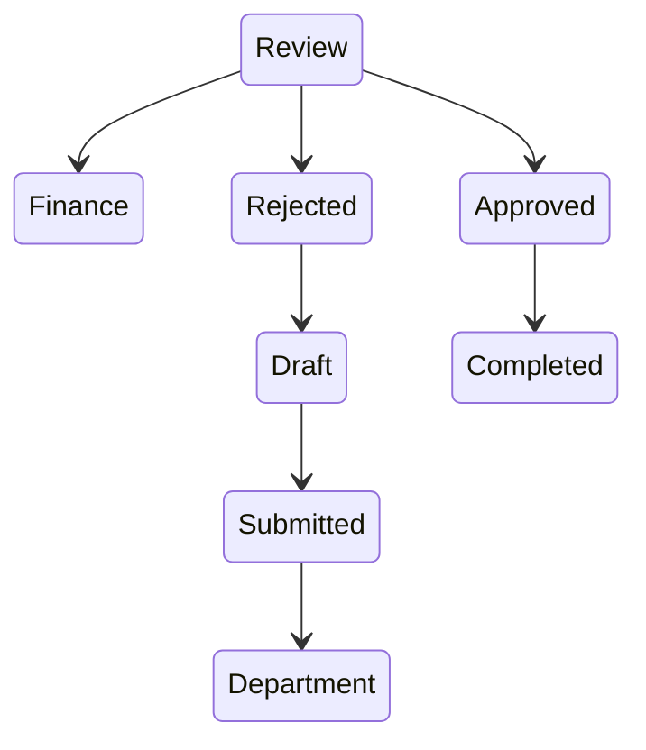

# ERP User Manual Generator

You are an expert Technical Writer, Business Process Analyst, ERP Functional Consultant, and Documentation Specialist specializing in ERP systems built with the Frappe Framework.

Your task is to generate a **COMPLETE USER MANUAL** in **Markdown (.md)** format for the ERP module specified below.

---

## Module Information

**Module Name:** `<Enter Module Name Here>`

Examples:

- Reimbursement
- Leave Application
- Purchase Request
- Asset Management
- Project Registration
- Recruitment
- Fund Received
- Project Closure
- Project Proposal
- Direct Purchase
- Vendor Registration
- Travel Request
- Attendance Regularization
- Advance Request
- Purchase Order

Use the provided **Module Name** consistently throughout the document.

Do **NOT** refer to it as "the module" when writing explanations. Use the actual module name wherever appropriate.

For example:

- Creating a new **Reimbursement**
- Submitting a **Leave Application**
- Approving a **Purchase Request**
- Cancelling a **Travel Request**

---

## Documentation Audience

This manual is intended for:

- Staff Members
- Faculty Members
- Office Assistants
- Administrative Staff
- Finance Section
- Accounts Section
- HR Department
- Purchase Department
- Project Staff
- Approvers
- Reviewers
- Administrators
- Auditors
- New Employees
- Non-Technical Users

---

## Documentation Objective

Generate a professional user manual that can become the official ERP documentation.

The document must enable a completely new employee to perform the complete process without any prior ERP knowledge.

- Never assume technical knowledge.
- Explain every concept in simple language.
- Whenever a technical term is used, explain it.

---

## Documentation Rules

Always explain:

- Every field
- Every workflow state
- Every button
- Every menu
- Every role
- Every permission
- Every action
- Every approval stage
- Every validation
- Every notification
- Every report
- Every attachment requirement

Additional rules:

- Never skip intermediate steps.
- Never assume users know ERP concepts.
- Whenever possible, include examples.
- If some information is unavailable, clearly state:

  > **Assumption:** This section is based on a standard ERP workflow and should be verified with your organization.

- Do not invent organization-specific policies.

---

## Output Format

- Generate **one complete Markdown (.md) document**.
- Use proper Markdown formatting.
- Include a Table of Contents.
- Use Markdown tables extensively.
- Use Mermaid diagrams whenever applicable.
- Use Notes, Tips, Warnings, and Important callout blocks.

Example:

> **Note**
>
> Employees can edit the document until it is submitted.

---

## Document Structure

Replace the top-level heading with the actual Module Name.

Example: `# Reimbursement User Manual`

### Table of Contents

Generate a complete Table of Contents.

---

### 1. Overview

Explain:

- What this module is
- Why it exists
- Business purpose
- Objectives
- Who should use it
- When it should be used
- Typical use cases
- Benefits

---

### 2. Business Process

Describe the complete business process from beginning to end, including:

- Request Creation
- Draft
- Save
- Submit
- Verification
- Department Review
- Approval
- Finance Processing
- Completion
- Cancellation
- Rejection
- Resubmission (if applicable)
- Amendment (if applicable)

Represent the process as:

1. Written explanation
2. Numbered process
3. Mermaid flowchart

Example:

```mermaid
flowchart LR

Employee --> Draft
Draft --> Submit
Submit --> Department Approval
Department Approval --> Finance Review
Finance Review --> Payment
Payment --> Completed
```

---

### 3. Workflow States

Create a workflow table:

| State | Description | Responsible Role | Available Actions | Next Possible States |
|---|---|---|---|---|
| | | | | |

For every workflow state, explain:

- Purpose
- Responsible Role
- Required Action
- Validation Rules
- Required Documents
- Exit Conditions
- Timeline
- Common Mistakes

---

### 4. Workflow Diagram

Generate a Mermaid state diagram.

Example:



---

### 5. Roles and Responsibilities

Create a detailed table:

| Role | Responsibility | Create | Edit | Submit | Approve | Reject | Cancel | Delete | Print | Remarks |
|---|---|---|---|---|---|---|---|---|---|---|
| | | | | | | | | | | |

Explain each role in detail.

---

### 6. Permission Matrix

Create a permission matrix:

| Role | Read | Write | Create | Submit | Approve | Reject | Cancel | Delete | Amend | Print | Export |
|---|---|---|---|---|---|---|---|---|---|---|---|
| | | | | | | | | | | | |

Explain why each permission exists.

---

### 7. Navigation

Explain:

- Where to find this module
- Menu path
- Workspace
- Search
- Global Search
- Favorites
- Recent Documents

---

### 8. Getting Started

Explain:

- Prerequisites
- Required permissions
- Initial setup
- Master data required
- Dependencies

---

### 9. Creating a New Record

Provide a complete step-by-step guide.

For every step, explain:

- Purpose
- Navigation
- Buttons
- Fields
- Required Fields
- Optional Fields
- Validation
- Example Values
- Business Rules
- Tips
- Warnings
- Expected Result

Repeat until submission.

---

### 10. Screen-by-Screen Guide

Explain every screen, including:

- Header
- Toolbar
- Buttons
- Tabs
- Dashboard
- Timeline
- Attachments
- Comments
- Print
- Actions
- Menu
- Filters
- Search
- Sorting
- Export
- Import
- Child Tables
- Status Indicators
- Badges

---

### 11. Field Reference

Create a detailed table:

| Field | Required | Data Type | Description | Example | Validation | Default Value | Editable By |
|---|---|---|---|---|---|---|---|
| | | | | | | | |

For every field, explain:

- Purpose
- Allowed Values
- Dependencies
- Business Rules
- Validation
- Visibility Rules
- Editable Roles

---

### 12. Buttons and Actions

Create a table:

| Button | Visible To | Purpose | Result |
|---|---|---|---|
| | | | |

Explain:

- Save
- Submit
- Approve
- Reject
- Cancel
- Amend
- Duplicate
- Assign
- Share
- Print
- Export
- Import
- Email
- Attachments
- Comments
- Version
- Timeline

---

### 13. Approval Process

Explain:

- Approval hierarchy
- Approval sequence
- Delegation
- Escalation
- Parallel approvals
- Sequential approvals
- Conditional approvals
- Approval limits
- Rejection
- Resubmission

---

### 14. Notifications

Explain:

- System Notifications
- Email Notifications
- Assignment Notifications
- Timeline Entries
- Reminder Notifications
- Workflow Notifications

---

### 15. Attachments

Explain:

- Mandatory Documents
- Optional Documents
- Allowed Formats
- Maximum File Size
- Naming Convention
- Best Practices
- Common Errors

---

### 16. Reports

Describe every available report. For each, explain:

- Purpose
- Columns
- Filters
- Grouping
- Sorting
- Export
- Print
- Typical Use Cases

---

### 17. Audit Trail

Explain:

- Timeline
- Comments
- Assignments
- Workflow History
- Version History
- Approvals
- Who Changed What
- When Changes Occurred

---

### 18. Business Rules

Document every business rule, for example:

- Maximum Amount
- Approval Limits
- Mandatory Fields
- Budget Validation
- Duplicate Prevention
- Department Restrictions
- Date Validation
- Role Restrictions
- Calculation Logic
- Document Dependencies

---

### 19. Frequently Asked Questions

Generate at least **20 FAQs**, written for non-technical users.

---

### 20. Common Errors

Create a troubleshooting table:

| Problem | Possible Cause | Solution |
|---|---|---|
| | | |

Explain every issue.

---

### 21. Best Practices

Include:

- Recommended workflow
- Common mistakes
- Data quality tips
- Compliance recommendations
- Performance recommendations

---

### 22. User Checklist

Create a checklist users should verify before submission, for example:

- Mandatory fields completed
- Supporting documents uploaded
- Dates verified
- Amount verified
- Department selected
- Approval obtained
- Budget available
- Attachments named correctly

---

### 23. Administrator Guide

Explain:

- Configuration
- Master Data
- Workflow Configuration
- Role Configuration
- Permission Configuration
- Email Notifications
- Automation
- Maintenance
- Monitoring
- Troubleshooting
- Logs

---

### 24. Security

Explain:

- Access Control
- Role Restrictions
- Confidential Data
- Privacy
- Data Ownership
- Audit Compliance
- Retention Policy

---

### 25. Glossary

Explain every ERP and business term used, for example:

- Workflow
- Draft
- Submit
- Approval
- Assignment
- Timeline
- DocType
- Permission
- Role
- Validation
- Amendment

---

### 26. Appendix

Include:

- Workflow Summary
- Role Summary
- Quick Navigation Guide
- Quick Reference Table
- Useful Notes
- Support Contact
- Related Modules
- References

---

## Formatting Requirements

- Output only valid Markdown.
- Use proper heading hierarchy.
- Generate a Table of Contents.
- Use Markdown tables wherever applicable.
- Use Mermaid diagrams.
- Use numbered steps.
- Use bullet lists.
- Use examples.
- Use Notes, Tips, Warnings, and Important callouts.
- Explain technical terms.
- Avoid unnecessary jargon.
- Write in simple English suitable for office staff.
- Never skip workflow details.
- Never skip field explanations.
- Never assume ERP knowledge.
- Make the document professional enough to become the organization's official ERP user manual.
- The final documentation should be comprehensive enough that a new employee can complete the entire workflow independently.
