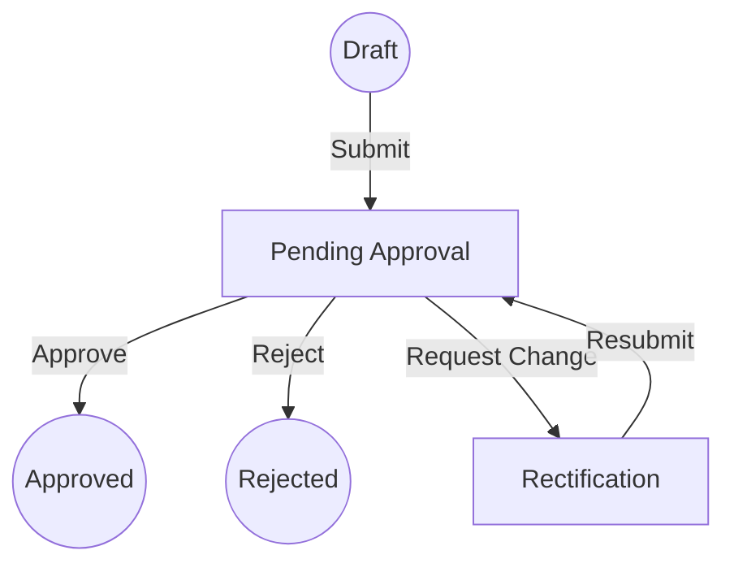
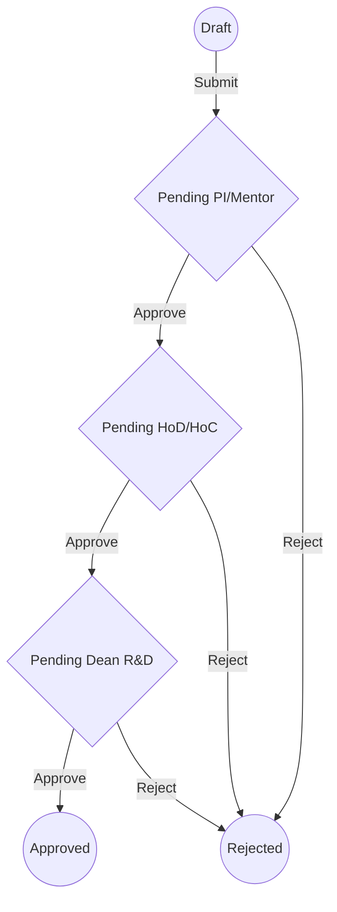
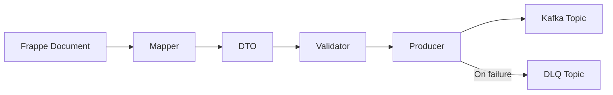
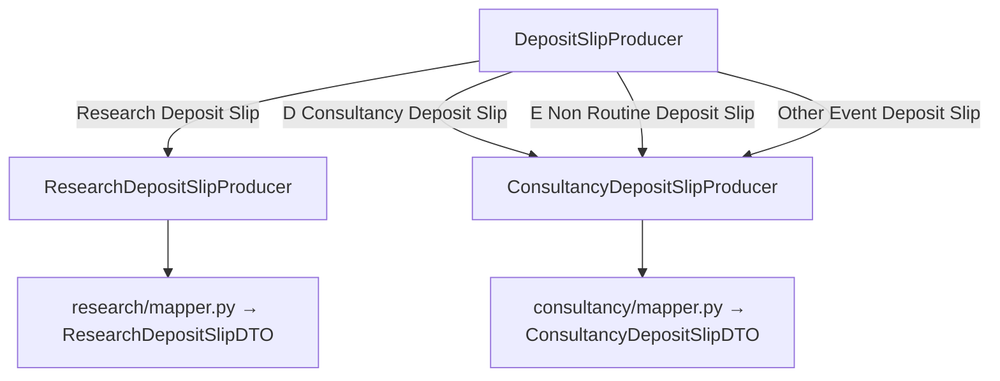
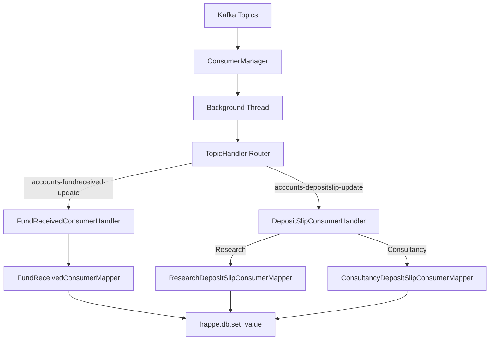
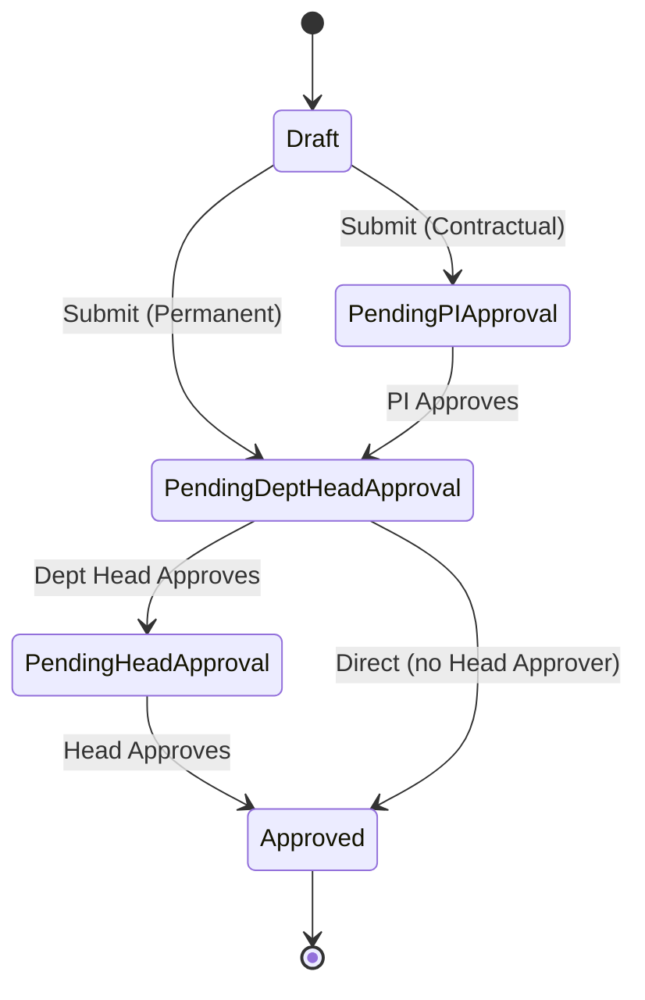
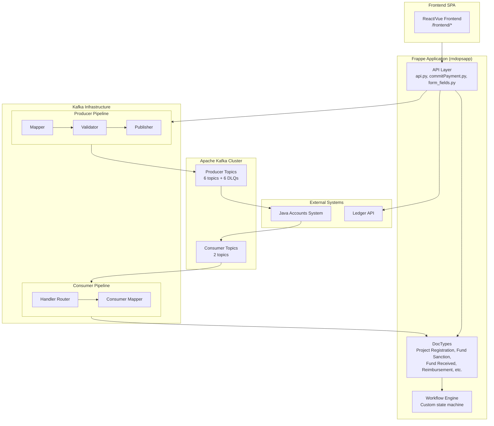

# rndopsapp — Technical Documentation

> **Module**: `rndopsapp` · **Framework**: Frappe · **License**: MIT
> **Publisher**: rndops · **Description**: RND Automation Software

---

## Table of Contents

1. [Module Overview](#1-module-overview)
2. [Directory Structure](#2-directory-structure)
3. [Doctype Definitions](#3-doctype-definitions)
4. [Doctype API Endpoints Reference](#4-doctype-api-endpoints-reference)
5. [Core API Documentation](#5-api-documentation)
6. [Kafka Integration](#6-kafka-integration)
   - [Configuration](#61-configuration)
   - [Producer Architecture](#62-producer-architecture)
   - [Consumer Architecture](#63-consumer-architecture)
   - [Infrastructure Utilities](#64-infrastructure-utilities)
7. [Internal Business Logic](#7-internal-business-logic)
8. [Usage Guide](#8-usage-guide)
9. [System Architecture](#9-system-architecture)

---

## 1. Module Overview

`rndopsapp` is a Frappe application for automating Research & Development operations at an academic institution (IIT Guwahati). It manages the full lifecycle of:

- **Project Registration** — proposal submission, multi-level approval workflows
- **Fund Sanction** — budget allocation with 5-year breakdowns per account head
- **Fund Received** — tracking incoming funds, bank transactions, budget breakup
- **Deposit Slips** — research and consultancy (categories D, E, T, Other Event) with credit distributions and GST
- **Reimbursements** — expense claims with commit/payment tracking
- **Account Head Payments** — direct payment processing with status lifecycle

All financial events are synchronized bidirectionally with an external **Java-based Accounts system** via **Apache Kafka**.

### Key Dependencies

| Dependency | Purpose |
|---|---|
| `frappe` | Web framework, ORM, workflow engine |
| `kafka-python` | Kafka producer/consumer library |
| `pydantic` | DTO validation (Project Registration) |
| `requests` | External ledger API calls |

### 1.1 Roles & Responsibilities Matrix

The application coordinates actions across various academic and administrative roles:

| Role | Key Responsibilities | Access Level |
|---|---|---|
| **Creator / Applicant** | Drafts proposals, submits forms, responds to rectification requests. | Read/Write Own Docs |
| **Principal Investigator (PI)** | Primary owner of projects. Approves student/staff submissions. Manages funds. | Read/Write Project Docs |
| **Head of Department (HoD)** | Reviews and endorses proposals from their department. | Approve/Reject Dept Docs |
| **Dean R&D** | Final authority for project registration and fund allocation. | Final Approval |
| **Admin** | System configuration, workflow management, manual overrides. | Full System Access |


---

## 2. Directory Structure

```
rndopsapp/
├── hooks.py                          # App hooks (website_route_rules for SPA frontend)
├── rndopsapp/
│   ├── api.py                        # Core whitelisted API endpoints
│   ├── commitPayment.py              # Ledger integration & commit/payment API
│   ├── form_fields.py                # Dynamic form metadata API
│   ├── kafka_sync.py                 # Legacy monolithic Kafka producer (retained for reference)
│   ├── kafka_consumer.py             # Legacy consumer (fully commented out)
│   ├── project_event_dto.py          # Legacy ProjectDataDTO (Pydantic)
│   ├── AccountHeadPayment/           # AccountHeadPayment DTO & validator module
│   │   ├── dto.py
│   │   └── validator.py
│   ├── kafka/                         # ★ Modern Kafka infrastructure
│   │   ├── config.py                  # Centralized topic/broker/retry configuration
│   │   ├── utils.py                   # Singleton producer, publish_message, DB utilities
│   │   ├── consumer_service.py        # Consumer management re-exports
│   │   ├── consumer_handler.py        # Consumer entry point with background threading
│   │   ├── producer/                  # Producer submodules (Mapper → Validator → Publisher)
│   │   │   ├── project_registration/  # dto.py, mapper.py
│   │   │   ├── fund_sanction/         # dto.py, mapper.py
│   │   │   ├── fund_received/         # dto.py, mapper.py
│   │   │   ├── deposit_slip/          # producer.py (router), research/, consultancy/
│   │   │   └── reimbursement/         # producer.py, dto.py, mapper.py, validator.py
│   │   └── consumer/                  # Consumer submodules
│   │       ├── handler.py             # Topic → handler routing
│   │       ├── manager.py             # Singleton consumer, background thread, offset management
│   │       ├── fund_received/         # consumer.py, dto.py, mapper.py
│   │       └── deposit_slip/          # consumer.py, research/, consultancy/
│   └── doctype/                       # 83 Frappe DocType definitions
│       ├── project_registration/
│       ├── fund_received/
│       ├── fund_sanction/
│       ├── reimbursement/
│       ├── accountheadpayment/
│       └── ... (78 more)
```

---

## 3. Doctype Definitions

### 3.1 Project Registration

The central doctype for research/consultancy project proposals.

| Field | Type | Description |
|---|---|---|
| `name` | Auto Name | Format: `PRJ-YYYY-NNNNN` |
| `pi_employee_id` | Data | Principal Investigator employee ID |
| `project_type` | Select | `Research` / `Consultancy` |
| `consultancy_category` | Select | Category D, E, F |
| `funding_agency_type` | Select | Funding agency classification |
| `funding_agen` | Link → `fundingagency_` | Linked funding agency |
| `total_budget_amount` | Currency | Total proposed budget |
| `overhead_research` / `overhead_consultancy` | Currency | Overhead amounts |
| `service_tax_research` / `service_tax_consultancy` | Currency | GST amounts |
| `prj_start_date` / `prj_end_date` | Date | Project timeline |
| `project_duration_months` / `project_duration_days` | Int | Calculated duration |
| `workflow_state` | Data | Current approval status |
| `implementation_department` | Table → `Department_prornd` | Multi-department assignment |
| `proposed_budget_breakup` | Table | Account head-wise budget details |

**Category-Specific Fields:**
- **Category D**: `cat_d_total_overhead`, `cat_d_gst_amt`, `cat_d_grand_total_calc`, `cat_d_project_cost_excl_gst`
- **Category E/F**: `cat_ef_gst`, `cat_ef_grand_total`, `cat_ef_total_amount`

### 3.2 Fund Sanction

| Field | Type | Description |
|---|---|---|
| `refnum_prj_num` / `project_proposal` | Link | Project reference |
| `sanctioned_letter_no` | Data | Sanction letter number |
| `sanctioned_letter_date` | Date | Letter date |
| `total_sanctioned_amount` | Currency | Total sanctioned amount |
| `sanctioned_budget_breakup` | Table | Per-head breakup with 5-year budgets |

**Budget breakup child table fields**: `account_head`, `b_id`, `first_year_budget` through `fifth_year_budget`, `total_proposal_of_heads`

### 3.3 Fund Received

| Field | Type | Description |
|---|---|---|
| `prjreg_title` | Link → `Project Registration` | Project reference |
| `fund_received_amt` | Currency | Amount received |
| `bank_account` | Data | IITG account number |
| `fund_received_ref_number` | Int | External system ref number |
| `sanction_ref_no` | Link → `Fund Sanction` | Sanction reference |
| `received_amt_breakup` | Table → `Project Received Budget` | Budget breakup |
| `fund_transactions` | Table → `Project Fund Transaction` | Transaction details |

### 3.4 Reimbursement

| Field | Type | Description |
|---|---|---|
| `webmail_id` | Data | Applicant email |
| `dept` / `designation` | Data | Department and designation |
| `project_number` / `project_name` | Data/Link | Project reference |
| `account_head` | Link → `Budget Head` | Budget head |
| `particulars_of_items` | Table | Line items for reimbursement |

### 3.5 AccountHeadPayment

Used for direct payments against account heads. Has a `PaymentStatus` lifecycle:

---

### 3.6 Disbursal of Honorarium

Used for paying honorariums to staff, students, or external beneficiaries.

| Field | Type | Description |
|---|---|---|
| `webmail_id` | Data | Applicant Webmail ID |
| `name_of_applicant` | Data | Name of Applicant |
| `department` | Data | Department |
| `account_head` | Select | Budget Head (Manpower, Equipment, etc.) |
| `total_amount` | Data | Total Honorarium Amount |
| `table_weoy` | Table → `honorarium_table` | List of beneficiaries |
| `attached_approvals` | Attach | Merged copy of approvals |

**Child Table: `honorarium_table`**

| Field | Type | Description |
|---|---|---|
| `name1` | Data | Beneficiary Name |
| `emp_id` | Data | Employee ID |
| `bank_account_number` | Data | Bank Account Number |
| `amount` | Data | Amount to be paid |

### 3.7 Disbursal of Consultancy

Used for distributing consultancy funds between personal and institute shares.

| Field | Type | Description |
|---|---|---|
| `webmail_id` | Link → `User` | PI Webmail ID |
| `project_title` | Data | Project Title |
| `total_amount_received` | Currency | Total Project Amount |
| `total_disbursal_amount` | Currency | Amount Being Disbursed |
| `total_institute_share` | Currency | 30% of Disbursal Amount |
| `total_personal_share` | Currency | 70% of Disbursal Amount |
| `details_of_disbursal` | Table → `Disbursal Detail` | Beneficiary Breakdown |

**Child Table: `Disbursal Detail`**

| Field | Type | Description |
|---|---|---|
| `name_as_per_in_back_account` | Data | Beneficiary Name |
| `disbursal_employee_student` | Select | Employee or Student |
| `disbursal_amount` | Currency | Individual Amount |
| `disbursal_personal_share` | Currency | 70% Share |
| `disbursal_institute_share` | Currency | 30% Share |

---

## 4. Doctype API Endpoints Reference

Every doctype exposes whitelisted API endpoints following a consistent pattern. All endpoints are called via:
```
POST /api/method/<dotted.python.path>
```

> **Common Return Structure**: Most endpoints follow these standard response shapes:
> - **get_*_fields** → `{ fields, prefill_data, link_options, related_data }`
> - **save_*** → `{ status: "success", docname: "..." }`
> - **submit_*** → `{ status: "success"|"info"|"error", message, docname, docstatus }`
> - **get_*_workflow_actions** → `[ { action, next_state, allowed } ]`
> - **perform_*_action** → `{ status, message, docname, new_state }`

---

### 4.1 Project Registration

**Base path**: `rndopsapp.rndopsapp.doctype.project_registration.project_registration`

#### `get_project_form_data(docname=None)`
Returns all data needed to render the Project Registration form: field definitions, link/select options, and current user prefill data.

```javascript
frappe.call({
    method: '...project_registration.get_project_form_data',
    args: { docname: 'PRJ-2026-00001' },  // optional, for edit mode
    callback: function(r) {
        // r.message.fields — [{fieldname, label, fieldtype, options, mandatory, hidden, ...}]
        // r.message.link_options — { field_name: [{value, label}] }
        // r.message.prefill_data — { pi_employee_id, department, ... }
        // r.message.doc_data — full document dict (edit mode only)
        // r.message.attached_files — [{name, file_url, file_name}] (edit mode only)
    }
});
```

#### `save_project_data(doc, html_content=None)`
Creates a new Project Registration document with child tables and file attachments.

| Parameter | Type | Description |
|---|---|---|
| `doc` | JSON string/dict | Document data including child tables |
| `html_content` | string (optional) | HTML endorsement content to save as file |

**Returns**: `{ status: "success", docname: "PRJ-2026-00001" }`

#### `save_project_draft(doc_data, html_content=None, files=None, docname=None)`
Saves or updates a Project Registration as draft (docstatus=0). Supports editing existing documents.

| Parameter | Type | Description |
|---|---|---|
| `doc_data` | JSON string/dict | Document data (include `name` for update) |
| `html_content` | string (optional) | Endorsement HTML |
| `files` | list (optional) | File attachments |
| `docname` | string (optional) | Explicit document name for update. If provided and exists, updates that document. If not provided, falls back to `data.get("name")` or creates new. |

**Returns**: `{ docname: "PRJ-2026-00001" }`

#### `submit_project_registration(docname)`
Submits a project via custom workflow engine. Determines approval path based on employee class (permanent vs contractual).

**Returns**: `{ status: "success", message: "...", docname, workflow_state }`

#### `get_workflow_actions(docname)` / `get_available_workflow_actions(docname)`
Returns available workflow actions for the current user. Reads transitions from the Frappe Workflow configuration.

**Dynamic injection**: When the workflow state is `"Endorsement Approved"`, a `"Register Project"` action is injected for the document owner or System Manager (since this state has no Frappe workflow transition).

**Returns**:
```json
[
  { "action": "Approve", "next_state": "Pending Dean Approval", "allowed": true },
  { "action": "Reject", "next_state": "Rejected", "allowed": true }
]
```

#### `perform_workflow_action(docname, action)`
Executes a workflow action and transitions the document state.

**Returns**: `{ status: "success", message: "...", docname, new_state: "Approved" }`

#### `handle_dynamic_workflow_action(doctype, docname, action, comment=None, endorsement=False)`
General-purpose workflow handler that works across doctypes.

| Parameter | Type | Description |
|---|---|---|
| `doctype` | str | DocType name |
| `docname` | str | Document name |
| `action` | str | Workflow action to perform |
| `comment` | str (optional) | Optional comment to attach |
| `endorsement` | bool (optional) | If `True`, skips Kafka publish on Approved state |

**Special behavior — "Endorsement Approved" state**: When the document is in `"Endorsement Approved"`, the function automatically:
1. Resolves the department head from `Department_prornd`
2. Looks up the next workflow state from the employee class workflow path
3. Transitions directly to that state (e.g. "Pending Head Approval") keeping `docstatus=1`
4. Returns immediately with the new state

#### `get_user_details_for_pi(user_email)`
Fetches PI details for populating form fields.

**Returns**: `{ name, full_name, designation_name, department_name, employee_id }`

#### `get_employee_list()`
Returns all active employees for dropdown menus.

**Returns**: `[ { value: "user@example.com", label: "John Doe" } ]`

#### `get_funding_agency_details(agency_name)`
Fetches funding agency details.

**Returns**: `{ name, funding_agency_name, agency_type, ... }` or `null`

#### `get_project_activity(docname)`
Combined activity log and comments for a project.

**Returns**: `[ { type: "Comment"|"Activity", user, content, timestamp } ]`

#### `save_endorsement_draft(doc_data, html_content=None, files=None, endorsement=False)`
Saves or updates a Project Registration specifically as an Endorsement Draft. Reuses `save_project_draft`, then sets `workflow_state` to `"Endorsement Pending at Dean"` and `docstatus=1`.

| Parameter | Type | Description |
|---|---|---|
| `doc_data` | JSON string/dict | Document data |
| `html_content` | str (optional) | Endorsement HTML to save as PDF |
| `files` | list (optional) | File attachments |
| `endorsement` | bool (optional) | Flag for endorsement flow |

**Returns**: `{ docname: "PRJ-2026-00001" }`

#### `view_endorsement_file(docname)`
Returns endorsement file URLs and HTML content.

**Returns**: `{ pdf_file_url, html_file_url, html_content }` or error if not found.

#### `download_endorsement_file(docname, file_type="pdf")`
Downloads the endorsement file (PDF or HTML) as a file response.

| Parameter | Type | Description |
|---|---|---|
| `docname` | str | Project Registration document name |
| `file_type` | str (optional) | `"pdf"` (default) or `"html"` |

**Returns**: File download response.

#### `send_project_registration_data_api(doc)`
Sends project data to external API (internal use; triggered on workflow state change).

---

### 4.2 Fund Sanction

**Base path**: `rndopsapp.rndopsapp.doctype.fund_sanction.fund_sanction`

#### `get_fund_sanction_form_data(project_proposal=None)`
Returns form data for creating/editing Fund Sanction documents.

```javascript
frappe.call({
    method: '...fund_sanction.get_fund_sanction_form_data',
    args: { project_proposal: 'PRJ-2026-00001' },
    callback: function(r) {
        // r.message.fields — field metadata
        // r.message.link_options — dropdown options
        // r.message.prefill_data — pre-populated data from project
    }
});
```

#### `get_project_proposal_budget_details(project_proposal_name)`
Fetches budget details from a linked Project Proposal for auto-populating sanction breakdown.

**Returns**: `{ budget_breakup: [{ account_head, amount }], total_amount }`

#### `save_fund_sanction_data(files=None, **data)`
Saves Fund Sanction parent + child tables, skipping link validations. Supports file attachments.

**Returns**: `{ status: "success", docname: "FS-2026-00001" }`

#### `get_sanctions_for_project(project_name)`
Retrieves all Fund Sanction documents for a project, including Base64-encoded attached files.

**Returns**:
```json
[
  {
    "name": "FS-2026-00001",
    "sanctioned_letter_no": "SL-001",
    "total_sanctioned_amount": 5000000,
    "attached_files": [{ "file_name": "sanction.pdf", "file_content_base64": "..." }]
  }
]
```

#### `get_fund_sanction_workflow_actions(docname)`
**Returns**: `[ { action, next_state, allowed } ]`

#### `perform_fund_sanction_action(docname, action)`
**Returns**: `{ status, message, docname, new_state }`

#### `submit_fund_sanction(sanction_name)`
**Returns**: `{ status: "success", message, docname, docstatus }`

---

### 4.3 Fund Received

**Base path**: `rndopsapp.rndopsapp.doctype.fund_received.fund_received`

#### `get_fund_received_fields(doc_name=None)`
Returns field metadata with prefill data based on project registration reference.

```javascript
frappe.call({
    method: '...fund_received.get_fund_received_fields',
    args: { doc_name: 'PRJ-2026-00001' },
    callback: function(r) {
        // r.message.fields — [ {fieldname, label, fieldtype, options, mandatory, ...} ]
        // r.message.prefill_data — { project_number, sanction_ref, ... }
        // r.message.link_options — { prjreg_title: [{value, label}], ... }
        // r.message.related_data — linked project details
    }
});
```

#### `get_fund_received_by_prjreg(prjreg_title, limit=200, start=0)`
Returns Fund Received documents for a given project. Supports internal auth via `X-Internal-Auth` header.

```
GET /api/method/...fund_received.get_fund_received_by_prjreg?prjreg_title=2025111101DST000103
```

**Returns**: `[ { name, fund_received_amt, bank_account, workflow_state, ... } ]`

#### `save_fund_received(doc_data, prjreg_title=None)`
Creates a new Fund Received document and optionally forwards to external API.

**Returns**: `{ status: "success", docname: "FR-2026-00001" }`

#### `get_fund_received_workflow_actions(docname)`
**Returns**: `[ { action, next_state, allowed } ]`

#### `perform_fund_received_action(docname, action, deposit_slip_data=None)`
Executes workflow action. When transitioning to HoS Approval, optionally creates a linked Deposit Slip from `deposit_slip_data`.

| Parameter | Type | Description |
|---|---|---|
| `docname` | str | Fund Received document name |
| `action` | str | Workflow action |
| `deposit_slip_data` | JSON (optional) | Deposit slip data to create on approval |

**Returns**: `{ status, message, docname, new_state, deposit_slip_name (if created) }`

#### `submit_fund_received(docname)`
**Returns**: `{ status: "success", message, docname, docstatus }`

---

### 4.4 Reimbursement

**Base path**: `rndopsapp.rndopsapp.doctype.reimbursement.reimbursement`

#### `get_reimbursement_fields(doc_name=None)`
Returns field metadata with prefill data. Includes project-linked data when `doc_name` (Project Registration name) is provided.

```javascript
frappe.call({
    method: '...reimbursement.get_reimbursement_fields',
    args: { doc_name: 'PRJ-2026-00001' },
    callback: function(r) {
        // r.message.fields — field definitions with eval expressions
        // r.message.prefill_data — { webmail_id, dept, project_number, account_head, ... }
        // r.message.link_options — { project_number: [...], account_head: [...] }
        // r.message.related_data — project details
        // r.message.client_scripts — JS scripts for field dependencies
    }
});
```

#### `save_reimbursement_data(data)`
Creates a new Reimbursement document with child tables (`particulars_of_items`).

| Parameter | Type | Description |
|---|---|---|
| `data` | JSON string/dict | Full document data including `particulars_of_items` array |

**Returns**: `{ status: "success", docname: "REIMB-2026-00001" }`

#### `edit_reimbursement(data)`
Edits an existing Reimbursement document. Only works on Draft (docstatus=0) documents.

| Parameter | Type | Description |
|---|---|---|
| `data` | JSON string/dict | Must include `name` field. Updates only provided fields. |

**Returns**: `{ status: "success", docname: "REIMB-2026-00001" }`

#### `get_reimbursement_workflow_actions(docname)`
**Returns**: `[ { action, next_state, allowed } ]`

#### `perform_reimbursement_action(docname, action)`
**Returns**: `{ status, message, docname, new_state }`

#### `submit_reimbursement(docname)`
Submits via workflow transitions.

**Returns**: `{ status: "success", message, docname, docstatus }`

---

### 4.5 Travel

**Base path**: `rndopsapp.rndopsapp.doctype.travel.travel`

#### `get_travel_fields(doc_name=None)`
Returns Travel form metadata with eval expressions for frontend conditional logic, client scripts, and child table metadata.

```javascript
frappe.call({
    method: '...travel.get_travel_fields',
    args: { doc_name: 'TRV-2026-00001' },  // optional, for edit mode
    callback: function(r) {
        // r.message.fields — [{fieldname, label, fieldtype, depends_on_eval, ...}]
        // r.message.prefill_data — { webmail_id, dept, ... }
        // r.message.link_options — dropdown options
        // r.message.client_scripts — JS client scripts
    }
});
```

#### `get_user_details_travel(user_email)`
Fetches user details for populating travel form fields.

**Returns**: `{ name, full_name, department_name, designation_name }`

#### `save_travel(doc_data)`
Saves Travel data from React form. Handles file uploads for Attach fields.

**Returns**: `{ status: "success", docname: "TRV-2026-00001" }`

#### `submit_travel(docname)`
**Returns**: `{ status: "success", message, docname, docstatus }`

#### `get_travel_workflow_actions(docname)`
**Returns**: `[ { action, next_state, allowed } ]`

#### `perform_travel_action(docname, action)`
**Returns**: `{ status, message, docname, new_state }`

---

### 4.6 Temporary Advance

**Base path**: `rndopsapp.rndopsapp.doctype.temporary_advance.temporary_advance`

#### `get_temporary_advance_fields(project_code=None)`
Returns field metadata with project-linked prefill data.

```javascript
frappe.call({
    method: '...temporary_advance.get_temporary_advance_fields',
    args: { project_code: 'PRJ-2026-00001' },
    callback: function(r) {
        // r.message.fields — field definitions
        // r.message.prefill_data — { applicant_email, dept, pi_mentor, ... }
        // r.message.link_options — dropdown options
    }
});
```

#### `get_user_details(user_email)`
Fetches user details including department and employee class.

**Returns**: `{ name, full_name, department_name, employee_class }`

#### `save_temporary_advance(doc_data)`
**Returns**: `{ status: "success", docname: "TA-2026-00001" }`

#### `get_temporary_advance_by_project(project_code, limit=200, start=0)`
Returns all Temporary Advance documents for a given project.

**Returns**: `[ { name, applicant_name, amount, status, ... } ]`

#### `get_temporary_advance_workflow_actions(docname)`
**Returns**: `[ { action, next_state, allowed } ]`

#### `perform_temporary_advance_action(docname, action)`
**Returns**: `{ status, message, docname, new_state }`

#### `submit_temporary_advance(docname)`
**Returns**: `{ status: "success", message, docname, docstatus }`

---

### 4.7 Advance Settlement

**Base path**: `rndopsapp.rndopsapp.doctype.advance_settlement.advance_settlement`

#### `get_advance_settlement_fields(doc_name=None)`
Returns field metadata with eval expressions, client scripts, and child table definitions.

```javascript
frappe.call({
    method: '...advance_settlement.get_advance_settlement_fields',
    args: { doc_name: 'AS-2026-00001' },
    callback: function(r) {
        // r.message.fields — includes depends_on_eval for conditional logic
        // r.message.prefill_data — current user data
        // r.message.link_options — dropdown options
        // r.message.client_scripts — JS scripts
    }
});
```

#### `get_user_details_advance_settlement(user_email)`
**Returns**: `{ name, full_name, department_name, designation_name }`

#### `save_advance_settlement(doc_data)`
Handles file uploads for Attach fields in both parent and child tables.

**Returns**: `{ status: "success", docname: "AS-2026-00001" }`

#### `submit_advance_settlement(docname)`
**Returns**: `{ status: "success", message, docname, docstatus }`

#### `get_advance_settlement_workflow_actions(docname)`
**Returns**: `[ { action, next_state, allowed } ]`

#### `perform_advance_settlement_action(docname, action)`
**Returns**: `{ status, message, docname, new_state }`

---

### 4.8 Deposit Slip (Research)

**Base path**: `rndopsapp.rndopsapp.doctype.deposit_slip.deposit_slip`

#### `get_deposit_slip_fields(doc_name=None)`
Returns field metadata for the Research Deposit Slip form. When `doc_name` (a Fund Received document name) is provided, prefills project and fund details.

```javascript
frappe.call({
    method: '...deposit_slip.get_deposit_slip_fields',
    args: { doc_name: 'FR-2026-00001' },  // Fund Received reference
    callback: function(r) {
        // r.message.fields — [{fieldname, label, fieldtype, depends_on, depends_on_eval, ...}]
        // r.message.prefill_data — { fund_received_ref, project_title, principal_investigator }
        // r.message.link_options — { fund_received_ref: [...], project_title: [...], funding_agency: [...] }
        // r.message.related_data — Fund Received document details
    }
});
```

#### `save_deposit_slip(doc_data)`
Creates a new Deposit Slip with field mapping and ECS dates child table.

**Returns**: `{ status: "success", docname: "DS-2026-00001" }`

#### `submit_deposit_slip(docname)`
**Returns**: `{ status: "success"|"info"|"error", message, docname, docstatus }`

---

### 4.9 D Consultancy Deposit Slip

**Base path**: `rndopsapp.rndopsapp.doctype.d_consultancy_deposit_slip.d_consultancy_deposit_slip`

**Auto-naming**: Uses `make_autoname()` for custom naming.
**Kafka trigger**: On `on_update`, publishes to Kafka via `publish_consultancy_deposit_slip`.

#### `get_d_consultancy_deposit_slip_fields(doc_name=None)`
Returns field metadata with eval expressions for frontend conditional logic.

**Returns**: `{ fields, prefill_data, link_options, related_data }`

#### `save_d_consultancy_deposit_slip(doc_data)`
**Returns**: `{ status: "success", docname: "..." }`

#### `submit_d_consultancy_deposit_slip(docname)`
**Returns**: `{ status: "success"|"info"|"error", message, docname, docstatus }`

#### `get_d_consultancy_deposit_slip_workflow_actions()`
**Returns**: `[ { action, next_state, allowed } ]`

#### `perform_d_consultancy_deposit_slip_workflow_action(docname, action)`
**Returns**: `{ status, message, docname, new_state }`

---

### 4.10 E Non-Routine Deposit Slip

**Base path**: `rndopsapp.rndopsapp.doctype.e_non_routine_deposit_slip.e_non_routine_deposit_slip`

Same pattern as D Consultancy:

| Endpoint | Returns |
|---|---|
| `get_e_non_routine_deposit_slip_fields(doc_name=None)` | `{ fields, prefill_data, link_options, related_data }` |
| `save_e_non_routine_deposit_slip(doc_data)` | `{ status: "success", docname }` |
| `submit_e_non_routine_deposit_slip(docname)` | `{ status, message, docname, docstatus }` |
| `get_e_non_routine_deposit_slip_workflow_actions()` | `[ { action, next_state, allowed } ]` |
| `perform_e_non_routine_deposit_slip_workflow_action(docname, action)` | `{ status, message, docname, new_state }` |

---

### 4.11 T Testing Deposit Slip

**Base path**: `rndopsapp.rndopsapp.doctype.t_testing_deposit_slip.t_testing_deposit_slip`

Same pattern as D Consultancy:

| Endpoint | Returns |
|---|---|
| `get_t_testing_deposit_slip_fields(doc_name=None)` | `{ fields, prefill_data, link_options, related_data }` |
| `save_t_testing_deposit_slip(doc_data)` | `{ status: "success", docname }` |
| `submit_t_testing_deposit_slip(docname)` | `{ status, message, docname, docstatus }` |
| `get_t_testing_deposit_slip_workflow_actions()` | `[ { action, next_state, allowed } ]` |
| `perform_t_testing_deposit_slip_workflow_action(docname, action)` | `{ status, message, docname, new_state }` |

---

### 4.12 Other Event Deposit Slip

**Base path**: `rndopsapp.rndopsapp.doctype.other_event_deposit_slip.other_event_deposit_slip`

Same pattern as D Consultancy:

| Endpoint | Returns |
|---|---|
| `get_other_event_deposit_slip_fields(doc_name=None)` | `{ fields, prefill_data, link_options, related_data }` |
| `save_other_event_deposit_slip(doc_data)` | `{ status: "success", docname }` |
| `submit_other_event_deposit_slip(docname)` | `{ status, message, docname, docstatus }` |
| `get_other_event_deposit_slip_workflow_actions()` | `[ { action, next_state, allowed } ]` |
| `perform_other_event_deposit_slip_workflow_action(docname, action)` | `{ status, message, docname, new_state }` |

---

### 4.13 Project Proposal

**Base path**: `rndopsapp.rndopsapp.doctype.project_proposal.project_proposal`

#### `get_project_proposal_fields(doc_name=None)`
Returns field metadata for the Project Proposal form.

**Returns**: `{ fields, prefill_data, link_options, related_data }`

#### `save_project_proposal(data)`
Saves parent + child tables with file upload support for Attach fields.

**Returns**: `{ status: "success", docname: "PP-2026-00001" }`

#### `submit_project_proposal(docname)`
Submits via workflow transitions.

**Returns**: `{ status: "success", message, docname, docstatus }`

#### `get_initial_endorsement_html(docname, print_format)`
Generates sanitized HTML for the endorsement Text Editor.

**Returns**: HTML string (stripped of system scripts/styles)

#### `save_edited_endorsement_and_submit_for_approval(docname, edited_content, print_format)`
Saves edited endorsement, generates PDF, sets status to 'Pending Approval', and creates a ToDo for Dean.

**Returns**: `{ status: "success", message }`

#### `process_endorsement(docname, action)`
Processes endorsement approval/rejection actions.

**Returns**: `{ status: "success", message, new_state }`

---

### 4.15 Recruitment Adhoc Contractual

**Base path**: `rndopsapp.rndopsapp.doctype.recruitment_adhoc_contractual.recruitment_adhoc_contractual`

#### `get_recruitment_adhoc_contractual_fields(doc_name=None)`
Returns field metadata with prefill data. Includes eval expressions for frontend conditional logic, child table definitions, and enabled client scripts.

**Returns**: `{ fields, prefill_data, link_options, client_scripts }`

#### `save_recruitment_adhoc_contractual_data(data)`
Creates or updates a Recruitment Adhoc Contractual document. Maps standard fields and handles nested child tables.

**Returns**: `{ status: "success", docname: "RAC-2026-00001" }`

#### `get_recruitment_adhoc_contractual_workflow_actions(docname)`
Gets available workflow actions for the current user based on document state, checking role permissions and conditions.

**Returns**: `[ "Approve", "Reject" ]` (list of allowed actions)

#### `perform_recruitment_adhoc_contractual_action(docname, action)`
Executes the selected workflow action, updating the document state. Submits or cancels the document if the target state requires it.

**Returns**: `{ status: "success", message, docname, workflow_state: "New State", next_actions }`

#### `submit_recruitment_adhoc_contractual(docname)`
Submits the document utilizing the "Submit" workflow action transition.

**Returns**: `{ status: "success", message, docname, workflow_state, next_actions }`

---

### 4.14 Rate Contract

**Base path**: `rndopsapp.rndopsapp.doctype.rate_contract.rate_contract`

#### `get_rate_contract_fields(doc_name=None)`
Returns field metadata with eval expressions for conditional logic.

**Returns**: `{ fields, prefill_data, link_options, related_data }`

#### `save_rate_contract(doc_data)`
**Returns**: `{ status: "success", docname }`

#### `submit_rate_contract(docname)`
**Returns**: `{ status, message, docname, docstatus }`

#### Client Script Filter APIs:

| Endpoint | Parameters | Returns |
|---|---|---|
| `get_principal_suppliers_by_item_type(item_type)` | `item_type` (str) | `[ { name, supplier_name, item_type } ]` |
| `get_local_suppliers_by_principal(principal_supplier)` | `principal_supplier` (str) | `[ { name, supplier_name } ]` |
| `get_vendors_by_p4_item_type(p4_item_type)` | `p4_item_type` (str) | `[ { name, supplier_name } ]` |
| `get_principal_supplier_details(principal_supplier)` | `principal_supplier` (str) | `{ name, address, agreement_no }` |
| `get_local_supplier_details(local_supplier)` | `local_supplier` (str) | `{ name, address, email }` |
| `get_vendor_details(vendor)` | `vendor` (str) | `{ name, address, agreement_no }` |
| `get_form_type_config()` | — | P3/P4 form config dict for field visibility |

---

### 4.15 Project Staff Resignation

**Base path**: `rndopsapp.rndopsapp.doctype.project_staff_resignation.project_staff_resignation`

#### `get_project_staff_resignation_fields(doc_name=None)`
Returns field metadata with current user prefill and eval expressions.

**Returns**: `{ fields, prefill_data, link_options, related_data }`

#### `save_project_staff_resignation(doc_data)`
Creates or updates a resignation document. Supports editing existing drafts via `name` field.

**Returns**: `{ status: "success", docname: "PSR-2026-00001" }`

#### `submit_project_staff_resignation(docname)`
**Returns**: `{ status: "success"|"info"|"error", message, docname, docstatus }`

#### `get_project_staff_resignation_list()`
Fetches all resignation documents.

**Returns**:
```json
{
  "status": "success",
  "data": [
    {
      "name": "PSR-2026-00001",
      "applicant_name": "John Doe",
      "applicant_email_id": "john@iitg.ac.in",
      "applicant_designation": "Research Associate",
      "applicant_department": "CSE",
      "resignation_date": "2026-01-15",
      "docstatus": 0,
      "modified": "2026-01-15 10:30:00"
    }
  ]
}
```

---

### 4.16 Budget Head

**Base path**: `rndopsapp.rndopsapp.doctype.budget_head.budget_head`

#### `get_budget_head()`
Returns all Budget Head entries.

```javascript
frappe.call({
    method: '...budget_head.get_budget_head',
    callback: function(r) {
        // r.message = [ { name: "BH-001", budget_head: "Equipment" }, ... ]
    }
});
```

**Returns**: `[ { name, budget_head } ]`

### 4.17 Research Deposit Slip

**Base Endpoint**: `/api/method/rndopsapp.rndopsapp.doctype.research_deposit_slip.research_deposit_slip`

#### `get_research_deposit_slip_fields(doc_name=None)`
Returns metadata and prefill data for the Research Deposit Slip form. Contains 5 credit distribution types (SWF, PDF, DPF, IDF, STWF).

**Parameters**:
- `doc_name` (str, optional): Name of existing document to prefill.

**Returns**:
```json
{
  "fields": [ ... ],
  "prefill_data": { ... },
  "link_options": { ... },
  "client_scripts": [ ... ],
  "fund_received_list": [ ... ] 
}
```

#### `save_research_deposit_slip(doc_data)`
Saves or updates a Research Deposit Slip.

**Parameters**:
- `doc_data` (dict/str): Full document object including child tables.

#### `submit_research_deposit_slip(docname)`
Submits the document. Triggers Kafka event via `on_update` hook in the controller.

### 4.18 Research Consultancy Deposit Slip

**Base Endpoint**: `/api/method/rndopsapp.rndopsapp.doctype.research_consultancy_deposit_slip.research_consultancy_deposit_slip`

#### `get_research_consultancy_deposit_slip_fields(doc_name=None)`
Returns metadata/prefill for Consultancy Deposit Slips.

#### `save_research_consultancy_deposit_slip(doc_data)`
Saves/updates document. Handles GST logic (IGST vs CGST/SGST) based on state selection.

#### `submit_research_consultancy_deposit_slip(docname)`
Submits document. Checks for valid GST inputs before submission.

#### `get_deposit_slip_with_fund_received(deposit_slip_name=None, fund_received_ref=None)`
Fetches a deposit slip along with its linked Fund Received document data.

#### `get_deposit_slips_by_fund_received(fund_received_name)`
Returns all deposit slips linked to a specific Fund Received document.

### 4.19 TA DA Settlement

**Base Endpoint**: `/api/method/rndopsapp.rndopsapp.doctype.ta_da_settlement.ta_da_settlement`

#### `get_ta_da_settlement_fields(doc_name=None, travel_ref=None)`
Returns fields and prefill data. Can prefill from a linked `Travel` request.

**Parameters**:
- `doc_name`: Existing TA DA Settlement ID.
- `travel_ref`: `Travel` document ID to pull initial data from (Project Code, PI, etc.).

#### `save_ta_da_settlement(doc_data)`
Saves the settlement form data.

#### `submit_ta_da_settlement(docname)`
Submits the settlement for processing.

### 4.20 Project Number Generation

**Base Endpoint**: `/api/method/rndopsapp.rndopsapp.doctype.project_number_generation.project_number_generation`

#### `get_project_number_generation_fields(doc_name=None)`
Returns fields for the standalone generation tool.

#### `save_project_number_generation_data(data, projrefno=None)`
Generates a new project number based on logic: `{Year}{Category}{Seq}{Dept}{Type}{EmpID}{EmpInitial}`.
- Optionally updates a linked `Project Registration` if `projrefno` is provided.

#### `perform_project_number_generation_action(docname, action)`
Workflow action handler for the generation tool.

### 4.21 Utility Assignment

**Base Endpoint**: `/api/method/rndopsapp.rndopsapp.doctype.utility_assignment.utility_assignment`

#### `get_all_available_utilities()`
Returns list of system utilities available for assignment.

#### `get_user_assignments(user)`
Fetches current assignments for a specific user.

#### `get_role_assignments(role)`
Fetches current assignments for a specific role.

#### `update_assignments(doc_name)`
Applies the assignments defined in the document to the actual user/role permissions and `UserUtilityLink` entries.

### 4.22 Module Registry

**Base Endpoint**: `/api/method/rndopsapp.rndopsapp.doctype.module_registry.module_registry`

#### `get_pending_task(page_name="pending-task")`
Returns all documents where the **current user** has a pending workflow action. Scans all registered modules.

#### `get_task_registry()`
Returns history of all documents processed/approved by the current user. Used for the "My Tasks" history view.

### 4.23 Account Head Payment

**Base Endpoint**: `/api/method/rndopsapp.rndopsapp.doctype.accountheadpayment.accountheadpayment`

#### `get_account_head_payment_fields(doc_name=None)`
Returns metadata for the generic Account Head Payment form. Includes robust Eval expression parsing for frontend conditional fields (`depends_on_eval`).

### 4.24 Disbursal of Honorarium

**Base Endpoint**: `/api/method/rndopsapp.rndopsapp.doctype.disbursal_of_honorarium.disbursal_of_honorarium`

#### `get_disbursal_of_honorarium_fields(doc_name=None)`
Returns metadata, prefill data, and client script logic.

#### `save_disbursal_of_honorarium_data(data)`
Saves the document including `honorarium_table` entries and file attachments.

**Parameters**:
- `data` (dict/str): Document data. File uploads for `attached_approvals` and `additional_documents` should be provided as `{ "file_name": "...", "file_data": "base64..." }` or handled via standard upload.

#### `perform_disbursal_of_honorarium_action(docname, action)`
Executes workflow transitions (e.g., Submit, Approve).

#### `get_disbursal_of_honorarium_workflow_actions(docname)`
Returns available workflow actions.

### 4.25 Disbursal of Consultancy

**Base Endpoint**: `/api/method/rndopsapp.rndopsapp.doctype.disbursal_of_consultancy.disbursal_of_consultancy`

#### `get_disbursal_of_consultancy_fields(doc_name=None)`
Returns metadata and prefill data.

#### `save_disbursal_of_consultancy_data(data)`
Saves the document and **automatically calculates** financial shares:
- **Personal Share**: 70% of total disbursal
- **Institute Share**: 30% of total disbursal
- **Institute Share Breakdown**: IDF (40%), DPF (50%), Staff Welfare (5%), Student Welfare (5%)

**Parameters**:
- `data` (dict/str): Document data including `details_of_disbursal` child table and attachments.

#### `perform_disbursal_of_consultancy_action(docname, action)`
Executes workflow action.

#### `get_disbursal_of_consultancy_workflow_actions(docname)`
Returns available workflow actions.

### 4.26 Universal Registration

**Base path**: `rndopsapp.rndopsapp.doctype.universal_registration__.universal_registration__`

#### `get_universal_registration___fields(doc_name=None)`
Returns field metadata, child table definitions, and client scripts. Accounts for `depends_on` logic and recursively fetches child table metadata.

**Returns**:
```json
{
  "fields": [ ... ],
  "prefill_data": { ... },
  "link_options": { ... },
  "client_scripts": [ ... ]
}
```

#### `save_universal_registration___data(data)`
Saves Universal Registration data. Handles:
- Child tables (recursive saving)
- File uploads for `Attach` and `Attach Image` fields
- Automatic phone number formatting (prepends `+91-` if missing)

**Returns**: `{ status: "success", docname: "..." }`

#### Child Tables

| Table | Field | Type | Description |
|---|---|---|---|
| **Universal Address** (`address_details`) | `address_type_u_r` | Select | Permanent, Current, Registered, etc. |
| | `address_line_1_u_r` | Data | House/Building |
| | `city_u_r` | Data | City (Read Only) |
| | `state_u_r` | Data | State (Read Only) |
| **Personal Qualification** (`qualifications_u_r`) | `level_u_r` | Select | 10th, 12th, Diploma, Bachelor, Master, PhD |
| | `course_name_u_r` | Data | Course Name (e.g., B.Tech) |
| | `year_of_passing_u_r` | Int | Year of Passing |
| **Personal Experience** (`experiences_u_r`) | `organization_u_r` | Data | Organization Name |
| | `designation_u_r` | Data | Designation |
| | `from_date_u_r` | Date | Start Date |
| **Universal Bank Details** (`bank_details_u_r`) | `beneficiary_name_u_r` | Data | Beneficiary Name |
| | `account_number_u_r` | Data | Account Number |
| | `ifsc_code_u_r` | Data | IFSC Code |
| **Universal Documents** (`uploaded_documents_u_r`) | `document_name_u_r` | Data | e.g. "Aadhaar" |
| | `file_u_r` | Attach | Document File |

#### Usage Example

**Save Universal Registration Payload**:
```json
{
  "full_name_u_r": "John Doe",
  "dob_u_r": "1990-01-01",
  "gender_u_r": "Male",
  "mobile_number_u_r": "9876543210",
  "email_address_u_r": "john.doe@example.com",
  "profile_type_u_r": "Individual / Personal",
  "status_u_r": "Draft",
  "address_details": [
    {
      "address_type_u_r": "Permanent",
      "address_line_1_u_r": "123 Main St",
      "pincode_u_r": "781039",
      "city_u_r": "Guwahati",
      "state_u_r": "Assam"
    }
  ],
  "qualifications_u_r": [
    {
      "level_u_r": "Bachelor",
      "course_name_u_r": "B.Tech",
      "year_of_passing_u_r": 2012,
      "result_type_u_r": "CGPA",
      "score_u_r": "8.5"
    }
  ]
}
```

### 4.27 Universal User

**Base path**: `rndopsapp.rndopsapp.doctype.universal_user__.universal_user__`

#### `get_universal_user___fields(doc_name=None)`
Returns field metadata and client scripts.

**Returns**: `{ fields, prefill_data, link_options, client_scripts }`

#### `save_universal_user___data(data)`
Saves Universal User data. Handles:
- Child tables
- Phone number formatting (+91)

**Returns**: `{ status: "success", docname: "..." }`

#### Usage Example

**Save Universal User Payload**:
```json
{
  "profile_type_u_r": "Individual",
  "email_u_r": "john.doe@example.com",
  "mobile_number_u_r": "9876543210",
  "status_u_r": "Active",
  "username_u_r": "john.doe"
}
```

### 4.28 Direct Purchase

**Base path**: `rndopsapp.rndopsapp.doctype.direct_purchase.direct_purchase`

#### `get_direct_purchase_fields(doc_name=None)`
Returns field metadata with eval expressions, computation rules, and client scripts.
- **prefill_data**: Auto-populates applicant details.
- **link_options**: Options for `account_head`, `applying_for_name`, `webmail_id` (Purchase Committee).
- **computation_rules**: Structured JSON rules for frontend calculations and validations.

**Returns**: `{ fields, prefill_data, link_options, client_scripts, computation_rules }`

#### `save_direct_purchase_data(data)`
Creates or updates a Direct Purchase document. Handles child tables and file uploads (`Attach` fields).

**Returns**: `{ status: "success", docname: "DP-2026-00001" }`

#### `submit_direct_purchase(docname)`
Submits a Direct Purchase document using Workflow transitions.

**Returns**: `{ status: "success", message, docname, workflow_state, next_actions }`

#### `get_direct_purchase_workflow_actions(docname)`
**Returns**: `[ action1, action2 ]`

#### `perform_direct_purchase_action(docname, action)`
Executes the selected workflow action and updates the document state.

**Returns**: `{ status, message, docname, workflow_state, next_actions }`

#### `get_user_details_direct_purchase(user_email)`
Fetches user details (name, department, designation) for auto-populating Purchase Committee rows and Applying For fields.

**Returns**: `{ full_name, department_name, designation_name }`

---

### 4.29 Indent Cum Sanction Sheet

**Base path**: `rndopsapp.rndopsapp.doctype.indent_cum_sanction_sheet.indent_cum_sanction_sheet`

| API Method | Parameters | Description |
|---|---|---|
| `get_icss_indent_types` | None | Fetches all available options for the `icss_indent_type` dropdown (e.g., Proprietary Purchase, Repair, AMC). |
| `get_icss_fields` | `doc_name` (optional) | Returns form metadata (fields, child tables, link options, and prefill data). Includes computation rules. |
| `save_icss_data` | `data` (JSON string/dict) | Generic save method. Creates/updates an ICSS document. |
| `save_icss_proprietary_purchase_data` | `data` | Specific save method for Proprietary Indents. |
| `save_icss_standardized_purchase_data` | `data` | Specific save method for Standardized Indents. |
| `save_icss_repair_replacement_data` | `data` | Specific save method for Repair/Replacement. |
| `get_icss_workflow_actions` | `docname` | Returns available workflow actions based on document state. |
| `perform_icss_action` | `docname`, `action` | Executes a workflow transition. |
| `submit_icss` | `docname` | Shortcut helper that executes "Submit". |
| `get_user_details_icss` | `user_email` | Returns auto-fill details for a given webmail ID. |

---

### 4.30 Proprietary Purchase

**Base path**: `rndopsapp.rndopsapp.doctype.proprietary_purchase.proprietary_purchase`

| API Method | Parameters | Description |
|---|---|---|
| `get_proprietary_purchase_fields` | `doc_name` (optional) | Returns metadata, link options, prefill data, and computation rules. |
| `save_proprietary_purchase_data` | `data` | Creates/updates a proprietary purchase doc. Include `project_no` and `project_ref`. |
| `get_proprietary_purchase_workflow_actions` | `docname` | Returns available workflow actions. |
| `perform_proprietary_purchase_action` | `docname`, `action` | Executes a workflow transition. |
| `submit_proprietary_purchase` | `docname` | Shortcut to submit the proprietary purchase document. |

---

### 4.31 Standardized Purchase

**Base path**: `rndopsapp.rndopsapp.doctype.standerdized_purchase.standerdized_purchase`

| API Method | Parameters | Description |
|---|---|---|
| `get_standerdized_purchase_fields` | `doc_name` (optional) | Returns metadata, link options, prefill data, and computation rules. |
| `save_standerdized_purchase_data` | `data` | Creates/updates a standardized purchase doc. Include `project_no` and `project_ref`. |
| `get_standerdized_purchase_workflow_actions`| `docname` | Returns available workflow actions. |
| `perform_standerdized_purchase_action` | `docname`, `action` | Executes a workflow transition. |
| `submit_standerdized_purchase` | `docname` | Shortcut to submit the standardized purchase document. |

---

### 4.32 Repair / Replacement

**Base path**: `rndopsapp.rndopsapp.doctype.repair_replacement.repair_replacement`

| API Method | Parameters | Description |
|---|---|---|
| `get_repair_replacement_fields` | `doc_name` (optional) | Returns metadata, link options, prefill data, and computation rules. |
| `save_repair_replacement_data` | `data` | Creates/updates a repair document. Include `project_no` and `project_ref`. |
| `get_repair_replacement_workflow_actions` | `docname` | Returns available workflow actions. |
| `perform_repair_replacement_action` | `docname`, `action` | Executes a workflow transition. |
| `submit_repair_replacement` | `docname` | Shortcut to submit the repair/replacement document. |

---

### 4.33 Universal User

**Base path**: `rndopsapp.rndopsapp.doctype.universal_user__.universal_user__`

| API Method | Parameters | Description |
|---|---|---|
| `get_universal_user___fields` | `doc_name` (optional) | Returns metadata, link options, and prefill data for the Universal User__ document. |
| `save_universal_user___data` | `data` (JSON string/dict) | Creates/updates a Universal User__ doc. Auto-formats `mobile_number_u_r` to include `+91`. |

---

### 4.34 Other Doctypes

The following doctypes are primarily for data storage or configuration and do not expose custom API endpoints. They are accessed via standard Frappe CRUD APIs.

| Category | Doctype | Description |
|---|---|---|
| **Master Data** | `Department_prornd` | Department codes and initials |
| | `Designation_prornd` | Staff designations |
| | `EmployeeClass_prornd` | Employee classifications (Permanent/Contractual) |
| | `Budget Head` | Budget types (Equipment, Manpower, etc.) |
| | `FundingAgency_` | Funding agency master |
| | `Principal Supplier` | Vendor master |
| **Forms** | `Direct Purchase` | Simple purchase form |
| | `Indent Cum Sanction Sheet` | Procurement form |
| | `Indent General Form` | General indenting |
| | `IPR Invention Disclosure` | Patent/IPR disclosure form |
| | `Top Up Fellowship` | Fellowship top-up request |
| | `UC Request` | Utilization Certificate request |
| | `Extension of Tenure` | Staff tenure extension |
| | `Recruitment Adhoc` | Contractual staff recruitment |
| **Child Tables** | `Items to be Purchased` | Line items for purchase |
| | `Project Staff Resignation` | Resignation details |
| | `Project Co-Investigator` | Co-PI details |
| | `Project Sanction Details` | Sanction letter details |

---


---

## 5. Workflow Architecture

`rndopsapp` uses a robust, data-driven workflow engine (`workflow_pipeline.py`) that abstracts permissions and state transitions.

### 5.1 Generic Workflow Pipeline

Most DocTypes in this app follow a standard approval pipeline. The system automatically fetches the active `Workflow` document for the DocType and enforces role-based transitions.



### 5.2 Project Registration Workflow

The **Project Registration** workflow is more complex, involving multiple levels of hierarchy based on the Investigator's role and Department.



**Key Roles:**
- **Creator/Applicant**: Can create and submit Drafts.
- **PI (Principal Investigator)**: Approves if the applicant is a student/staff.
- **HoD (Head of Department)**: Approves all projects from their department.
- **Dean R&D**: Final approval authority.

---

## 6. Standard Forms Reference

These DocTypes serve specific operational needs and generally follow the standard workflow pipeline.

### 6.1 Procurement Forms

| DocType | Description | Key Fields |
|---|---|---|
| **Direct Purchase** | For low-value purchases (typically < ₹1L). | `account_head`, `total_estimate`, `is_sanctioned`, `upload_detailed_specification` |
| **Indent Cum Sanction Sheet (ICSS)** | Comprehensive form for Proprietary, AMO, or Repair indenting. | `icss_indent_type` (General/Repair/AMC), `icss_item_type` (Proprietary/Standardized), `icss_items` (Table), `icss_committee_members` |
| **Indent General Form (IGF)** | General purchase indenting, often for tendered purchases. | `igf_project_title`, `igf_items`, `igf_vendors`, `igf_tender_type`, `igf_number_of_bids` |

### 6.2 HR & Staff Forms

| DocType | Description | Key Fields |
|---|---|---|
| **Top Up Fellowship** | For students applying for top-up fellowship. | `name_of_student`, `roll_number`, `dept_centre`, `bank_details`, `pi_webmail` |
| **Extension of Tenure** | Extending appointment tenure for project staff. | `project_title`, `emp_id`, `expiry_date`, `ext_sought` (months), `basic_pay` |
| **Recruitment Adhoc Contractual** | Requesting recruitment for Adhoc or Contractual posts. | `upfa_appointment_type`, `upfa_posts` (Table), `upfa_selection_committee` (Table), `upfa_funds_sanctioned` |
| **Project Staff Resignation** | Processing staff resignations. | `applicant_name`, `resignation_date`, `reason` |

### 6.3 Project Management Forms

| DocType | Description | Key Fields |
|---|---|---|
| **Project Extension** | Extending the duration of an existing project. | `project_ref`, `prj_end_date`, `prj_extended_till_date` |
| **UC Request** | Requesting Utilization Certificates (Intermediate/Final). | `project_id`, `uc_type` (Revised/Audited/etc.), `total_sanction_amount`, `prev_uc` (Upload) |

---

## 7. Core API Documentation

### 5.1 Core APIs (`api.py`)

## 7. Detailed Process Flows & Core API Logic

This section details the internal logic of key operations, complementing the API reference in Section 4.

### 7.1 Project Registration Submission (`submit_project_registration`)

**Function**: `rndopsapp.rndopsapp.api.submit_project_registration(docname)`

This function is the entry point for the approval workflow. It dynamically determines the routing path based on the applicant's status:

1.  **Employee Lookup**: Fetches `EmployeeClass_prornd` and `Department_prornd` for the submitter (owner).
2.  **Path Determination**:
    *   **Permanent Employees**: Routed directly to **HoD**.
    *   **Contractual/Student**: Routed first to **PI/Mentor**, then to **HoD**.
3.  **State Transition**: Updates `workflow_state` to the next required approval state (e.g., `Pending PI Approval` or `Pending HoD Approval`).
4.  **Notification**: Triggers email alerts to the next approver.

### 7.2 Data Persistence Logic (`save_project_data`)

**Function**: `rndopsapp.rndopsapp.doctype.project_registration.project_registration.save_project_data`

Handles the complexity of saving a nested document structure with attachments:

1.  **JSON Parsing**: deserializes the `doc` JSON string into a Python dictionary.
2.  **Child Table Handling**: Iterates through `proposed_budget_breakup` and `implementation_department`, formatting them for Frappe's ORM.
3.  **File Attachments**:
    *   Checks for `html_content` (endorsement).
    *   Converts HTML to PDF using `frappe.utils.pdf.get_pdf`.
    *   Saves the PDF as a private `File` document attached to the Project.
4.  **Idempotency**: Checks if a draft with the same name exists; updates it if so, otherwise creates a new one.

### 7.3 Workflow Engine (`perform_workflow_action`)

**Function**: `rndopsapp.rndopsapp.api.perform_workflow_action`

A generic regularizer for all workflow transitions:

1.  **Validation**: Verifies if the `action` (e.g., "Approve") is valid for the current `workflow_state`.
2.  **Permission Check**: Ensures the current user has the required Role (e.g., "Dean R&D") allowed to perform this action.
3.  **Transition Execution**:
    *   Updates the `workflow_state`.
    *   Logs the action in the document's history.
    *   Executes identification logic (e.g., if "Submit" on "Fund Received", trigger `publish_fund_received_event`).

### 7.4 Helper Utilities

### 5.2 Commit & Payment APIs (`commitPayment.py`)

#### `get_project_available_amount(project_number)`
Fetches available amount from external ledger API.

```
GET /api/method/rndopsapp.rndopsapp.commitPayment.get_project_available_amount
Params: project_number (str)
```

#### `get_account_head_payments(account_head_id, status)`
Fetches payments from ledger filtered by account head and status.

#### `get_account_head_commits(account_head_id, status)`
Fetches commits from ledger filtered by account head and status.

#### `submit_commit_data(doctype, frapAppId, name, project_name, commit_amount, budget_head, bmr=None, bill_amount=None, refDetails=None)`
Publishes commit data to Kafka using `AccountHeadCommitProducer`. Automatically includes `moduleName` and `moduleId` resolved from the doctype.

| Parameter | Type | Description |
|---|---|---|
| `doctype` | str | Source DocType (e.g. Reimbursement, Travel) |
| `frapAppId` | str | Application identifier |
| `name` | str | Document name |
| `project_name` | str | Project reference number |
| `commit_amount` | float | Amount to commit |
| `budget_head` | str | Budget head name or ID |
| `bmr` | str (optional) | BMR reference |
| `bill_amount` | float (optional) | Bill amount |
| `refDetails` | str (optional) | Reference details |

**Returns**: `{ status: "success"|"error", message }` 

#### `submit_payment_data(doctype=None, name=None, project_name=None, payment_amount=None, budget_head=None, bmr=None, refDetails=None, frapAppId=None, moduleName=None)`
Publishes payment data to Kafka using `AccountHeadPaymentProducer`. Creates or updates an `AccountHeadPayment` document, then publishes to Kafka.

| Parameter | Type | Description |
|---|---|---|
| `doctype` | str (optional) | Source DocType |
| `name` | str (optional) | Existing document name (creates new if not found) |
| `project_name` | str (optional) | Project reference number |
| `payment_amount` | float (optional) | Payment amount (negative values allowed) |
| `budget_head` | str (optional) | Budget head name or ID |
| `bmr` | str (optional) | BMR reference |
| `refDetails` | str (optional) | Reference details |
| `frapAppId` | str (optional) | Application identifier passed to Kafka mapper |
| `moduleName` | str (optional) | Module name passed to Kafka mapper |

**Returns**: `{ status: "success"|"error", message, docname }`

#### `get_account_head_payment_fields()`
Returns comprehensive field metadata for the AccountHeadPayment form, including field types, options, and validation rules.

### 5.3 Dynamic Form API (`form_fields.py`)

#### `get_dynamic_form_data(doctype_name, doc_name=None)`
Returns field definitions, link options, and prefill data for any doctype.

- **Recursive child table support**: For `Table` fields, recursively fetches child doctype field definitions
- **Link field options**: Fetches available options for all Link fields (including those in child tables)
- **Edit mode**: When `doc_name` is provided, returns existing document data for prefilling forms

```
GET /api/method/rndopsapp.rndopsapp.form_fields.get_dynamic_form_data
Params: doctype_name (str), doc_name (str, optional)
```

---

## 8. Kafka Integration

### 6.1 Configuration

All Kafka configuration is centralized in `kafka/config.py`.

**Cluster:**
```python
KAFKA_BOOTSTRAP_SERVERS = ['172.16.134.81:9095', '172.16.134.81:9096']
NUM_PARTITIONS = 2
REPLICATION_FACTOR = 2
```

**Topics:**

| Topic | Direction | Purpose |
|---|---|---|
| `project-registration-events` | Producer | Project registration events |
| `fund-sanction-events` | Producer | Fund sanction events |
| `fund-received-events` | Producer | Fund received events |
| `deposit-slip-events` | Producer | Deposit slip events |
| `account-head-commit-events` | Producer | Commit transactions |
| `account-head-payment-events` | Producer | Payment transactions |
| `accounts-fundreceived-update` | Consumer | Fund received updates from accounts |
| `accounts-depositslip-update` | Consumer | Deposit slip updates from accounts |

All producer topics have corresponding DLQ (Dead Letter Queue) topics with `-dlq` suffix.

**Schema Versions:** All currently at `1.0`

**Producer Settings:**

| Setting | Value |
|---|---|
| `PRODUCER_ACKS` | `"all"` (all replicas must acknowledge) |
| `PRODUCER_RETRIES` | 3 (protocol-level) |
| `PRODUCER_MAX_RETRIES` | 3 (application-level) |
| `PRODUCER_LINGER_MS` | 10ms (batch window) |
| Backoff | Exponential: 1s × 2^attempt |

**Consumer Settings:**

| Setting | Value |
|---|---|
| `CONSUMER_GROUP_ID` | `rndopsapp-consumer-group-v2` |
| `CONSUMER_AUTO_OFFSET_RESET` | `earliest` |
| `CONSUMER_MAX_POLL_RECORDS` | 100 |
| `CONSUMER_SESSION_TIMEOUT_MS` | 30000 |
| `CONSUMER_HEARTBEAT_INTERVAL_MS` | 10000 |

### 6.2 Producer Architecture

All producers follow the **Mapper → Validator → Publisher** pattern:



#### 6.2.1 Project Registration Producer

**Module**: `kafka/producer/project_registration/`

| Component | Class | Description |
|---|---|---|
| DTO | `ProjectDataDTO` (Pydantic) | Project data with calculated budget fields |
| DTO | `ProjectEventDTO` (Pydantic) | Kafka message envelope |
| Mapper | `ProjectRegistrationMapper` | Maps Frappe doc → DTO with category-based financial logic |

**Key mapper logic:**
- Resolves `department_id` from `Department_prornd` doctype via `get_department_id()`
- Resolves `funding_agency_id` from `fundingagency_` doctype via `get_funding_agency_id()`
- Category-based financial field mapping:
  - **Category D**: Uses `cat_d_*` fields (overhead, GST, grand total)
  - **Category E/F**: Uses `cat_ef_*` fields (no overhead)
  - **Research/Default**: Falls back to `overhead_research`/`service_tax_research`, then extracts from `proposed_budget_breakup` child table
- Calculates `totalBudgetAmount = total - (overhead + GST)` and `overHeadAmountPercentage`

**Kafka Payload Structure:**
```json
{
  "schemaVersion": "1.0",
  "eventType": "PROJECT_REGISTRATION",
  "timestamp": "2026-01-15T10:30:00",
  "data": {
    "projectNumber": "PRJ-2026-00001",
    "empId": "EMP-001",
    "departmentId": "5",
    "projectType": "Research",
    "projectCategory": "Research",
    "fundingAgencyType": "Government",
    "fundingAgencyId": "FA-001",
    "projectScheme": "DST-SERB",
    "totalBudgetAmount": 4500000.0,
    "overHeadAmountPercentage": 10.0,
    "overHeadAmount": 500000.0,
    "budgetWithOverHeadAmount": 4750000.0,
    "gst": 250000.0,
    "grandTotal": 5000000.0,
    "startDate": "2026-01-01",
    "completionDate": "2029-01-01",
    "durationMonths": "36",
    "durationInDays": "1096",
    "status": "Approved",
    "applyDate": "2025-12-01T09:00:00",
    "implementedDeptCentres": ["5", "8"]
  }
}
```

#### 6.2.2 Fund Sanction Producer

**Module**: `kafka/producer/fund_sanction/`

| Component | Class | Description |
|---|---|---|
| DTO | `FundSanctionDTO` | Fund sanction with budget breakups |
| DTO | `BudgetBreakupDTO` | Per-head breakup with 5 yearly budgets |
| Mapper | `FundSanctionMapper` | Maps sanction doc → DTO |

**Key mapper logic:**
- Resolves `accountHeadId` from `Budget Head` doctype via `get_budget_head_id()` (with plural/singular fallback)
- Maps 5-year budget fields per account head
- Calculates `accountHeadAmount` from `total_proposal_of_heads` or sum of yearly budgets

#### 6.2.3 Fund Received Producer

**Module**: `kafka/producer/fund_received/`

| Component | Class | Description |
|---|---|---|
| DTO | `FundReceivedDTO` | Fund received with breakups and transactions |
| DTO | `FundBudgetBreakupDTO` | Budget breakup line item |
| DTO | `TransactionDetailsDTO` | Bank transaction detail |
| Mapper | `FundReceivedMapper` | Maps fund received doc → DTO |

**Key mapper logic:**
- Fetches `sanctionLetterNo` from linked `Fund Sanction` document
- Determines `depositSlipStatus` based on existence of linked deposit slip
- Maps `received_amt_breakup` child table → `fundBudgetBreakupList`
- Maps `fund_transactions` child table → `transactionDetailsList`

#### 6.2.4 Deposit Slip Producer

**Module**: `kafka/producer/deposit_slip/`

The deposit slip producer is a **router** that dispatches to either the **Research** or **Consultancy** submodule based on the document's doctype.



##### Research Deposit Slip

| Component | File | Key Fields |
|---|---|---|
| DTO | `research/dto.py` | `ResearchDepositSlipDTO` with 5 credit distribution types (SWF, PDF, DPF, IDF, STWF) |
| Mapper | `research/mapper.py` | Maps Frappe doc → DTO with fund received lookup, date formatting |
| Validator | `research/validator.py` | Validates required fields, numeric ≥ 0, credit distribution integrity |

**Credit Distribution Types:**
- `SWF` — Software Fund
- `PDF` — Principal Development Fund (from `pdf_credit_distribution` child table)
- `DPF` — Department Project Fund (from `dpf_credit_distributions` child table)
- `IDF` — Infrastructure Development Fund
- `STWF` — Science & Technology Working Fund

##### Consultancy Deposit Slip

| Component | File | Key Fields |
|---|---|---|
| DTO | `consultancy/dto.py` | `ConsultancyDepositSlipDTO` with GST details, category-specific fields |
| Mapper | `consultancy/mapper.py` | Identifies category from doctype, maps GST (CGST_SGST/IGST/NOGST) |
| Validator | `consultancy/validator.py` | Category-specific validation, GST consistency checks |

**Category mapping:**
| Doctype | Category |
|---|---|
| `D Consultancy Deposit Slip` | `CONSULTANCY_D` |
| `E Non Routine Deposit Slip` | `CONSULTANCY_E` |
| `T Testing Deposit Slip` | `CONSULTANCY_T` |
| `Other Event Deposit Slip` | `OTHER_EVENT` |

**GST Type Detection** (via `determine_gst_type()`):
- `CGST_SGST`: If `cgst_9` or `sgst_9` > 0
- `IGST`: If `igst_18` > 0
- `NOGST`: Otherwise

#### 6.2.5 Reimbursement Producer (Commit & Payment)

**Module**: `kafka/producer/reimbursement/`

| Component | Class | Topic |
|---|---|---|
| `AccountHeadCommitProducer` | Publishes commit events | `account-head-commit-events` |
| `AccountHeadPaymentProducer` | Publishes payment events | `account-head-payment-events` |

**Commit DTO fields:**

| Field | Type | Description |
|---|---|---|
| `projectNumber` | str | Project reference |
| `accountHeadId` | int | Resolved budget head ID |
| `commitAmount` | float | Commitment amount |
| `commitDate` | str | Date (yyyy-MM-dd) |
| `commitParticular` | str | Description |
| `status` | str | `COMMITTED` / `PENDING` / `CANCELLED` |
| `frapAppId` | str | Frappe app identifier for module tracking |
| `moduleId` | int | Module Registry idx |
| `billAmount` | float | Associated bill amount |

**Payment DTO fields:**

| Field | Type | Description |
|---|---|---|
| `projectNumber` | str | Project reference |
| `accountHeadId` | int | Budget head ID |
| `paymentAmount` | float | Payment amount |
| `paymentDate` | str | Date (yyyy-MM-dd) |
| `paymentStatus` | str | `PENDING` / `PAID` / `REJECTED` / `RECTIFICATION` |
| `bmr` | str | Bill/Memo Reference |
| `bankTransactionNumber` | str | Bank transaction reference |

**moduleId Resolution:**
The mapper resolves `moduleId` via `get_module_id()`, which looks up the `Module Registry` doctype to get the `idx` for a given module (e.g., Reimbursement=5, Travel=6, Temporary Advance=7).

**Validator rules:**
- Commit: `projectNumber`, `accountHeadId`, `commitDate` required; `commitAmount > 0`; valid statuses: `COMMITTED`, `PENDING`, `CANCELLED`
- Payment: `projectNumber`, `accountHeadId`, `paymentDate` required; `paymentAmount > 0`; valid statuses: `PAID`, `PENDING`, `CANCELLED`, `FAILED`, `RECTIFICATION`, `REJECTED`

### 6.3 Consumer Architecture



#### 6.3.1 Consumer Manager (`consumer/manager.py`)

- **Singleton pattern**: Single `KafkaConsumer` instance across the application
- **Manual partition assignment**: Uses `consumer.assign()` instead of group subscription for direct partition control
- **Background threading**: Consumer loop runs in a daemon thread with auto-reconnect
- **Offset management**: Supports `seek_to_beginning()` for replay scenarios
- **Frappe context**: Ensures proper site initialization (`frappe.init()` / `frappe.connect()`) in background threads
- **Health checks**: Validates database connectivity before processing messages

**Whitelisted management methods:**
- `start_kafka_consumer()` — Start background consumer thread
- `stop_kafka_consumer()` — Gracefully stop consumer
- `get_kafka_consumer_status()` — Return connection and thread status
- `reset_consumer_offset_to_beginning()` — Reset offsets for replay
- `consume_kafka_messages(max_messages)` — Manual one-shot consumption

#### 6.3.2 Fund Received Consumer

**Module**: `kafka/consumer/fund_received/`

**Processing flow:**
1. Parse Kafka message → `FundReceivedUpdateDTO`
2. Find document via multi-strategy lookup:
   - Primary: `fundReceivedRefNumberFap` (FAP doc name)
   - Fallback: `fundReceivedRefNumber` (numeric ref)
   - Fallback: Filter by `sanctionLetterNo` + `projectNumber`
3. Apply field updates via `frappe.db.set_value()` (bypasses controller validation for submitted docs)
4. **Status mapping**:
   - `APPROVED` → `Pending Misc. Staff Approval(Deposit Slip Pending)`
   - `PENDING_APPROVAL` → `Pending Approval`
   - Others → Title case
5. Update child tables (delete + re-insert pattern):
   - `received_amt_breakup` → `Project Received Budget`
   - `fund_transactions` → `Project Fund Transaction`

#### 6.3.3 Deposit Slip Consumer

**Module**: `kafka/consumer/deposit_slip/`

Routes by `category` field in message data:
- `RESEARCH` → `ResearchDepositSlipConsumerMapper`
- `D_CONSULTANCY`, `E_NON_ROUTINE`, `T_TESTING`, `OTHER_EVENT` → `ConsultancyDepositSlipConsumerMapper`

Updates parent document fields and credit distribution child tables.

### 6.4 Infrastructure Utilities

#### `kafka/utils.py`

**Singleton Producer** (`get_producer()`):
- Maintains a global `_producer` instance
- Auto-creates `KafkaProducer` with JSON serialization, `acks="all"`, 3 retries, 10ms linger

**`publish_message(topic, payload, doc_name, dlq_topic, key)`:**
1. Publish with key-based partitioning (ensures ordering per project)
2. Retry with exponential backoff: `1s × 2^attempt`
3. On retry failure, reset producer for fresh connection
4. On final failure, send to DLQ with failure metadata:
   ```json
   {
     "originalTopic": "fund-received-events",
     "failedAt": "2026-01-15T10:30:00",
     "retryCount": 3,
     "error": "Connection timed out",
     "payload": { ... }
   }
   ```

**Database Lookup Utilities:**
| Function | Doctype | Returns |
|---|---|---|
| `get_department_id(dept_link)` | `Department_prornd` | `dept_id` |
| `get_funding_agency_id(link)` | `fundingagency_` | `funding_agency_id` |
| `get_budget_head_id(head)` | `Budget Head` | `id` (with plural/singular fallback) |
| `get_fund_received_ref_number(ref)` | `Fund Received` | `fund_received_ref_number` |
| `get_project_number(doc)` | `Project Registration` | Project number |
| `determine_gst_type(doc)` | — | `NOGST` / `CGST_SGST` / `IGST` |

**Date Utilities:**
| Function | Description |
|---|---|
| `fmt_date(d)` | Format to ISO 8601 with `T` separator |
| `parse_date(value)` | Parse string, date, or `[year, month, day]` list |
| `parse_datetime(value)` | Parse string, datetime, or 6-element list |

---

## 9. Internal Business Logic

### 7.1 Project Registration Workflow



The `submit_project_registration()` function:
1. Resolves `EmployeeClass_prornd` for the applicant
2. Fetches department head from `Department_prornd`
3. Determines workflow path based on employee class
4. Shares document with next approver and grants appropriate permissions

### 7.2 Budget Head ID Resolution

The `get_budget_head_id()` function uses a multi-fallback strategy:
1. Direct lookup by `Budget Head` name
2. Filter by `budget_head` field value
3. Try singular/plural variations (e.g., `Equipment` ↔ `Equipments`)

### 7.3 Key-Based Partitioning

All Kafka messages use the **project number** as the partition key, ensuring:
- All events for a given project go to the same partition
- Message ordering is maintained per project
- Consumers process events in correct temporal order

---

## 10. Usage Guide

### 8.1 Publishing Events

**From Server Script (Hook):**
```python
from rndopsapp.rndopsapp.kafka.producer.project_registration.mapper import ProjectRegistrationMapper
from rndopsapp.rndopsapp.kafka.utils import publish_message

event = ProjectRegistrationMapper.map_to_event(doc)
payload = event.model_dump(mode="json")
publish_message("project-registration-events", payload, doc.name,
                dlq_topic="project-registration-events-dlq", key=doc.name)
```

**Commit via API:**
```python
from rndopsapp.rndopsapp.kafka.producer.reimbursement.producer import publish_commit

publish_commit(doc, commit_amount=50000.0, budget_head="Equipment",
               project_name="PRJ-2026-00001", frap_app_id="rndopsapp")
```

**Payment via API:**
```python
from rndopsapp.rndopsapp.kafka.producer.reimbursement.producer import publish_payment

publish_payment(doc, project_name="PRJ-2026-00001",
                payment_amount=48000.0, budget_head="Equipment")
```

### 8.2 Consumer Management

```python
# Start consumer
from rndopsapp.rndopsapp.kafka.consumer_service import start_kafka_consumer
start_kafka_consumer()

# Check status
from rndopsapp.rndopsapp.kafka.consumer_service import get_kafka_consumer_status
status = get_kafka_consumer_status()

# Stop consumer
from rndopsapp.rndopsapp.kafka.consumer_service import stop_kafka_consumer
stop_kafka_consumer()

# Reset offsets (replay all messages)
from rndopsapp.rndopsapp.kafka.consumer_service import reset_consumer_offset_to_beginning
reset_consumer_offset_to_beginning()
```

### 8.3 Dynamic Form Rendering

```javascript
// Fetch form metadata
frappe.call({
    method: 'rndopsapp.rndopsapp.form_fields.get_dynamic_form_data',
    args: { doctype_name: 'Project Registration', doc_name: 'PRJ-2026-00001' },
    callback: function(r) {
        // r.message.fields — field definitions (recursive for child tables)
        // r.message.link_options — available options for Link fields
        // r.message.prefill_data — existing data for edit mode
    }
});
```

---

## 11. System Architecture



### Architecture Highlights

| Aspect | Detail |
|---|---|
| **Communication** | Bidirectional via Kafka (async events) + REST (sync ledger queries) |
| **Reliability** | DLQ for failed messages, exponential backoff, producer reconnection |
| **Ordering** | Project-number-based partition keys guarantee per-project ordering |
| **Consumer Resilience** | Auto-reconnect, database health checks, Frappe site re-init |
| **Data Integrity** | DTO validation before publishing, direct DB updates for submitted docs |
| **Frontend** | SPA served via Frappe website route rule (`/frontend/<path>`) |

### Legacy Files

The following files are retained for reference but are **not actively used**:
- `kafka_sync.py` — Original monolithic Kafka producer (inline in single file)
- `kafka_consumer.py` — Original consumer (fully commented out)
- `project_event_dto.py` — Original Pydantic DTO (now in `kafka/producer/project_registration/dto.py`)
