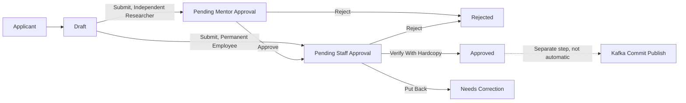
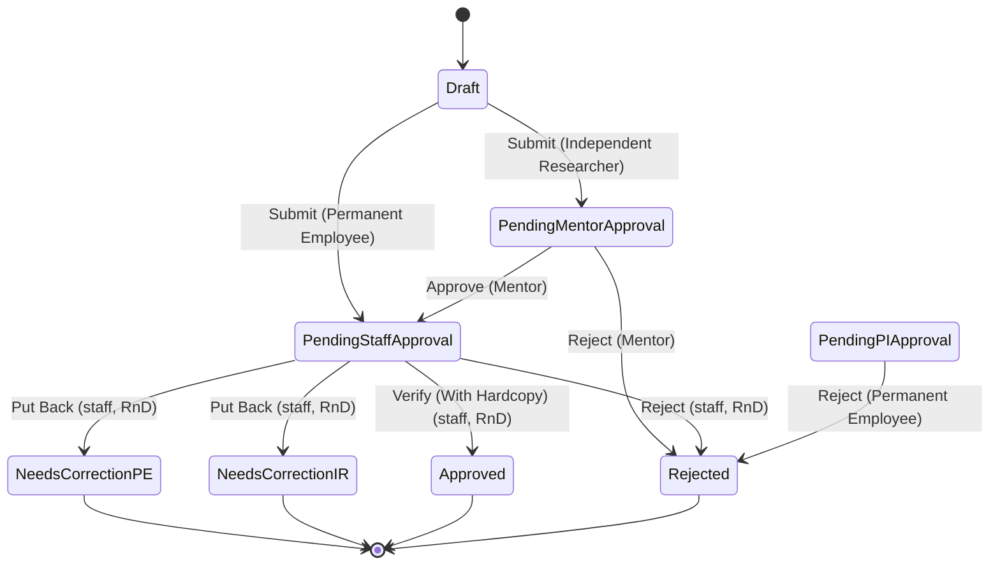

# Reimbursement User Manual

> This manual documents the **Reimbursement** DocType as it is actually configured in this Frappe/ERPNext installation (module `Rndopsapp`). It is based directly on the DocType schema, server-side APIs, the live Workflow configuration, and the Reimbursement→Kafka commit-publishing integration. Wherever the system's actual behavior is incomplete, inconsistent, or not enforced, this is called out explicitly with an **Important** or **Note** block instead of being assumed away.

---

## Table of Contents

1. [Overview](#1-overview)
2. [Business Process](#2-business-process)
3. [Workflow States](#3-workflow-states)
4. [Workflow Diagram](#4-workflow-diagram)
5. [Roles and Responsibilities](#5-roles-and-responsibilities)
6. [Permission Matrix](#6-permission-matrix)
7. [Navigation](#7-navigation)
8. [Getting Started](#8-getting-started)
9. [Creating a New Record](#9-creating-a-new-record)
10. [Screen-by-Screen Guide](#10-screen-by-screen-guide)
11. [Field Reference](#11-field-reference)
12. [Buttons and Actions](#12-buttons-and-actions)
13. [Approval Process](#13-approval-process)
14. [Notifications](#14-notifications)
15. [Attachments](#15-attachments)
16. [Reports](#16-reports)
17. [Audit Trail](#17-audit-trail)
18. [Business Rules](#18-business-rules)
19. [Frequently Asked Questions](#19-frequently-asked-questions)
20. [Common Errors](#20-common-errors)
21. [Best Practices](#21-best-practices)
22. [User Checklist](#22-user-checklist)
23. [Administrator Guide](#23-administrator-guide)
24. [Security](#24-security)
25. [Glossary](#25-glossary)
26. [Appendix](#26-appendix)

---

## 1. Overview

**Reimbursement** is the ERP module used to claim back money an employee, project staff member, or independent researcher has already spent out of pocket on project-related purchases (for example, lab consumables, small equipment, or vendor bills), where the purchase was not made through the normal Purchase Order/Purchase Request route.

- **What it is:** A submittable request document (`Reimbursement` DocType) that captures who is claiming, which project/budget head the expense belongs to, an itemized list of purchases with supporting bills, bank details for payment, and a set of mandatory declarations.
- **Why it exists:** Projects occasionally need staff to pay small vendors directly (cash memo/money receipt) instead of routing the purchase through Direct Purchase or Purchase Order. Reimbursement lets that expense be recorded, verified, and reconciled against the project's budget head.
- **Business purpose:** To formally record, verify, and approve out-of-pocket project expenses before they are paid back and committed against the project's account head.
- **Objectives:** Capture complete proof of purchase, route the claim through the correct verifier based on the applicant's employment type, and produce an auditable trail before money moves.
- **Who should use it:** Permanent Employees, Independent Researchers, and (per the child-table/attachment structure) anyone incurring project-related out-of-pocket expenses.
- **When it should be used:** After a purchase has already been made with personal funds and a bill/receipt exists — this is a reimbursement, not a purchase request.
- **Typical use case:** A Permanent Employee buys glassware worth ₹4,500 from a local vendor using personal funds, then files a Reimbursement with the bill attached against the relevant project and Budget Head.
- **Benefits:** Structured proof-of-purchase capture, declaration-based compliance, and a role-based verification step before the amount is committed against the project's budget.

> **Note**
>
> The Reimbursement form itself displays this printed rule to applicants:
> - Maximum Limit ₹1,00,000, not applicable for rate contract items.
> - Splitting a bill to apply for reimbursement of the same item is not allowed.

---

## 2. Business Process

### 2.1 Written explanation

A Reimbursement always starts as a **Draft**. The applicant fills in project/item/bank details, attaches bills per item, ticks the four declarations, and submits.

What happens after Submit depends on the applicant's role:

- A **Permanent Employee** applicant's claim goes straight to **Pending Staff Approval**, where a user with the **staff, RnD** role verifies it against the hardcopy bill and either approves it, rejects it, or puts it back for correction.
- An **Independent Researcher** applicant's claim first goes to **Pending Mentor Approval**. The **Mentor** either approves it (which forwards it to **Pending Staff Approval** for the same hardcopy verification) or rejects it outright.

From **Pending Staff Approval**, the staff/RnD verifier has three options: **Verify (With Hardcopy)** → **Approved**, **Reject** → **Rejected**, or **Put Back** → one of the "Needs Correction" states.

> **Important**
>
> As configured today, the "Needs Correction (PE)" and "Needs Correction (IR)" states have **no transition leading back** into `Pending Staff Approval` or `Draft`, and the `edit_reimbursement()` API only allows edits while `workflow_state == "Draft"`. In practice this means a document that is "Put Back" cannot be resubmitted through the normal workflow/API path — it requires manual intervention (e.g. a System Manager editing it directly in the Frappe Desk). Treat "Put Back" as a **dead end** until this is wired up, and verify with your workflow administrator before relying on it.

Reimbursement's **workflow state** and its **financial commit** (the entry that reduces available budget on the project's Account Head) are two separate steps:

1. Saving or forwarding a Reimbursement **never automatically publishes a commit**.
2. A separate call to the commit API (`commitPayment.submit_commit_data`) is required to publish the expense to the ledger service via Kafka (topic `account-head-commit-events`).
3. The commit amount is **not** calculated automatically from the itemized bill amounts in the record — whoever triggers the commit is responsible for supplying the correct total.

### 2.2 Numbered process

1. Applicant opens a new Reimbursement (optionally pre-filled from a Project Registration).
2. Applicant fills in project, item particulars (with bills), bank details, and declarations.
3. Applicant clicks **Save** (Draft) as many times as needed.
4. Applicant clicks **Submit**.
5. System routes the document based on applicant type (Permanent Employee vs. Independent Researcher).
6. Mentor approval (Independent Researcher only) → forwarded to staff verification.
7. Staff/RnD verification against hardcopy bill → **Approved**, **Rejected**, or **Put Back**.
8. (Separately, and manually) an authorized user/service triggers the commit publish so the amount is recorded against the project's Budget Head.

### 2.3 Mermaid flowchart

---

## 3. Workflow States

| State | Description | Responsible Role(s) to Edit | Available Actions From This State | Next Possible States |
|---|---|---|---|---|
| Draft | Initial editable state; applicant is filling in the form. | Permanent Employee, Independent Researcher | Submit | Pending Staff Approval, Pending Mentor Approval |
| Pending Mentor Approval | Awaiting the applicant's Mentor to review (Independent Researcher path only). | Mentor | Approve, Reject | Pending Staff Approval, Rejected |
| Pending Staff Approval | Awaiting hardcopy bill verification by a staff/RnD reviewer. | staff, RnD | Verify (With Hardcopy), Reject, Put Back | Approved, Rejected, Needs Correction (PE), Needs Correction (IR) |
| Needs Correction (PE) | Sent back to a Permanent Employee applicant for correction. | Permanent Employee | *(none configured)* | *(dead end — see [§2](#2-business-process))* |
| Needs Correction (IR) | Sent back to an Independent Researcher applicant for correction. | Independent Researcher | *(none configured)* | *(dead end — see [§2](#2-business-process))* |
| Needs Correction (PS) | Defined for a "project staff" correction path. | project staff | *(no transition references this state at all)* | — |
| Pending PI Approval | Defined as a PI-approval step. | Permanent Employee | Reject | Rejected |
| Approved | Final approved state. | System Manager | *(none configured)* | — |
| Rejected | Final rejected state. | System Manager | *(none configured)* | — |

> **Important — read before relying on this table**
>
> - **Needs Correction (PS)** and **Pending PI Approval** exist as configured workflow states but have **little or no wiring** to the rest of the flow (no transition ever moves a document *into* `Needs Correction (PS)`; nothing moves a document *into* `Pending PI Approval` either — the only transition involving it is an outgoing `Reject`). Treat these as reserved/incomplete states rather than a live part of the process until your workflow administrator confirms otherwise.
> - Every state above — including **Approved** and **Rejected** — is configured with **`doc_status = 0` (Draft)**. This means the underlying Frappe document `docstatus` never actually becomes "Submitted" (1) purely by moving through the workflow: even an "Approved" Reimbursement remains, at the framework level, a *draft* document. See [§24 Security](#24-security) for why this matters.
> - "Common Mistakes," "Timeline," and specific "Required Documents" per state are organization procedure, not something enforced in the system.
>
> **Assumption:** SLA/turnaround timelines for each state should be verified with your organization; the system does not enforce or record a due date per state.

---

## 4. Workflow Diagram

---

## 5. Roles and Responsibilities

| Role | Responsibility | Create | Edit | Submit (workflow action) | Approve/Verify | Reject | Cancel | Delete | Print | Remarks |
|---|---|---|---|---|---|---|---|---|---|---|
| Permanent Employee | Files claims for self; corrects "Needs Correction (PE)" records; can act on the (dead-end) Pending PI Approval → Reject transition. | Yes | Yes (Draft) | Yes | — | Yes (from Pending PI Approval) | Yes | Yes | Yes | Has full base DocType permission (see [§6](#6-permission-matrix)). |
| Independent Researcher | Files claims for self; routed through Mentor approval first. | Yes | Yes (Draft) | Yes | — | — | — | — | — | No explicit base DocType permission row exists for this role — see the Important note below. |
| Mentor | Reviews and approves/rejects Independent Researcher claims before staff verification. | — | — | — | Yes (Approve) | Yes | — | — | — | No explicit base DocType permission row exists for this role — see the Important note below. |
| staff, RnD | Verifies the claim against the physical/hardcopy bill; can approve, reject, or put back. | Yes | Yes (Pending Staff Approval) | — | Yes (Verify With Hardcopy) | Yes | Yes | Yes | Yes | Has full base DocType permission, same level as Permanent Employee. |
| project staff | Named as the edit role for "Needs Correction (PS)". | — | Yes (that state, if reached) | — | — | — | — | — | — | No explicit base DocType permission row; state is otherwise unreferenced. |
| Hos, RnD (Head of Section, RnD) | Read-only oversight/export of Reimbursement records. | — | — | — | — | — | — | — | — | Read + Export only. |
| Dean, RnD | Read-only oversight/export of Reimbursement records. | — | — | — | — | — | — | — | — | Read + Export only. |
| System Manager | Administers the DocType, Workflow, and Print Format; can edit records in Approved/Rejected state. | Yes | Yes | — | — | — | No (`cancel = 0`) | Yes | Yes | Full admin access except cancel/amend. |

> **Important**
>
> `Independent Researcher`, `Mentor`, and `project staff` are all referenced by name in the **Workflow** (as transition-allowed roles or state edit-roles) but have **no row at all** in the DocType's own permission list (neither `DocPerm` nor `Custom DocPerm` — see [§6](#6-permission-matrix)). A user who holds *only* one of these roles may not have baseline `read`/`write` access to the Reimbursement list in the first place, unless they are also granted one of the roles listed in §6 through another mechanism (e.g. a broader role, User Permission, or a permission source outside what's in this DocType's own configuration). **Verify actual access for these three roles in Role Permissions Manager before assuming the documented workflow works for them end-to-end.**

---

## 6. Permission Matrix

This is the DocType's actual configured permission set (base `DocPerm` plus `Custom DocPerm` overrides in this site):

| Role | Read | Write | Create | Submit | Cancel | Amend | Delete | Print | Email | Report | Export | Share |
|---|---|---|---|---|---|---|---|---|---|---|---|---|
| System Manager | ✔ | ✔ | ✔ | ✔ | ✘ | ✘ | ✔ | ✔ | ✔ | ✔ | ✔ | ✔ |
| Permanent Employee | ✔ | ✔ | ✔ | ✔ | ✔ | ✔ | ✔ | ✔ | ✔ | ✔ | ✔ | ✔ |
| staff, RnD | ✔ | ✔ | ✔ | ✔ | ✔ | ✔ | ✔ | ✔ | ✔ | ✔ | ✔ | ✔ |
| Hos, RnD (Head of Section, RnD) | ✔ | ✘ | ✘ | ✘ | ✘ | ✘ | ✘ | ✘ | ✘ | ✘ | ✔ | ✘ |
| Dean, RnD | ✔ | ✘ | ✘ | ✘ | ✘ | ✘ | ✘ | ✘ | ✘ | ✘ | ✔ | ✘ |

**Why each permission exists:**

- **Permanent Employee** and **staff, RnD** get the widest access because these are the two roles that actively create, edit, and process claims end-to-end (applicant + verifier).
- **System Manager** gets administrative access for setup and exception-handling, but not `cancel`/`amend` — consistent with the workflow not driving the document to a true "Submitted" `docstatus` in the first place (see [§24](#24-security)).
- **Hos, RnD** and **Dean, RnD** get read + export only, for oversight/reporting without the ability to alter records.

> **Important**
>
> `Permanent Employee` and `staff, RnD` both have **`delete = 1`**. Combined with the fact that no workflow state ever sets `docstatus = 1` ([§3](#3-workflow-states)), an **Approved** Reimbursement is still, at the framework level, a deletable draft document for anyone holding either of those roles. Frappe's normal "submitted documents can't be deleted" protection does not apply here. If this is not the intended control, add a role restriction, a validation hook, or fix the workflow states to actually submit the document on approval.

---

## 7. Navigation

- Reimbursement is a standard DocType in the **Rndopsapp** module — reachable from the Frappe Desk via the module's workspace/sidebar, or directly at `/app/reimbursement`.
- **Search:** Use Global Search (Ctrl/Cmd+G) or the Awesomebar and type "Reimbursement".
- **List view:** `/app/reimbursement` shows all records the current user's role can read.
- **Favorites / Recent Documents:** Standard Frappe Desk behavior — once opened, a Reimbursement appears in Recent Documents; it can be starred as a Favorite from the form.

> **Note**
>
> No custom Workspace record specific to Reimbursement was found in this site at review time — it is accessed like any standard DocType unless your organization has since added a dedicated workspace shortcut.

---

## 8. Getting Started

**Prerequisites**

- A Frappe user account with one of the roles in [§6](#6-permission-matrix) (or one of the workflow-only roles in [§5](#5-roles-and-responsibilities), once its base access is confirmed).
- Knowledge of the **Project Registration** the expense belongs to (its name/number).
- The physical or scanned bill/receipt for each item being claimed.

**Master data required before filing a claim**

| Master Data | DocType | Purpose |
|---|---|---|
| Project Registration | `Project Registration` | Identifies which project the expense is charged to; can pre-fill project name/number and, if exactly one exists, the linked Fund Sanction. |
| Budget Head | `Budget Head` | The account head the expense is charged against. |
| User | `User` | Applicant and, for "Other" claims, the person being claimed for (PI). |
| Department_prornd | `Department_prornd` | Source of the applicant's/PI's department, fetched automatically from the User record. |

**Dependencies**

- If a **Fund Sanction** exists for the project, the system will try to prefill `sanction_ref_no` when there is exactly one match.
- Bank auto-fill depends on a `Bank` master and a `User Bank` doctype for account lookups.

> **Important**
>
> The backend code path that auto-fills bank details looks up a doctype called **`User Bank`**, which **does not exist in this app**. That lookup will always silently fail (it's wrapped in a try/except), so in practice **applicants must always type their bank name, account number, and IFSC code manually** — do not rely on auto-fill for bank details.

---

## 9. Creating a New Record

Follow these steps in order. Each step lists the field(s) involved — see [§11 Field Reference](#11-field-reference) for full details on every field.

### Step 1 — Open a new Reimbursement

- **Navigation:** `/app/reimbursement/new`, or launch it from a Project Registration record if your frontend supports it.
- **Purpose:** Start a Draft.
- **Expected result:** A blank form in Draft state; `applicant_webmail` is prefilled to the current logged-in user where possible.

### Step 2 — Applicant / "Applying for" details

- If **Applying for self or other?** (`self_other`) is "Self" (the default), the **Applicant Details** section is shown: `applicant_webmail`, with `applicant_department` and `applicant_designation` auto-fetched (read-only) from the User record.
- If it is "Other", the **Applying for** section is shown instead: `reimbursement_for_id` (PI Webmail Id), with `reimbursement_for_department` / `reimbursement_for_designation` auto-fetched.

> **Important**
>
> `self_other` is a **read-only** field on the DocType and is **not included** in the list of fields the `save_reimbursement_data()` / `edit_reimbursement()` APIs will write. In practice, this means the value cannot be changed from Draft through the normal save/edit flow described in this manual — it stays at its default, **"Self"**. If your organization needs the "Applying for Other" path, it currently requires a System Manager to set it directly (e.g. via the Frappe Desk or a script). **Assumption:** confirm with your workflow/frontend team whether a UI exists elsewhere that sets this field before relying on the "Other" path.

### Step 3 — Bank Details

- Fill in `account_holder_name`, `bank_name`, `bank_account_number`, `ifsc_code`. None of these are auto-verified against a bank master (see [§8](#8-getting-started)) — enter them carefully, since this is where the reimbursement amount will be paid.

### Step 4 — Project and Item Details

- `project_name` / `project_number` (both hidden fields, normally prefilled by the frontend when launched from a Project Registration).
- `account_head` — select the Budget Head this expense should be charged to. If the correct head isn't listed, select "Other" and use `other_head` to specify it (only shown when `account_head == "Other"`).
- `comment` — free-text note about the claim.
- **Particulars of Items** (`table_bosk`) — add one row per bill:
  - `r_date` — date of purchase.
  - `vendors_name` — vendor/shop name.
  - `particulars` — description of the item purchased.
  - `amount` — the bill amount (**Data field, not Currency** — see [§18 Business Rules](#18-business-rules)).
  - `uploads` — attach a scan/photo of the bill for this row.

### Step 5 — Declarations

Tick all four declaration checkboxes (`dec1`–`dec4`) — see [§11](#11-field-reference) for exact wording. These are not server-enforced as mandatory, but should be treated as required before submission (see [§22 User Checklist](#22-user-checklist)).

### Step 6 — Save

Click **Save** to persist the Draft. You can save and return to it repeatedly while in Draft state.

### Step 7 — Submit

Click **Submit** to move the claim into the workflow. The system routes it to **Pending Staff Approval** (Permanent Employee) or **Pending Mentor Approval** (Independent Researcher) — see [§4](#4-workflow-diagram).

> **Warning**
>
> Once submitted past Draft, editing through the standard `edit_reimbursement()` API is blocked (`workflow_state` must be `"Draft"`). Double-check all fields, items, and attachments before clicking Submit.

---

## 10. Screen-by-Screen Guide

| Screen Area | What It Shows |
|---|---|
| **Header** | Document name (auto-generated, see [§25 Glossary](#25-glossary) for the naming format), current `workflow_state` badge, docstatus indicator. |
| **Toolbar / Menu** | Save, Submit, Print, Email, Duplicate, and other standard Frappe Desk actions available per the user's permissions in [§6](#6-permission-matrix). |
| **Rules panel** | An HTML block (`rules_content`) displayed alongside the form, listing the ₹1,00,000 maximum-limit and no-bill-splitting rules. |
| **Sections** | Applying-for / Applicant Details (conditional on `self_other`), Bank Details, Project and Item Details, Declarations. |
| **Particulars of Items grid (`table_bosk`)** | Editable child table grid — Date, Vendor's Name, Particulars, Amount, Uploads columns are all shown in list view (`in_list_view = 1`). |
| **Attachments** | Standard Frappe attachment panel at the document level, plus per-row `uploads` inside the item grid. |
| **Comments / Timeline** | Standard Frappe comment thread and activity timeline (state changes, saves, etc.). |
| **Print** | Uses the custom **"Reimbursement print"** Print Format (Jinja-based). |
| **Status Indicator** | Reflects `workflow_state` (Draft, Pending Staff Approval, Pending Mentor Approval, Needs Correction (…), Approved, Rejected). |

> **Note**
>
> No custom Client Script was found attached to the Reimbursement DocType at review time, so field show/hide behavior beyond what's declared in `depends_on` in the schema (e.g. `applying_for_section`, `other_head`) is standard Frappe form rendering, not custom JS logic.

---

## 11. Field Reference

### Parent fields (`Reimbursement`)

| Field | Fieldname | Required | Data Type | Description | Default | Editable By |
|---|---|---|---|---|---|---|
| Applying for self or other? | `self_other` | No | Select (Self / Other) | Determines whether the "Applicant Details" or "Applying for" section is shown. | Self | Not editable via app APIs — see [§9](#9-creating-a-new-record) |
| PI Webmail Id | `reimbursement_for_id` | No | Link → User | The person the claim is being filed for, when `self_other = Other`. | — | Applicant (Draft) |
| Department | `reimbursement_for_department` | No | Data (fetched) | Auto-fetched from `reimbursement_for_id.department_name`. | — | System (fetch) |
| Designation | `reimbursement_for_designation` | No | Data (fetched) | Auto-fetched from `reimbursement_for_id.designation_name`. | — | System (fetch) |
| Webmail Id | `applicant_webmail` | No | Link → User | The applicant, when `self_other = Self`. Prefilled to the logged-in user. | Session user | Applicant (Draft) |
| Department | `applicant_department` | No | Data (fetched, read-only) | Auto-fetched from `applicant_webmail.department_name`. | — | System (fetch) |
| Designation | `applicant_designation` | No | Data (fetched, read-only) | Auto-fetched from `applicant_webmail.designation_name`. | — | System (fetch) |
| Account Holder Name | `account_holder_name` | No | Data | Name on the bank account to be paid. | — | Applicant (Draft) |
| Bank Name | `bank_name` | No | Data | Not linked to a Bank master by default — see [§8](#8-getting-started). | — | Applicant (Draft) |
| Bank Account Number | `bank_account_number` | No | Data | — | — | Applicant (Draft) |
| IFSC Code | `ifsc_code` | No | Data | — | — | Applicant (Draft) |
| Project Name | `project_name` | No | Link → Project Registration (hidden) | Project the claim belongs to. | — | System/frontend prefill |
| Project Number | `project_number` | No | Data (hidden, read-only) | Note: `options` points to "Project Registration" even though the fieldtype is Data, not Link — a schema quirk, not a real link. | — | System/frontend prefill |
| Account Head | `account_head` | No | Link → Budget Head | The budget head the expense is charged against. | — | Applicant (Draft) |
| *(Other Account Head)* | `other_head` | No | Data | Shown only when `account_head == "Other"`. Manually specify the head. | — | Applicant (Draft) |
| Comment | `comment` | No | Small Text | Free-text note. | — | Applicant (Draft) |
| Particulars of Items | `table_bosk` | No | Table → Particulars of Items Reimbursement | Itemized bill list — see child table below. | — | Applicant (Draft) |
| None of the items are purchased or under rate contract. | `dec1` | No (not server-enforced) | Check | Declaration 1. | 0 | Applicant (Draft) |
| The items purchased were approved by the funding agency. | `dec2` | No (not server-enforced) | Check | Declaration 2. | 0 | Applicant (Draft) |
| "I, am personally satisfied that goods purchased." | `dec3` | No (not server-enforced) | Check | Declaration 3 (label text is verbatim from the schema, including punctuation). | 0 | Applicant (Draft) |
| I stock entered the items… (see full label in system) | `dec4` | No (not server-enforced) | Check | Declaration 4 — confirms stock entry was recorded on the reverse of the cash memo/receipt with signature. | 0 | Applicant (Draft) |
| Amended From | `amended_from` | No | Link → Reimbursement (hidden, read-only) | Standard Frappe amend-history link; see [§24](#24-security) for why amendment may not trigger in practice. | — | System |
| Workflow State | `workflow_state` | No | Data (read-only) | Current workflow state label, driven by the Workflow engine. | Draft | System (workflow engine) |

> **Note**
>
> **No field on this DocType is flagged `reqd` (server-mandatory)** in the schema — including project, account head, item rows, bank details, and declarations. Any "required field" enforcement your organization expects happens only in the frontend UI (not reviewed as part of this manual) or must be added as a validation. **Assumption:** confirm with your frontend/implementation team which fields their form treats as mandatory before publishing this as a compliance-critical control.

### Child table fields (`Particulars of Items Reimbursement`, table field `table_bosk`)

| Field | Fieldname | Data Type | Shown in Grid | Description |
|---|---|---|---|---|
| Date | `r_date` | Date | Yes | Date of purchase. |
| Vendor's Name | `vendors_name` | Data | Yes | Vendor/shop the item was purchased from. |
| Particulars | `particulars` | Data | Yes | Description of the item. |
| Amount | `amount` | Data | Yes | Bill amount — stored as **plain text (Data)**, not Currency/Float. See [§18](#18-business-rules). |
| Uploads | `uploads` | Attach | Yes | Scan/photo of the bill for this specific row. |

---

## 12. Buttons and Actions

| Button / Action | Visible To | Purpose | Result |
|---|---|---|---|
| Save | Anyone with write access in the current state | Persist changes without changing workflow state | Document saved, `workflow_state` unchanged |
| Submit | Applicant, while in Draft | Move the document into the approval workflow | Calls the "Submit" transition → `Pending Staff Approval` or `Pending Mentor Approval` |
| Approve | Mentor, while in Pending Mentor Approval | Forward an Independent Researcher's claim | → `Pending Staff Approval` |
| Verify (With Hardcopy) | staff, RnD, while in Pending Staff Approval | Confirm the physical bill matches the claim | → `Approved` |
| Reject | Mentor / staff, RnD / Permanent Employee, depending on state | Stop the claim | → `Rejected` |
| Put Back | staff, RnD, while in Pending Staff Approval | Return the claim for correction | → `Needs Correction (PE)` or `Needs Correction (IR)` — see the dead-end note in [§3](#3-workflow-states) |
| Print | Roles with `print = 1` (see [§6](#6-permission-matrix)) | Generate a printable form | Uses the "Reimbursement print" Print Format |
| Delete | Permanent Employee, staff, RnD, System Manager | Remove the record | See the [§6](#6-permission-matrix) Important note about deletable "Approved" records |
| Amend | Permanent Employee, staff, RnD (permission granted) | Standard Frappe amend | In practice unlikely to trigger — see [§24](#24-security) |

> **Note**
>
> "Assign," "Share," "Export," "Import," and "Version" are standard Frappe Desk features available generically to any DocType and were not specifically customized for Reimbursement.

---

## 13. Approval Process

- **Approval hierarchy:**
  - Permanent Employee path: Applicant → staff, RnD verifier → done.
  - Independent Researcher path: Applicant → Mentor → staff, RnD verifier → done.
- **Approval sequence:** Strictly sequential, single approver per stage — there is no parallel or multi-approver step configured.
- **Delegation / Escalation:** Not implemented in the Workflow configuration reviewed. If your organization needs this, it must be added.
- **Conditional approvals:** The only conditional routing is by applicant type (`self_other`/role at Submit time — Permanent Employee vs. Independent Researcher), which determines the first approval stop.
- **Approval limits:** The printed rule states a ₹1,00,000 maximum limit (not applicable to rate contract items), but this is **not enforced by the system** — it is a printed instruction only, not a validation.
- **Rejection:** Available at every active review stage (`Pending Mentor Approval`, `Pending Staff Approval`, and the largely-disconnected `Pending PI Approval`), and moves the document to `Rejected`.
- **Resubmission:** Not currently implemented as a workflow path — see the "Needs Correction" dead-end note in [§3](#3-workflow-states).

> **Assumption:** Any approval-limit escalation policy (e.g., amounts above ₹1,00,000 requiring a different approver) should be confirmed with your organization and, if required, implemented as an actual validation rather than relying on the printed rule text.

---

## 14. Notifications

> **Important**
>
> No `Notification` (Notification/Alert) record and no `Server Script` hook were found configured against the `Reimbursement` DocType in this site at review time, and the Workflow's `send_email_alert` flag is **disabled**. In practice, this means:
>
> - There is **no automatic email notification** when a claim moves between states.
> - There is **no automatic assignment/ToDo** created for the next approver (confirmed directly in the reimbursement forward-flow implementation notes — see [§23](#23-administrator-guide)).
>
> Reviewers must currently check the Reimbursement list manually, or your organization must add Notifications/assignment logic if timely alerts are required. **Assumption:** verify whether notifications are handled by a separate service (e.g. the frontend app, or an external system) not reviewed here.

---

## 15. Attachments

- **Mandatory Documents:** The bill/receipt scan is expected per item row (`uploads` on each `table_bosk` row), though this is not server-enforced as mandatory.
- **Optional Documents:** General document-level attachments via the standard Frappe attachment panel.
- **Allowed Formats / Maximum File Size:** Controlled by standard Frappe file-upload settings (site-wide), not customized specifically for this DocType.
- **Upload mechanism:** When a row is saved with a `uploads` value containing `file_name` and base64 `file_data`, the backend (`save_file()`) stores it and replaces the field with the resulting file URL.
- **Best Practice:** Attach one clear scan/photo per item row rather than a single combined attachment, so each bill can be matched to its `particulars` row during hardcopy verification.
- **Common Errors:** If the upload payload is malformed, the backend logs the failure (`Reimbursement File Upload` error log) and sets `uploads` to `None` for that row rather than blocking the save — so a failed attachment can silently leave a row without its bill. Always check that each row shows its attachment after saving.

---

## 16. Reports

No custom Report (Query Report / Report Builder) specific to Reimbursement was found in this app at review time.

- **Available today:** The standard Frappe **List View** (with filters, sorting, and export) and the standard **Report View** for the Reimbursement DocType, using whatever fields the current role can read.
- **Typical use cases:** Filtering by `workflow_state`, `project_name`/`project_number`, or `account_head` to see pending verifications or claims per project/budget head.
- **Financial reconciliation:** Actual committed amounts against a project's Budget Head are tracked separately, via the Kafka `account-head-commit-events` topic and the downstream ledger service — **not** by querying the Reimbursement DocType directly, since the commit amount is supplied independently and not derived from `table_bosk`.

> **Assumption:** If your organization has a dedicated Reimbursement report or dashboard, it lives outside the `rndopsapp` doctype/report fixtures reviewed for this manual — confirm its location with your reporting team.

---

## 17. Audit Trail

- **Timeline:** Standard Frappe document Timeline records saves, workflow state changes made via `doc.save()`/`doc.submit()`, and any comments.
- **Comments:** Standard Frappe comment thread on the form.
- **Workflow History:** Each `workflow_state` change is visible in the Timeline as the field is updated and saved; there is no separate dedicated workflow-history child table on this DocType.
- **Version History:** Standard Frappe version tracking applies if enabled at the site level.
- **Who changed what / when:** Available via the standard Frappe Timeline and `Version` doctype, same as any other DocType — no custom audit logging was added specifically for Reimbursement.
- **Errors:** Save/edit/forward failures are written to the Frappe **Error Log** under the titles `Reimbursement Save Error`, `Reimbursement Edit Error`, and `Reimbursement Action Error`/`Reimbursement Submit Error` — System Managers can review these for troubleshooting.

---

## 18. Business Rules

| Rule | Detail | Enforced by System? |
|---|---|---|
| Maximum claim limit | ₹1,00,000, not applicable for rate contract items. | **No** — printed instruction only, not validated. |
| No bill-splitting | Splitting one item's bill across multiple reimbursement claims is not allowed. | **No** — printed instruction only, not validated. |
| Applicant routing | Permanent Employee → staff verification directly; Independent Researcher → Mentor first. | **Yes** — enforced by the Workflow transition's `allowed` role per action. |
| Declarations (`dec1`–`dec4`) | Applicant must tick the four declaration checkboxes. | **No** — not a mandatory field at the schema level. |
| Item amount is free text | `table_bosk.amount` is a Data field, not Currency/Float. | System does not validate it is numeric, and does not sum it anywhere automatically. |
| Commit amount is independent | The financial commit published to the ledger is supplied directly by the caller, not derived from `table_bosk` totals. | By design (see [§2](#2-business-process)) — a caller could publish a commit that doesn't match the itemized total. |
| No server-side mandatory fields | Nothing on the parent DocType is flagged `reqd`. | Confirmed from schema — see [§11](#11-field-reference). |

> **Assumption:** Department-level or organization-specific budget/duplicate-prevention rules beyond what's listed above should be confirmed with your organization; none were found implemented in the Reimbursement DocType or its Python controller.

---

## 19. Frequently Asked Questions

1. **What is Reimbursement used for?**
   Claiming back money already spent personally on a project-related purchase, supported by a bill.

2. **Can I use Reimbursement instead of a Purchase Request?**
   No — Reimbursement is for expenses already paid for personally; use Purchase Request/Direct Purchase/Purchase Order for new purchases going through the normal procurement route.

3. **Is there a maximum amount I can claim?**
   The form states ₹1,00,000 as the maximum limit (not applicable to rate contract items), though this is not system-enforced — follow it as organizational policy.

4. **Can I split one bill into two reimbursement claims?**
   No — this is explicitly disallowed by the printed rule on the form.

5. **Who approves my claim if I am a Permanent Employee?**
   A user with the "staff, RnD" role, who verifies against the hardcopy bill.

6. **Who approves my claim if I am an Independent Researcher?**
   Your Mentor first, then a "staff, RnD" verifier.

7. **What happens if my claim is "Put Back" for correction?**
   As currently configured, there is no workflow path to resubmit it automatically — contact your System Manager/administrator (see the Important note in [§3](#3-workflow-states)).

8. **Can I edit my claim after I submit it?**
   No — editing via the standard app flow is only allowed while the document is in Draft state.

9. **Will I get an email when my claim is approved or rejected?**
   Not automatically — no notification is currently configured for this DocType (see [§14](#14-notifications)). Check the list view or ask your verifier directly.

10. **Does approving my claim mean the money is committed against the project budget?**
    Not automatically — approval and the financial "commit" to the ledger are separate steps (see [§2](#2-business-process)).

11. **Why is my bank name not auto-filled?**
    The bank auto-fill lookup depends on a doctype that isn't installed in this app — always enter bank details manually.

12. **Can I file a claim for someone else?**
    The form has an "Applying for Other" option, but as currently wired, that flag cannot be changed through the standard save/edit flow — confirm with your administrator if you need this.

13. **What documents should I attach?**
    A scan or photo of the bill/receipt for each item row.

14. **What if my attachment upload fails?**
    The row will save without the attachment (the backend logs the failure) — always verify each row shows its attachment after saving.

15. **Can I delete my claim after it's Approved?**
    Technically, if you hold the "Permanent Employee" or "staff, RnD" role, yes — see the Important note in [§6](#6-permission-matrix). Treat this as a control gap, not an intended feature.

16. **Is the Amount field validated as a number?**
    No — it is a plain text field; enter numeric values carefully.

17. **What roles can see all Reimbursement claims for oversight?**
    "Hos, RnD" and "Dean, RnD" have read + export access.

18. **How is the document ID generated?**
    Automatically, in the format `{Year}{Month}{Day}{project_number}-{####}` (see [§25 Glossary](#25-glossary)).

19. **What print format is used?**
    A custom Jinja-based format named "Reimbursement print".

20. **Who do I contact if a workflow action button is missing?**
    Your System Manager/workflow administrator — it likely means your role isn't listed as `allowed` on that transition (see [§4](#4-workflow-diagram) and [§5](#5-roles-and-responsibilities)).

21. **Does declaring the four checkboxes matter if they're not mandatory?**
    Yes, organizationally — they are compliance statements even though the system won't block submission if left unticked. Always tick them truthfully before submitting.

---

## 20. Common Errors

| Problem | Possible Cause | Solution |
|---|---|---|
| "Cannot edit a submitted or cancelled document. Document must be in Draft state." | Trying to edit via `edit_reimbursement()` after Submit. | Editing is only allowed in Draft; if correction is needed post-submission, escalate to your workflow administrator (see [§3](#3-workflow-states) dead-end note). |
| Workflow action button missing/greyed out | Your role isn't in the `allowed` list for that transition from the current state. | Check [§4](#4-workflow-diagram)/[§5](#5-roles-and-responsibilities) for who can act on the current state; ask that person, or request a role change. |
| "No valid transition found for action '…' from state '…'." | Attempted action doesn't exist from the document's current `workflow_state` (e.g. calling Submit twice). | Refresh the document to see its current state, then choose an available action. |
| Bank details not auto-filled | The `User Bank` lookup doctype doesn't exist in this installation. | Enter bank details manually every time (see [§8](#8-getting-started)). |
| Bill attachment missing after save | File payload was malformed; upload failed silently and was logged. | Check the Frappe Error Log ("Reimbursement File Upload"), then re-upload the attachment for that row. |
| Reimbursement stuck in "Needs Correction" | No workflow transition currently leads out of this state. | Contact your System Manager for manual correction/resubmission (see [§3](#3-workflow-states)). |
| Amount doesn't total correctly in downstream reports | `amount` is free text, and commit totals are entered independently, not summed from item rows. | Manually verify totals; consider requesting numeric validation and auto-sum as an enhancement. |
| Claim disappears / can't be found after Approval | Deleted by a user with `delete` permission (Permanent Employee/staff, RnD) since Approved records are still technically draft `docstatus`. | Check the Deleted Documents log; consider restricting delete permission on Approved records. |

---

## 21. Best Practices

- **Recommended workflow:** Save the Draft as you go and attach each bill to its own item row before submitting, rather than adding all rows and attachments at the very end.
- **Common mistakes to avoid:** Leaving `amount` non-numeric, forgetting to tick declarations, splitting one vendor bill across two claims (explicitly disallowed).
- **Data quality tips:** Enter bank details carefully since there is no automatic verification; double-check `account_head`/`other_head` matches the correct Budget Head.
- **Compliance recommendation:** Treat the four declarations as mandatory in practice even though the system does not enforce them.
- **Performance/process recommendation:** Because commit publishing is a separate manual step from workflow approval ([§2](#2-business-process)), agree within your team on exactly *when* (e.g., immediately after "Verify With Hardcopy") the commit call should be triggered, so approved claims don't sit un-committed.

---

## 22. User Checklist

Before clicking Submit, verify:

- [ ] Applicant/PI details section matches who the claim is actually for.
- [ ] Project Name/Number is correct.
- [ ] Account Head (or Other Account Head, if applicable) is correct.
- [ ] Every purchased item has its own row in Particulars of Items, with Date, Vendor's Name, Particulars, and Amount filled in.
- [ ] A bill/receipt is attached to each item row.
- [ ] Bank details (Account Holder Name, Bank Name, Account Number, IFSC Code) are correct — they are not auto-verified.
- [ ] All four declarations are ticked truthfully.
- [ ] Total claimed amount is within the ₹1,00,000 limit (or the item is a rate contract exception).
- [ ] No single vendor bill has been split across multiple claims.

---

## 23. Administrator Guide

**Configuration**

- DocType: `rndopsapp/rndopsapp/doctype/reimbursement/reimbursement.json`
- Child table: `rndopsapp/rndopsapp/doctype/particulars_of_items_reimbursement/particulars_of_items_reimbursement.json`
- Controller: `rndopsapp/rndopsapp/doctype/reimbursement/reimbursement.py`
- Workflow: `Workflow` record named `Reimbursement`, `document_type = Reimbursement`, `workflow_state_field = workflow_state`, `is_active = 1`, `send_email_alert = 0`.
- Print Format: `Reimbursement print` (Jinja).

**Key server-side APIs (all `@frappe.whitelist()`)**

| API | Purpose |
|---|---|
| `get_reimbursement_fields(doc_name=None)` | Returns field metadata (incl. child table) plus prefill data/link options; optionally seeded from a Project Registration name. |
| `save_reimbursement_data(data)` | Creates or updates a Reimbursement (parent + `table_bosk`), including inline attachment upload. |
| `edit_reimbursement(data)` | Same as save, but restricted to Draft-state documents only. |
| `get_reimbursement_workflow_actions(docname)` | Returns the list of workflow actions available to the current user from the document's current state. |
| `perform_reimbursement_action(docname, action)` | Executes a named workflow transition and updates `workflow_state` (and `docstatus`, per the target state's `doc_status`). |
| `submit_reimbursement(docname)` | Convenience wrapper that performs the "Submit" transition from the current state. |
| `commitPayment.submit_commit_data(...)` | Separate API that publishes the financial commit event to Kafka topic `account-head-commit-events`. Not called automatically by any of the APIs above. |

**Workflow configuration (states/transitions)** — see [§3](#3-workflow-states) and [§4](#4-workflow-diagram) for the full, verified table.

**Maintenance / Monitoring**

- Watch the Frappe **Error Log** for entries titled `Reimbursement Save Error`, `Reimbursement Edit Error`, `Reimbursement Action Error`, `Reimbursement Submit Error`, and `Reimbursement File Upload`.
- Confirm Kafka connectivity for the `AccountHeadCommitProducer` if commit publishing is expected to work.

**Known gaps to review with the workflow/product owner**

1. `Needs Correction (PE)` / `Needs Correction (IR)` have no return transition (dead end).
2. `Needs Correction (PS)` and `Pending PI Approval` are effectively disconnected from the live flow.
3. No workflow state ever sets `docstatus = 1`, so submission/cancel/amend framework protections don't fully apply.
4. `Independent Researcher`, `Mentor`, and `project staff` roles are used in the Workflow but have no base DocType permission row.
5. No Notification/email alert or auto-assignment exists for state changes.
6. `self_other` cannot be changed via the app's own save/edit APIs.

---

## 24. Security

- **Access Control:** Governed by the Role Permission Manager entries in [§6](#6-permission-matrix) (`DocPerm`/`Custom DocPerm`), plus the Workflow transition `allowed` roles in [§4](#4-workflow-diagram) that gate which action buttons appear.
- **Role Restrictions:** Only Permanent Employee, staff-RnD, and System Manager have full CRUD; Hos/Dean RnD are read+export only.
- **Confidential Data:** Bank account number and IFSC code are stored as plain `Data` fields — there is no field-level encryption or masking configured on this DocType.
- **Data Ownership:** Standard Frappe `owner`/`modified_by` tracking applies.
- **Audit Compliance:** See [§17](#17-audit-trail) — standard Frappe Timeline/Version history only; no custom audit trail was added.
- **Retention Policy:** Not configured at the DocType level; follows whatever site-wide retention/backup policy your organization applies.

> **Important**
>
> Because every workflow state (including Approved/Rejected) keeps `docstatus = 0`, Reimbursement records never gain the framework-level protection Frappe normally gives to submitted documents (e.g., "submitted documents require cancel-then-delete"). Combined with `delete = 1` for Permanent Employee and staff, RnD ([§6](#6-permission-matrix)), an already-approved claim can be deleted outright by those roles. If financial-record retention is a compliance requirement, this should be reviewed and likely fixed (e.g., by having the "Approved"/"Rejected" states actually submit the document, or by restricting delete permission once `workflow_state` is terminal).

---

## 25. Glossary

| Term | Meaning |
|---|---|
| **DocType** | A Frappe framework term for a data model/table definition — e.g. `Reimbursement` itself, or `Particulars of Items Reimbursement` for its child table. |
| **Workflow** | The Frappe engine that moves a document through named states via role-gated transitions/actions. |
| **Workflow State** | The current named status of a document within its Workflow (e.g. "Pending Staff Approval"). |
| **docstatus** | The framework-level lifecycle flag of a document: 0 = Draft, 1 = Submitted, 2 = Cancelled. Distinct from `workflow_state`, which is just a labeled field — see the Important notes in [§3](#3-workflow-states) and [§24](#24-security) for why the distinction matters here. |
| **Draft** | The initial, freely editable state of a document, before Submit. |
| **Submit** | The workflow action that moves a Draft into the approval process. |
| **Approval** | A role-gated transition that advances the document toward "Approved". |
| **Put Back** | A transition intended to return a document for correction (currently a dead end for this DocType — see [§3](#3-workflow-states)). |
| **Commit (financial)** | A separate event published to the ledger service (via Kafka) that records the expense against a project's Budget Head; independent from workflow approval. |
| **Budget Head / Account Head** | The `Budget Head` DocType record an expense is charged against. |
| **Amendment** | Standard Frappe mechanism to create a new version of a cancelled submitted document, linked via `amended_from` — unlikely to trigger for this DocType in practice (see [§24](#24-security)). |
| **Permission / Role** | Frappe's access-control mechanism; see [§6](#6-permission-matrix) for the exact roles configured on this DocType. |
| **Validation** | Server- or client-side rule that blocks invalid data; largely **absent** on this DocType at the schema level (see [§11](#11-field-reference) and [§18](#18-business-rules)). |

---

## 26. Appendix

**Workflow Summary:** Draft → (Pending Mentor Approval →) Pending Staff Approval → Approved / Rejected, with an unreachable "Put Back" branch to "Needs Correction" states. Full detail in [§3](#3-workflow-states)/[§4](#4-workflow-diagram).

**Role Summary:** Permanent Employee and staff, RnD hold full CRUD; Mentor and Independent Researcher are workflow-only; Hos/Dean RnD are read+export; System Manager is administrative. Full detail in [§5](#5-roles-and-responsibilities)/[§6](#6-permission-matrix).

**Quick Navigation:** `/app/reimbursement` (list), `/app/reimbursement/new` (new record).

**Quick Reference — Naming:** Document names follow `{YYYY}{MM}{DD}{project_number}-{####}` (e.g. a claim created on 9 July 2026 for project number `2026001` would be named like `20260709 2026001-0001`, formatting per Frappe's `format:` autoname rule).

**Related Modules:** Project Registration, Fund Sanction, Fund Received, Budget Head, and — for the financial side — the Account Head Commit / Kafka ledger integration documented in `apps/rndopsapp/REIMBURSEMENT_FORWARD_COMMIT_IMPLEMENTATION.md`.

**References:**
- `apps/rndopsapp/rndopsapp/rndopsapp/doctype/reimbursement/reimbursement.json`
- `apps/rndopsapp/rndopsapp/rndopsapp/doctype/reimbursement/reimbursement.py`
- `apps/rndopsapp/rndopsapp/rndopsapp/doctype/particulars_of_items_reimbursement/particulars_of_items_reimbursement.json`
- `apps/rndopsapp/REIMBURSEMENT_FORWARD_COMMIT_IMPLEMENTATION.md`
- Live `Workflow`, `Workflow Document State`, `Workflow Transition`, `DocPerm`, and `Custom DocPerm` records for `Reimbursement` in this site's database.

**Support Contact:** *(Assumption: add your organization's actual ERP support contact/desk here — not available in the reviewed code/config.)*
