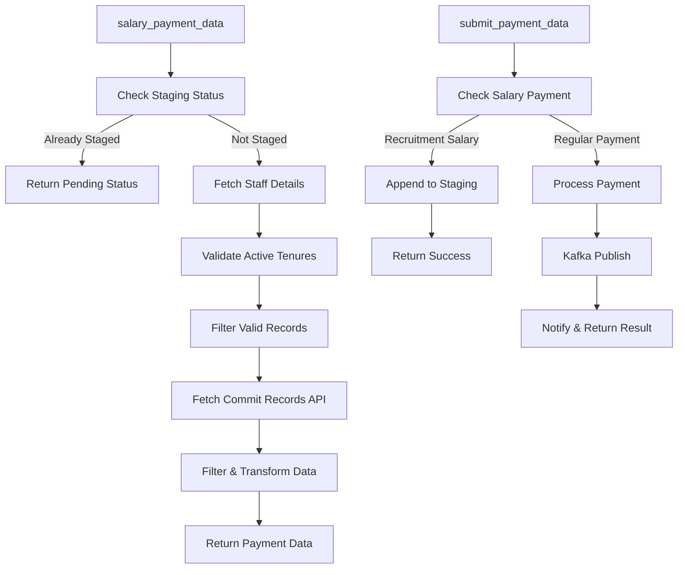

# Salary Staging and Payment Implementation

## Overview
This documentation details the newly implemented salary staging and payment system in the commitPayment.py file. The system handles salary payments for project staff, including recruitment adhoc contractual employees, with staging capabilities and integration with external commit APIs.

## Implementation Architecture

### Flow Diagram



---

## 1. Initial Endpoint: `salary_payment_data`

**Location:** Lines 120-261  
**Function Name:** `salary_payment_data`  
**Entry Point:** The API endpoint to initiate salary payment data retrieval

### Function Signature
```python
@frappe.whitelist(allow_guest=True)
def salary_payment_data(ps_emp_id)
```

### Data Flow & Processing

#### 1.1 Input Validation
- **Input:** `ps_emp_id` - Project Staff Employee ID
- **Validation:** Returns error if ID is missing

#### 1.2 Staging Status Check
- Calls `_salary_staging_has_ps_emp_id(ps_emp_id)` to check if employee already has pending approval
- **Returns:** `"Pending Approval in Account Portal"` if staged
- **Memory Impact:** Minimal - single query on Salary Staging doctype

#### 1.3 Staff Details Fetching
- Queries `Project Staff Details` doctype
- **Fields Retrieved:**
  - `name` - Document name
  - `scr_id` - Selection Committee Report ID
  - `project_no` - Project number

#### 1.4 Active Tenure Validation
For each staff record, validates tenure data from `table_ymed` child table:
- **Validation Criteria:**
  - Term completion date > current date
  - Tenure must have completion date and joining date
  - Basic salary must be present
- **Data Processed per Tenure:**
  ```python
  {
      "joining_date": tenure.joining_date,
      "term_completion_date": tenure.completion_date,
      "basic_salary": tenure.basic_salary
  }
  ```

#### 1.5 Latest Record Selection
- Selects the most recent record based on joining date and completion date
- Ensures the most current valid tenure is used

#### 1.6 Interview ID Resolution
- Retrieves interview ID from Selection Committee Report if `scr_id` exists
- Validates existence of `Recruitment Adhoc Contractual` document

#### 1.7 External API Integration
Fetches commit records from external Account Head Commit API:
- **API URLs:** Multiple status-based endpoints
- **Statuses Queried:** `["COMMITTED", "PARTIALLY_PAID", "OVERPAYMENT"]`
- **Concurrency:** Uses ThreadPoolExecutor for parallel API calls
- **Memory Impact:** All commit records loaded into memory as list of dictionaries

#### 1.8 Data Filtering & Transformation
Filters commit records with criteria:
- `moduleId == "11"`
- `frapAppId` matches recruitment document name
- `projectNumber` matches staff project number

Enriches data with:
- **Project Title:** From `Project Registration` doctype
- **Transformed Record Structure:**
  ```python
  {
      "projectNumber": string,
      "projectTitle": string,
      "moduleId": "11",
      "frapAppId": string,
      # ... additional fields from commit API
  }
  ```

### Return Data Structure
```python
[
    {
        "projectNumber": "string",
        "projectTitle": "string",
        "moduleId": "11",
        "frapAppId": "recruitment_doc_name",
        # ... additional commit API fields
    }
]
```

### Memory Usage
- **Staff Records:** All Project Staff Details for employee (minimal count)
- **Commit Records:** All API responses for 3 statuses (potentially large)
- **Project Title Cache:** One entry per unique project number
- **Validation Results:** Valid tenures list per staff record

---

## 2. Payment Submission: `submit_payment_data`

**Location:** Lines 852-1030  
**Function Name:** `submit_payment_data`  
**Purpose:** Process and submit payment data, with special handling for recruitment salaries

### Function Signature
```python
@frappe.whitelist()
def submit_payment_data(
    doctype=None,
    name=None,
    project_name=None,
    payment_amount=None,
    budget_head=None,
    bmr=None,
    refDetails=None,
    frapAppId=None,
    moduleName=None,
    salary_year_month=None
)
```

### 2.1 Salary Payment Detection
Calls `_is_recruitment_salary_payment()` to identify recruitment salary payments:
- **Detection Logic:**
  - `doctype == "Recruitment Adhoc Contractual"`
  - `moduleName == "Recruitment Adhoc Contractual"`
  - `moduleName == "11"` or `moduleId == "11"`
  - Document exists in `Recruitment Adhoc Contractual` doctype

### 2.2 Salary Staging Process

#### 2.2.1 Payload Construction
For recruitment salaries, constructs staging payload:
```python
{
    "doctype": doctype,
    "name": name,
    "project_name": project_name,
    "payment_amount": payment_amount,
    "budget_head": budget_head,
    "bmr": bmr,
    "refDetails": refDetails,
    "frapAppId": frapAppId,
    "moduleName": moduleName,
    "salary_year_month": salary_year_month,
    "status": "PENDING_APPROVAL",
    # ... additional form data
}
```

#### 2.2.2 Staging Record Management
Calls `_append_salary_staging_record(salary_year_month, payload)`:

- **Storage Format:** JSON lines in `salary_record` field
- **Document Name:** Uses `salary_year_month` as document key
- **Data Persistence:** 
  - If doc exists: Appends new line to existing `salary_record`
  - If new: Creates new doc with initial JSON line
- **Memory Impact:** 
  - Reads entire `salary_record` field into memory
  - Parses existing JSON lines to append new entry
  - Commits transaction to database

#### 2.2.3 Return from Staging
```python
{
    "status": "success",
    "message": "Salary record appended",
    "name": staging_doc.name,
    "created": boolean
}
```

### 2.3 Regular Payment Processing

#### 2.3.1 Document Retrieval/Creation
- Attempts to get existing doc by `doctype` and `name`
- Creates new doc if none exists

#### 2.3.2 Field Population Logic
```python
def get_val(arg_val, fieldname, default=None):
    if arg_val is not None:
        return arg_val
    if fieldname in frappe.form_dict:
        return frappe.form_dict[fieldname]
    return getattr(doc, fieldname, default)
```

#### 2.3.3 Reference Resolution
**Project Reference:**
- Checks direct existence in `Project Registration`
- Fallback: query by `project_no` field

**Budget Head:**
- Checks direct existence in `Budget Head`
- Fallback 1: query by `budget_head` field
- Fallback 2: query by `id` field

#### 2.3.4 Field Mapping
Supports camelCase alternatives for API integration:
```python
{
    'payment_particular': ['paymentParticular'],
    'payment_reference_details': ['paymentRefDetails'],
    'payment_status': ['paymentStatus'],
    'bank_transaction_number': ['bankTransactionNumber'],
    'bank_transaction_date': ['bankTransactionDate'],
    'commit_id': ['commitId', 'transactionCommitNumber']
}
```

#### 2.3.5 Document Save
- Sets `flags.ignore_permissions = True`
- `insert()` for new docs, `save()` for existing
- Generates document name/ID based on naming series

#### 2.3.6 Kafka Publishing
- Calls `kafka_publish_payment()` with saved document
- Passes explicit args as None to use doc values
- Sends notification via `_mm_notify()` on success/failure

### Return Data Structure
```python
# Success
{
    "status": "success",
    "message": "Payment published to Kafka",
    "name": doc.name,
    "data": doc.as_dict()
}

# Error
{
    "status": "error",
    "message": "error_description"
}
```

---

## 3. Helper Functions

### 3.1 `_salary_staging_has_ps_emp_id(ps_emp_id)`
**Lines:** 92-117

**Purpose:** Check if employee has existing staged records

**Process:**
1. Queries all `Salary Staging` documents (unlimited pagination)
2. Parses each `salary_record` field line by line
3. Uses `_json_contains_ps_emp_id()` to search for `ps_emp_id`

**Memory Impact:**
- Loads all Salary Staging docs into memory
- Parses all JSON records in all docs
- Potentially high memory if many staged records

### 3.2 `_json_contains_ps_emp_id(value, ps_emp_id)`
**Lines:** 80-89

**Purpose:** Recursively search for `ps_emp_id` in nested JSON structures

**Search Logic:**
- Dictionaries: Checks direct match, then recurses through values
- Lists: Recursively checks each item
- Primitives: Returns false

### 3.3 `_is_recruitment_salary_payment()`
**Lines:** 800-812

**Purpose:** Detect if payment is for recruitment salary

**Detection Criteria:**
- Doctype name match
- Module name match or ID of "11"
- Document existence check

### 3.4 `_append_salary_staging_record(salary_year_month, payload)`
**Lines:** 815-848

**Purpose:** Store salary payment data in staging

**Storage Strategy:**
1. Converts payload to JSON string
2. Appends new line to existing `salary_record` field
3. Creates new doc if salary_year_month doesn't exist
4. Handles both `salary_year_month` field presence and absence

**Memory Impact:**
- Reads entire `salary_record` field for append operations
- Stores JSON representation of complete payload

### 3.5 `_fetch_account_head_commits_by_status(status)`
**Lines:** 60-77

**Purpose:** Fetch commit records from external API

**API Call:**
- GET request to external Account Head Commit API
- Format: `{ACCOUNT_HEAD_COMMIT_API_URL}/by-status/{status}`
- Timeout: 10 seconds

**Response Parsing:**
- Returns list directly if data is list
- Extracts list from dict if data contains `data`, `message`, or `results` key
- Returns empty list on failure

### 3.6 `_get_project_title_by_number(project_number)`
**Lines:** 46-57

**Purpose:** Get project title for enrichment

**Query Logic:**
- Checks for `project_number` or `project_no` field in metadata
- Queries `Project Registration` doctype for `project_title`

---

## 4. Constants & Configuration

```python
# Valid commit statuses
VALID_COMMIT_STATUSES = ["SETTLED", "PARTIALLY_PAID", "OVERPAYMENT", "PENDING"]
SALARY_COMMIT_STATUSES = ["COMMITTED", "PARTIALLY_PAID", "OVERPAYMENT"]
```

---

## 5. Data Fetching & Memory Impact Summary

### 5.1 Staging Queries
| Operation | Data Retrieved | Memory Impact |
|-----------|----------------|---------------|
| Check employee staging | All Salary Staging docs | High - all records loaded |
| Append staging record | Single Salary Staging doc | Medium - entire salary_record loaded |

### 5.2 Payment Data Queries
| Operation | Data Retrieved | Memory Impact |
|-----------|----------------|---------------|
| Project Staff Details | All records for ps_emp_id | Low - minimal count |
| Active tenures | Valid tenures per staff record | Low - filtered subset |
| External Commit API | All records for 3 statuses | High - potentially large datasets |
| Project titles | One title per unique project | Low - cached |

### 5.3 Payment Processing
| Operation | Data Retrieved | Memory Impact |
|-----------|----------------|---------------|
| Document retrieval | Single Payment document | Low |
| Form data processing | All form_dict fields | Low |
| Reference resolution | Single document per reference | Low |
| Kafka publishing | Saved document as_dict | Medium |

---

## 6. Return Data Structures

### 6.1 `salary_payment_data` Returns

**Pending Approval:**
```python
{
    "status": "Pending Approval in Account Portal",
    "message": "Salary already initiated"
}
```

**Error Cases:**
```python
{
    "status": "error",
    "message": "error_description"
}
```

**Success - Payment Records:**
```python
[
    {
        "projectNumber": "string",
        "projectTitle": "string",
        "moduleId": "11",
        "frapAppId": "string",
        # ... additional commit API fields
    }
]
```

### 6.2 `submit_payment_data` Returns

**Staging Success:**
```python
{
    "status": "success",
    "message": "Salary record appended",
    "name": staging_doc.name,
    "created": boolean
}
```

**Payment Success:**
```python
{
    "status": "success",
    "message": "Payment published to Kafka",
    "name": doc.name,
    "data": doc.as_dict()
}
```

**Error Cases:**
```python
{
    "status": "error",
    "message": "error_description"
}
```

---

## 7. Key Implementation Characteristics

### 7.1 Performance Optimizations
- Parallel API calls using ThreadPoolExecutor
- Project title caching for repeated lookups
- Efficient filtering before data transformation

### 7.2 Data Consistency
- Database transactions for staging operations
- Error logging for external API failures
- Form data validation and normalization

### 7.3 Flexibility
- Multiple input field name conventions (camelCase/snake_case)
- Dynamic reference resolution
- Support for both new and existing documents

### 7.4 Security
- Permission overrides where appropriate (`ignore_permissions=True`)
- Form data sanitization (removes `cmd`)
- Input validation at multiple levels

---

## 8. Error Handling

### 8.1 Exception Logging
All functions wrap operations in try-catch blocks and log errors using:
```python
frappe.log_error(frappe.get_traceback(), "Error Description")
```

### 8.2 Graceful Degradation
- Returns empty lists on API failures
- Returns error messages with clear descriptions
- Maintains data integrity on staging failures

---

## 9. Integration Points

### 9.1 External Systems
- **Account Head Commit API:** Fetches commit records
- **Kafka:** Publishes payment events
- **Notification System:** Sends status updates

### 9.2 Internal Frappe Doctypes
- `Project Staff Details`
- `Salary Staging`
- `Selection Committee Report`
- `Recruitment Adhoc Contractual`
- `Project Registration`
- `Budget Head`

---

## 10. Future Considerations

### 10.1 Memory Optimization
- Implement pagination for staging queries
- Add streaming for large commit API responses
- Consider caching for frequently accessed data

### 10.2 Performance
- Add indexing on frequently queried fields
- Implement batch processing for multiple employees
- Add monitoring for API response times

### 10.3 Scalability
- Consider async processing for large datasets
- Implement queue-based salary staging
- Add rate limiting for external API calls

---

*Implementation Date: 2025-05-29*
*Code Location: `/home/prornd/frappe-dev/prornd/apps/rndopsapp/rndopsapp/rndopsapp/commitPayment.py`*