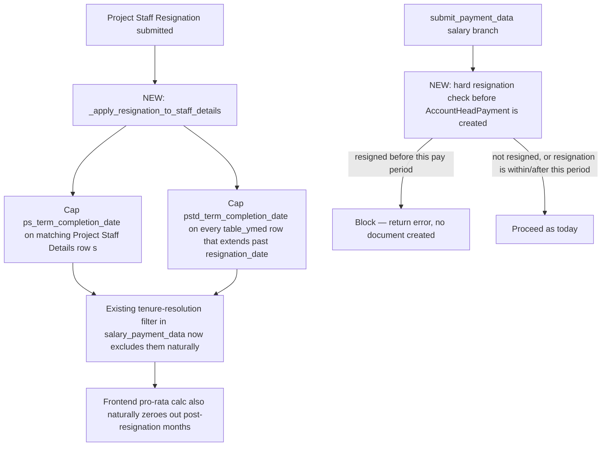
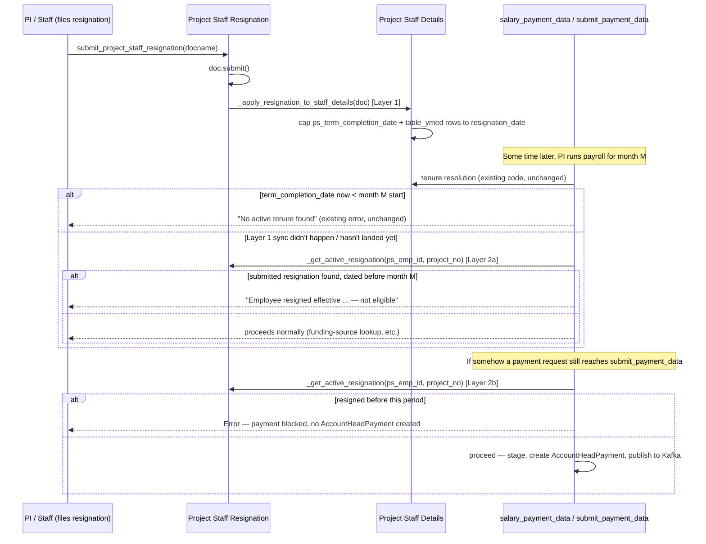

# Implementation Plan — Blocking Salary Payment for Resigned Project Staff

> **Status: PROPOSAL — not implemented.** Nothing in this document has been coded
> yet. Review and approve before any change lands in `commitPayment.py`,
> `project_staff_resignation.py`, or elsewhere.

---

## 1. Problem Statement

`Project Staff Resignation` already exists as a doctype — staff/PI can file and
submit a resignation with a `resignation_date`. But filing one currently has
**zero effect on anything else in the system**. The Salary Module has no
awareness of it at all, so a resigned employee keeps showing up as payable
indefinitely, for as long as their `Project Staff Details.ps_term_completion_date`
(contract end date) says they're still active — which is unrelated to when they
actually resigned.

**Goal:** once a `Project Staff Resignation` is submitted, the employee should
stop being payable for any salary period starting after their resignation date —
without breaking legitimate payment for the partial month in which they resigned.

---

## 2. Current Implementation — What Exists Today

### 2.1 `Project Staff Resignation` is a standalone, disconnected doctype

*File:* [`doctype/project_staff_resignation/project_staff_resignation.py`](doctype/project_staff_resignation/project_staff_resignation.py)

- Fields: `applicant_email_id` (Link → User), `applicant_name`, `applicant_emp_id`
  (**plain Data — free text, not a Link, not validated against `Project Staff
  Details.ps_emp_id`**), `applicant_prj_num` (**plain Data, read-only, free
  text**), `applicant_designation`, `applicant_department`, `resignation_date`,
  `reason`.
- `is_submittable: 1`, but **no `workflow_state` field and no `Workflow`
  document** — just plain `docstatus` (0 Draft / 1 Submitted / 2 Cancelled) via
  `submit_project_staff_resignation(docname)`, which just calls `doc.submit()`.
  So "resigned, confirmed" is unambiguous: `docstatus == 1`.
- **No code anywhere reads this doctype except its own CRUD functions.** Grepped
  the whole app: the only other reference is a cosmetic category label in
  `activity_logger.py` ("Project Staff Resignation" → "HR / Staff" for generic
  workflow-transition logging). Nothing syncs it into `Project Staff Details`,
  and nothing in `commitPayment.py` queries it.

### 2.2 There's an existing precedent for this exact kind of sync — but it's not wired up for resignation

*File:* [`doctype/project_staff_details/project_staff_details.py`](doctype/project_staff_details/project_staff_details.py)

`perform_project_staff_details_action` ([`project_staff_details.py:452`](doctype/project_staff_details/project_staff_details.py#L452))
already does the mirror-image of what this plan needs, for the *opposite* event
(a staff record becoming Approved rather than someone leaving):

```python
if (updated.workflow_state or "") == "Approved":
    _populate_tenure_on_approval(updated)
    _allocate_leave_data_on_approval(updated)
```

`_populate_tenure_on_approval` ([`project_staff_details.py:488`](doctype/project_staff_details/project_staff_details.py#L488))
appends a row to the `table_ymed` (`Project Staff Tenure Details`) child table
with `pstd_joining_date` / `pstd_term_completion_date` / `pstd_basic_salary`,
idempotently, then `doc.save(ignore_permissions=True)`. **This is the exact
pattern this plan should mirror** — a direct function call from the
action-performing endpoint, not a generic `hooks.py` `doc_events` entry (the
codebase's own convention for this specific doctype pair).

Notably, **`Extension of Tenure of Appointment` — the doctype for the opposite
case, extending a contract — has *zero* python logic** (`class
ExtensionOfTenureOfAppointment(Document): pass`). So today, *any* change to a
staff member's actual tenure end date (extension or early resignation) is a
**manual step**: someone has to go edit the `Project Staff Details` record's
`ps_term_completion_date` / `table_ymed` by hand after the fact. That manual gap
is the root cause of the reported problem — nothing is missing from the salary
logic itself, the salary logic just has no way to know a resignation happened.

### 2.3 The salary eligibility check *already* excludes staff whose tenure has ended — it just isn't told about resignations

*File:* [`commitPayment.py`](commitPayment.py), inside `salary_payment_data`
(tenure resolution step, [`commitPayment.py:263-330`](commitPayment.py#L263)):

```python
for tenure in staff_doc.get("table_ymed") or []:
    term_completion_date = tenure.get("pstd_term_completion_date")
    ...
    term_completion_date = getdate(term_completion_date)
    if current_date > term_completion_date:
        continue          # tenure already ended -> not counted as valid
    ...
```

and the fallback for when `table_ymed` is empty:

```python
if not valid_tenures:
    top_level_completion = staff_doc.get("ps_term_completion_date")
    if top_level_completion:
        top_level_completion = getdate(top_level_completion)
        if current_date <= top_level_completion:
            valid_tenures.append(...)
```

If **no** valid tenure survives this filter, the function already returns a
clean error (`"No active tenure found for the given Employee ID"`) before ever
reaching the recruitment/funding-source lookups. **This means: if a resigned
employee's `ps_term_completion_date` (or their active `table_ymed` row) reflected
their actual resignation date, they would already be correctly excluded by
existing, already-tested code — no new filtering logic would be needed at all.**
The Salary Module UI's own frontend pro-rata calculation (§6 of
[`salary-module-full-flow.md`](salary-module-full-flow.md)) is *also* driven by
this same `term_completion_date`, so keeping it in sync fixes both the backend
eligibility check and the frontend's pay-table/pro-ration display in one move.

**Conclusion: the fix belongs at the sync boundary between `Project Staff
Resignation` and `Project Staff Details`, not as new bespoke filtering logic
bolted onto the salary code.** A second, independent safety net is still
warranted for the payment *write* path specifically, because incorrectly paying
someone is a financial control failure, not just a UX gap — see §4.2.

---

## 3. Proposed Design — Two Layers



Plain-text version of the same diagram:

```
 LAYER 1 — root-cause sync                         LAYER 2 — write-path safety net
 ══════════════════════════                        ═══════════════════════════════

 Project Staff Resignation                         submit_payment_data (salary branch)
 submitted                                          │
        │                                           ▼
        ▼                                  NEW: hard resignation check
 NEW: _apply_resignation_to_staff_details    before AccountHeadPayment is created
        │                                           │
        ├──► cap ps_term_completion_date       ┌────┴─────────────────────┐
        │    on matching Project Staff         │                          │
        │    Details row(s)               resigned before             not resigned, or
        │                                  this pay period          resignation is within/
        └──► cap pstd_term_completion_date      │                   after this period
             on every table_ymed row that       ▼                          │
             extends past resignation_date  BLOCK — return error,          ▼
        │                                   no document created      proceed as today
        ▼
 existing tenure-resolution filter in
 salary_payment_data now excludes
 them naturally
        │
        ▼
 frontend pro-rata calc also naturally
 zeroes out post-resignation months
```

### Layer 1 — Sync resignation into `Project Staff Details` (root-cause fix)

**New function** `_apply_resignation_to_staff_details(resignation_doc)` in
[`doctype/project_staff_resignation/project_staff_resignation.py`](doctype/project_staff_resignation/project_staff_resignation.py),
called from `submit_project_staff_resignation` right after `doc.submit()`
succeeds — mirroring `_populate_tenure_on_approval`'s placement in the sibling
doctype:

1. Resolve matching `Project Staff Details` record(s):
   ```python
   filters = {"ps_emp_id": resignation_doc.applicant_emp_id}
   if resignation_doc.applicant_prj_num:
       filters["project_no"] = resignation_doc.applicant_prj_num
   staff_records = frappe.get_all("Project Staff Details", filters=filters, pluck="name")
   ```
   (Project-scoped when `applicant_prj_num` was captured; falls back to
   emp-id-only — i.e. "resigned from every project" — when it wasn't. See §6
   point 1 for why this is an assumption that needs confirming.)
2. For each matched record, load the doc and:
   - **Cap `ps_term_completion_date`:** if unset, or later than
     `resignation_date`, set it to `resignation_date`. Never push it *later*
     (a resignation should only ever shorten a tenure, never extend it).
   - **Cap every row in `table_ymed`:** for each row whose
     `pstd_term_completion_date` is unset or later than `resignation_date`, set
     it to `resignation_date`. This matters because the eligibility check reads
     `table_ymed` rows *first* and only falls back to the parent field when the
     child table is empty — capping only the parent field would silently leave
     an already-approved tenure row claiming validity past the resignation date.
   - `doc.save(ignore_permissions=True)` — same idempotency posture as
     `_populate_tenure_on_approval` (safe to re-run; capping an already-capped
     date to the same value is a no-op).
3. Wrap in `try/except`, `frappe.log_error` on failure — a sync failure should
   never prevent the resignation document itself from being submitted (the
   resignation is the source of truth; the sync is a projection of it). This is
   exactly why Layer 2 exists as an independent backstop.
4. Fire a Mattermost notification (reusing the `_mm_notify` pattern already
   established in `commitPayment.py` — import it from there, or add an
   equivalent local notifier) so ops can see when a resignation successfully
   (or unsuccessfully) propagated to a staff record, without digging through
   logs.

This alone, if it works cleanly for every case, is sufficient to stop future
salary runs — **for the record it was able to match.** Layer 2 exists for
everything Layer 1 can't guarantee.

### Layer 2 — Explicit resignation check in the salary flow (defense-in-depth)

Two insertion points in [`commitPayment.py`](commitPayment.py), both driven by
a new shared helper:

```python
def _get_active_resignation(ps_emp_id, project_no=None):
    """Most recent submitted resignation for this employee (optionally scoped
    to a project). Returns {'resignation_date': date, 'name': str} or None."""
    filters = {"applicant_emp_id": ps_emp_id, "docstatus": 1}
    if project_no:
        filters["applicant_prj_num"] = project_no
    rows = frappe.get_all(
        "Project Staff Resignation",
        filters=filters,
        fields=["name", "resignation_date"],
        order_by="resignation_date desc",
        limit=1,
        ignore_permissions=True,
    )
    return rows[0] if rows else None


def _month_start_date(yyyy_month):
    """'2026_july' -> date(2026, 7, 1). Reuses _SALARY_MONTH_ORDER."""
    if not yyyy_month or "_" not in str(yyyy_month):
        return None
    yr, mo = str(yyyy_month).split("_", 1)
    month_num = _SALARY_MONTH_ORDER.get(mo.strip().lower())
    if not (yr.isdigit() and month_num):
        return None
    from frappe.utils import getdate
    return getdate(f"{yr}-{month_num:02d}-01")
```

- `_month_start_date` reuses the existing `_SALARY_MONTH_ORDER` dict
  ([`commitPayment.py:1957`](commitPayment.py#L1957), used today by
  `search_salary_records`) — Python resolves module-level globals at call time,
  so it's safe to reference from earlier-defined functions despite being
  defined later in the file; no need to relocate it.
- **Block condition:** `resignation_date < month_start(yyyy_month)` — i.e. the
  entire salary period being processed starts *after* the employee resigned.
  This deliberately does **not** block the resignation month itself (allows a
  correctly pro-rated final payment) or any earlier month (allows legitimate
  arrears), only strictly-later months.

Timeline view of the block condition (resignation lands on 15 July):

```
        June            July              August           September
   ├──────────────┼──────────────┼──────────────┼──────────────┤
                          ▲
                   resignation_date
                     (15 July)

   June    → resignation_date >= month_start(June)   → ALLOWED   (arrears)
   July    → resignation_date is INSIDE this month    → ALLOWED   (pro-rated final pay)
   August  → resignation_date <  month_start(August)  → BLOCKED
   Sept.   → resignation_date <  month_start(Sept.)   → BLOCKED
```

**2a. `salary_payment_data` — eligibility check (UX)**

Inserted right after tenure resolution (`project_no` known,
[`commitPayment.py:341-343`](commitPayment.py#L341)), before the recruitment
linkage / migrated-employee fallback work — this is also the cheapest place to
short-circuit, since it avoids the ledger/`Miscellaneous Commit` lookups
entirely for someone who's already resigned:

```python
active_resignation = _get_active_resignation(ps_emp_id, project_no)
if active_resignation:
    cutoff = _month_start_date(yyyy_month)
    if cutoff and getdate(active_resignation["resignation_date"]) < cutoff:
        return [{
            "status": "error",
            "message": (
                f"Employee '{ps_emp_id}' resigned effective "
                f"{active_resignation['resignation_date']} (see Project Staff "
                f"Resignation '{active_resignation['name']}') — not eligible "
                f"for salary in {yyyy_month}."
            ),
        }]
```

**2b. `submit_payment_data` — hard enforcement (the actual money-movement gate)**

Inserted in the salary branch right after `_salary_backend` is parsed
([`commitPayment.py:1299-1305`](commitPayment.py#L1299)), **before**
`_append_salary_staging_record` is called — so a blocked attempt leaves no
`Salary Staging` audit entry either:

```python
_resign_emp_id = _salary_backend.get("ps_emp_id")
_resign_project_no = _salary_backend.get("project_no") or _get_form_value("project_no")
if _resign_emp_id:
    active_resignation = _get_active_resignation(_resign_emp_id, _resign_project_no)
    if active_resignation:
        cutoff = _month_start_date(salary_year_month)
        if cutoff and getdate(active_resignation["resignation_date"]) < cutoff:
            _mm_notify(
                f":no_entry: **Salary Payment Blocked — Employee Resigned**\n"
                f"**Employee:** {_resign_emp_id}\n"
                f"**Resignation:** {active_resignation['name']} (effective {active_resignation['resignation_date']})\n"
                f"**Attempted period:** {salary_year_month}"
            )
            return {
                "status": "error",
                "message": (
                    f"Employee '{_resign_emp_id}' resigned effective "
                    f"{active_resignation['resignation_date']} — salary payment "
                    f"for '{salary_year_month}' is blocked."
                ),
            }
```

This is deliberately **enforced independently of whatever the frontend already
checked** — unlike the rest of `submit_payment_data`, which trusts that
`salary_payment_data` (Step 4) already validated eligibility (§2.3 of
[`salary-payment-workflow.md`](salary-payment-workflow.md)). That existing
"trust the frontend already checked" pattern is fine for funding-source
resolution (worst case: a bad request just fails to resolve a project/budget
head and gets rejected). It is **not** an acceptable pattern for "did this
person actually still work here" — that's a financial control, not a UX
nicety, so it gets checked at the write path too, regardless of `Project Staff
Details.ps_term_completion_date` sync state.

**Why this works identically for migrated employees (the
`Miscellaneous Commit` fallback from [`migrated-employee-salary-fallback.md`](migrated-employee-salary-fallback.md)):**
both checks key off `ps_emp_id`, not `frapAppId` — so a migrated, resigned
employee is blocked exactly the same way as an RAC-based one, with zero
special-casing needed.

---

## 4. Files Requiring Modification

| File | Change |
|---|---|
| [`doctype/project_staff_resignation/project_staff_resignation.py`](doctype/project_staff_resignation/project_staff_resignation.py) | Add `_apply_resignation_to_staff_details(doc)`; call it from `submit_project_staff_resignation` after `doc.submit()` (Layer 1). |
| [`commitPayment.py`](commitPayment.py) | Add `_get_active_resignation` and `_month_start_date` helpers; wire the block into `salary_payment_data` (§3, 2a) and `submit_payment_data` (§3, 2b) (Layer 2). |
| [`doctype/project_staff_details/project_staff_details.py`](doctype/project_staff_details/project_staff_details.py) | **No change required** — existing tenure-filtering logic already does the right thing once dates are capped correctly. |
| [`doctype/project_staff_resignation/project_staff_resignation.json`](doctype/project_staff_resignation/project_staff_resignation.json) | **Optional, recommended hardening** — see §6 point 3. Not required for the core fix. |
| [`salary-payment-workflow.md`](salary-payment-workflow.md) / [`salary-module-full-flow.md`](salary-module-full-flow.md) | Documentation update: add the resignation gate to the eligibility/payment walkthroughs and error tables, same as was done for the migrated-employee fallback. |

No new doctypes needed. No migration/patch needed for the core design (§3) —
only the optional hardening in §6 point 3 would touch a DocType JSON.

---

## 5. Data Flow — End to End



Plain-text version of the same sequence:


---

## 6. Assumptions & Open Questions (need confirmation before implementation)

1. **Is resignation project-scoped or employee-global?** `applicant_prj_num` on
   the resignation form suggests project-scoped (an employee juggling multiple
   project engagements might resign from one but not another) — but it's a
   free-text field that isn't currently prefilled by the backend
   (`get_project_staff_resignation_fields` doesn't set it; whatever frontend
   form fills it in isn't in this repo). Proposed default: match by
   `applicant_emp_id` **and** `applicant_prj_num` when the latter is present,
   else treat as a global resignation across all of that employee's projects.
   Needs confirmation from whoever owns the resignation frontend/process.
2. **Does `Project Staff Resignation` need HR/PI approval before it should
   count, or is a plain `docstatus=1` submit enough?** The doctype has no
   `Workflow` document (§2.1) — submission is a single step with no review
   gate. If a review/approval step is expected before this should actually stop
   salary, that would need to be added to the doctype itself (a real workflow),
   which is a larger change than this plan currently scopes. Confirm whether
   "submitted" alone is the right trigger.
3. **Recommended hardening (not required for the fix to work): make matching
   deterministic.** `applicant_emp_id` is free-text Data, not validated against
   `Project Staff Details.ps_emp_id` — a typo silently breaks both Layer 1 sync
   and Layer 2's block (the employee would keep getting paid with no error at
   all, since `_get_active_resignation` would simply find nothing). Two options,
   either useful independently:
   - Change `applicant_emp_id`'s fieldtype/validation to require an existing
     `ps_emp_id` (e.g. a Select/Link-like validation in `save_project_staff_resignation`).
   - Add a proper `linked_project_staff` **Link → Project Staff Details** field
     to the doctype, populated by the frontend from a dropdown of the
     applicant's own active assignments, and match on that directly instead of
     free text. This is the more robust fix and removes the ambiguity in point
     1 as a side effect (the linked record's `project_no` becomes authoritative).
4. **`ignore_permissions=True` on the `Project Staff Resignation` read in
   Layer 2.** Its permissions table (§2.1) grants read/write/etc. only to
   `System Manager` — every other role gets nothing. Since `salary_payment_data`
   and `submit_payment_data` are `allow_guest=True` / used by non-admin PIs,
   the lookup needs `ignore_permissions=True`, same reasoning as
   `get_commit_staging_status` and the migrated-employee fallback's
   `Miscellaneous Commit` read (both already documented precedents in this
   codebase for exactly this situation).
5. **Retroactive backfill.** This plan only wires up the sync going forward —
   `Project Staff Resignation` records already submitted *before* this ships
   will **not** have retroactively updated their linked `Project Staff Details`
   records. Layer 2 covers this at the payment layer going forward (it checks
   `Project Staff Resignation` directly, not the synced date), but a one-time
   backfill script (iterate all `docstatus=1` resignations, run
   `_apply_resignation_to_staff_details` for each) is recommended once this
   ships, so the Salary Module UI's own staff-listing/pro-rata display (which
   reads `Project Staff Details` directly, not `Project Staff Resignation`)
   also reflects already-resigned staff correctly, not just the payment gate.

---

## 7. Edge Cases & Validation Scenarios

| Scenario | Expected behavior |
|---|---|
| Employee has no resignation on file | **Unchanged** — both layers no-op, existing flow proceeds |
| Resignation submitted, resignation_date falls in a future month | Layer 1 caps tenure dates; that month and all following are blocked once reached; earlier/current months unaffected |
| Resignation submitted mid-month, PI runs payroll for that same month | **Allowed** — `resignation_date` is not `< month_start`, so Layer 2 doesn't block; Layer 1's date-capping lets the existing pro-rata formula correctly pay only the partial month |
| Resignation submitted, but Layer 1 sync fails (e.g. no matching `Project Staff Details` found, or an exception) | `Project Staff Details.ps_term_completion_date` stays stale, but Layer 2 still blocks at both `salary_payment_data` and `submit_payment_data` independently — payment is still prevented |
| `applicant_emp_id` on the resignation has a typo / doesn't match any `ps_emp_id` | **Not caught by either layer** — this is the one gap neither layer can fix without the hardening in §6 point 3. Flagged as the most important open risk. |
| Employee resigns from Project A but is also on Project B (multiple `Project Staff Details` rows) | With `applicant_prj_num` populated and project-scoped matching (§6 point 1 default): only Project A's record is capped/blocked; Project B salary continues normally |
| Resignation later gets cancelled (`docstatus=2`) — e.g. filed in error | `_get_active_resignation`'s `docstatus=1` filter naturally excludes it, so Layer 2 stops blocking immediately. Layer 1's date-capping on `Project Staff Details`, however, is **not automatically reversed** — would need a manual correction or a symmetrical "on_cancel" handler (not in this plan's scope; flagged as a follow-up if cancellations turn out to be common). |
| Migrated employee (Miscellaneous Commit funding source, per [`migrated-employee-salary-fallback.md`](migrated-employee-salary-fallback.md)) resigns | Works identically — both checks key off `ps_emp_id`, independent of funding source |
| Resignation filed for an employee who was never actually eligible for salary anyway (e.g. still missing recruitment data) | No behavior change — the existing failure ("No Recruitment/Selection Committee record found...") still fires first; the resignation checks are additive, not a replacement for other validations |
| `search_salary_records` / `publish_salary_staging` / `delete_salary_record` admin tools, for a resigned employee's already-staged past payment | **Unaffected** — these operate on already-created `Salary Staging` records; this plan only prevents *new* payments from being created, it does not retroactively touch history |

---

## 8. Implementation Steps (for after approval)

1. Add `_get_active_resignation(ps_emp_id, project_no=None)` and
   `_month_start_date(yyyy_month)` helpers to `commitPayment.py`.
2. Wire the eligibility-check block into `salary_payment_data`
   (§3, 2a) right after tenure resolution.
3. Wire the hard-enforcement block into `submit_payment_data`'s salary branch
   (§3, 2b) right after `_salary_backend` parsing, before staging.
4. Add `_apply_resignation_to_staff_details(doc)` to
   `project_staff_resignation.py`; call it from `submit_project_staff_resignation`
   after `doc.submit()` succeeds, wrapped in its own `try/except` +
   `frappe.log_error` so a sync failure never blocks the resignation submission
   itself.
5. Resolve the open questions in §6 (project-scoping default, whether a
   review/approval gate is expected) with whoever owns the resignation process
   before finalizing the exact matching filters.
6. Update `salary-payment-workflow.md` and `salary-module-full-flow.md` with the
   new gate (mirroring how the migrated-employee fallback was documented).
7. Decide on and, if approved, implement the §6 point 3 hardening
   (`linked_project_staff` field or emp-id validation) — recommended but
   separable from the core fix; could ship as a fast-follow.
8. Write and run the one-time backfill script from §6 point 5 for existing
   `docstatus=1` resignations, once the sync function exists.
9. Manual verification (no automated test harness exists for this flow):
   - File and submit a `Project Staff Resignation` for a test employee with a
     past `resignation_date`; confirm their linked `Project Staff Details`
     record's `ps_term_completion_date`/`table_ymed` gets capped.
   - Call `salary_payment_data` for that employee/a future month; confirm it
     now errors instead of returning a payable row.
   - Directly call `submit_payment_data` (bypassing the frontend) with that
     employee's data for a future month; confirm it's blocked even without
     going through `salary_payment_data` first.
   - Confirm a resignation dated *within* the currently-processed month still
     allows a (correctly pro-rated) payment.
   - Confirm an employee with no resignation on file is completely unaffected.

---

## 9. Non-Goals

- Not adding a review/approval workflow to `Project Staff Resignation` itself —
  it stays a single-step submit, unless §6 point 2 comes back requiring one.
- Not retroactively reversing already-created `AccountHeadPayment`/Kafka events
  for payments made before this ships, even if made to an employee who had
  already resigned.
- Not building a symmetrical "un-cap tenure dates on resignation cancellation"
  handler in this pass (§7's cancellation edge case) — flagged as a possible
  follow-up, not core to "stop paying resigned staff."
- Not touching `Extension of Tenure of Appointment` — it's the mirror-image
  gap (also unsynced) but out of scope for this specific request.
