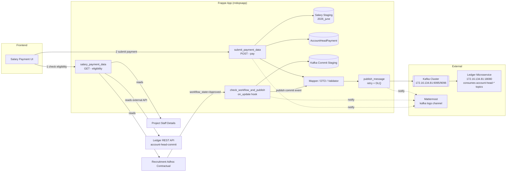
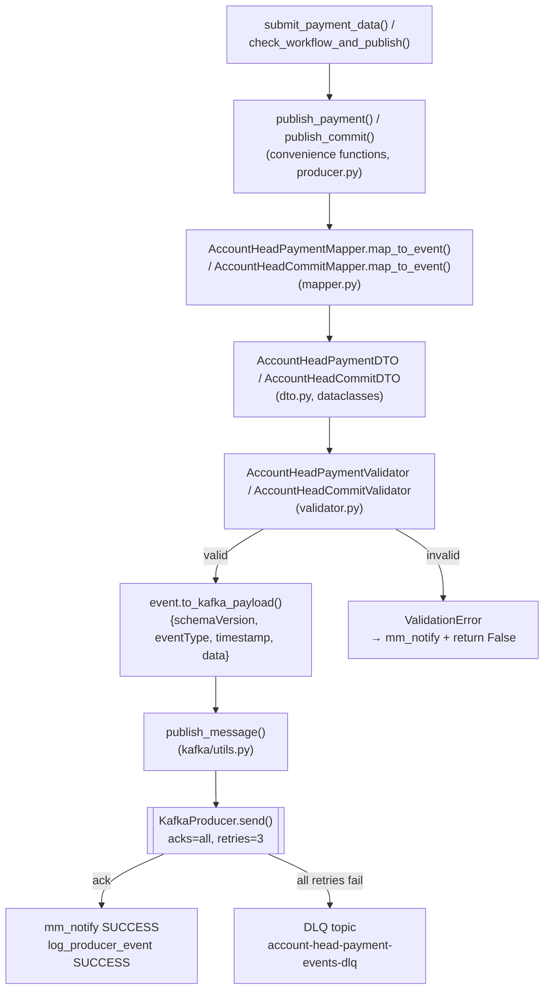
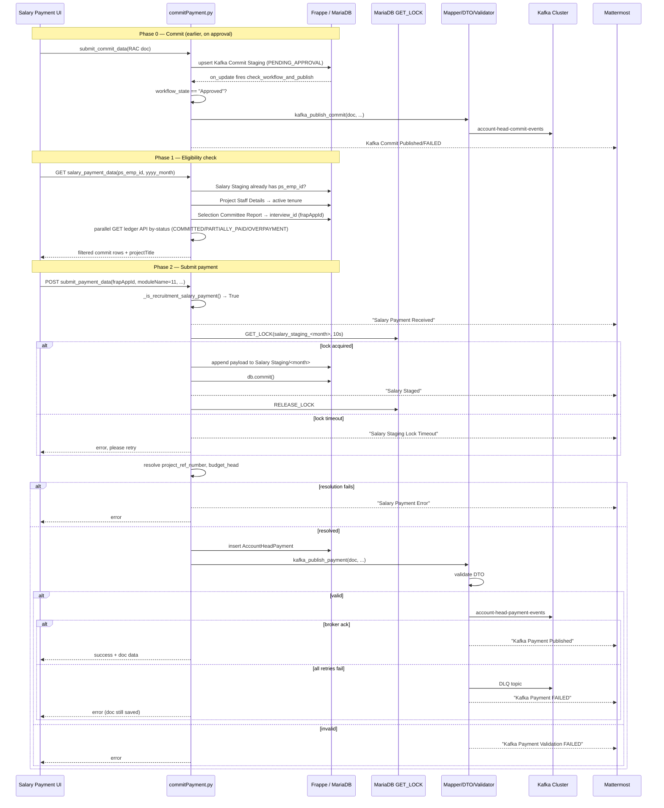

# Salary Module Payment Workflow

> Covers the full lifecycle of a Project Staff (Recruitment Adhoc Contractual) salary
> payment inside `rndopsapp`: eligibility lookup → commit-on-approval → payment
> submission → staging/locking → `AccountHeadPayment` creation → Kafka publishing →
> Mattermost observability.
>
> Primary file: [`commitPayment.py`](commitPayment.py)
> Line references below verified against `commitPayment.py` as of 2026-07-20 (2029 lines).
> For how the frontend Salary Module drives these endpoints end-to-end, see
> [`salary-module-full-flow.md`](salary-module-full-flow.md).

---

## 1. Overview

### 1.1 Purpose

The salary module lets a Project Staff member's monthly salary be paid out against
the budget of the project they are attached to. A salary payment is **not** a
standalone document — it rides on top of two other domains that already exist in
this app:

| Domain | Doctype | Role in salary flow |
|---|---|---|
| Recruitment | `Recruitment Adhoc Contractual` | The employment record. Its `workflow_state` reaching `Approved` is what *commits* budget for the employee. |
| Staffing | `Project Staff Details` → `table_ymed` (tenure child table) | Holds joining date, term completion date, and basic salary per tenure. Used to decide "is this employee currently eligible to be paid". |
| Finance | `AccountHeadPayment` | The actual payment ledger row created (or found) for every payout, salary or otherwise. |
| Staging | `Salary Staging` (single JSON field `salary_record`, autonamed `{YYYY}_{MMMM}`, e.g. `2026_june`) | Durable audit trail of every salary payload received for a given month, independent of whether the Kafka publish succeeded. |

A payment always ends as one Kafka event on topic **`account-head-payment-events`**,
consumed by an external ledger microservice (Java, `172.16.134.81:18080`) that is
**outside this repo** — this app never consumes that topic itself.

### 1.2 High-Level Architecture



---

## 2. Data Fetching

Before a payment is ever submitted, the frontend calls a **read-only** endpoint to
determine whether the employee is currently eligible and what their active tenure
looks like.

### 2.1 `salary_payment_data(ps_emp_id, yyyy_month=None)`

*File:* [`commitPayment.py:219-456`](commitPayment.py#L219) — `@frappe.whitelist(allow_guest=True)`

**Sequence:**

1. **Duplicate-submission guard** — if `yyyy_month` is supplied, calls
   `_salary_staging_has_ps_emp_id(ps_emp_id, yyyy_month)`
   ([`commitPayment.py:185-215`](commitPayment.py#L185)), which:
   - Loads the `Salary Staging` doc for that month (if it exists).
   - Parses `salary_record` (a JSON array, one line per staged payload).
   - Recursively searches every nested dict/list for a `ps_emp_id` match via
     `_json_contains_ps_emp_id` ([`commitPayment.py:173-182`](commitPayment.py#L173)).
   - If found → returns immediately: `{"status": "Pending Approval in Account Portal", "message": "Salary already initiated"}`. This prevents double-paying the same employee in the same month.

2. **Tenure resolution** — Queries `Project Staff Details` for every row matching
   `ps_emp_id`, then for each staff record walks its `table_ymed` child table
   (joining date, term completion date, basic salary) and keeps only tenures whose
   `pstd_term_completion_date` is still in the future relative to `today()`. Among
   valid tenures it picks the one with the latest `(joining_date, term_completion_date)`.
   A fallback also treats the parent doc's `ps_joining_date` / `ps_term_completion_date`
   / `ps_basic_salary` as a tenure when `table_ymed` is empty.

3. **Recruitment linkage** — From the winning staff record's `scr_id`, looks up
   `Selection Committee Report.interview_id`. That `interview_id` **is** the
   `Recruitment Adhoc Contractual` document name (`frapAppId` used everywhere else
   in this flow). If it doesn't resolve to an existing document, returns `[]`.

4. **External commit lookup (parallelized)** — Calls the external ledger REST API
   three times in parallel via a `ThreadPoolExecutor`
   (`_fetch_account_head_commits_by_status`, [`commitPayment.py:67-84`](commitPayment.py#L67)),
   one request per status in `SALARY_COMMIT_STATUSES = ["COMMITTED", "PARTIALLY_PAID", "OVERPAYMENT"]`,
   hitting `GET {ACCOUNT_HEAD_COMMIT_API_URL}/by-status/{status}`.

5. **Filtering** — Merges all three result sets and keeps only rows where
   `moduleId == "11"` (the Recruitment/Salary module id) **and**
   `frapAppId == recruitment_doc_name` **and** `projectNumber == project_no` of the
   staff record. Each surviving row is enriched with `projectTitle` (resolved via
   `_get_project_title_by_number`, [`commitPayment.py:53-64`](commitPayment.py#L53)).

**Returns:** a list of matching account-head-commit rows (the amounts already
committed against this employee/project), or an error/status dict.

> This endpoint answers "has budget been committed for this employee, and have they
> already been staged for payment this month?" — it never writes anything.

### 2.1a Migrated-employee fallback (`_find_migrated_employee_commit`)

*File:* [`commitPayment.py`](commitPayment.py) — helper defined just before
`_json_contains_ps_emp_id`; invoked from step 3 above the moment
`recruitment_doc_name` fails to resolve (blank `scr_id`, a `Selection Committee
Report` that doesn't exist, or an `interview_id` that doesn't match a real
`Recruitment Adhoc Contractual` document).

Employees migrated from the legacy system never had a `Recruitment Adhoc
Contractual` / `Selection Committee Report` created in this app, so step 3 always
fails for them. Instead of returning `[]` immediately, `salary_payment_data` now
calls this helper before giving up:

1. Resolves `project_no` → the `Project Registration` document name.
2. Searches `Miscellaneous Commit` for candidates matching
   `project_number = <resolved project>`, `module = "Recruitment Adhoc
   Contractual"`, `commit_decommit = "Commit"`, `workflow_state = "Approved"`
   (`ignore_permissions=True` — same reasoning as `get_commit_staging_status`:
   this endpoint is `allow_guest=True` and `Miscellaneous Commit` isn't guest
   readable).
3. If multiple candidates exist, prefers one whose `linked_application` exactly
   matches `ps_emp_id`; otherwise takes the most recently approved one
   (`order_by="modified desc"`).
4. Re-fetches the real ledger row for that candidate — same
   `_fetch_account_head_commits_by_status` / `SALARY_COMMIT_STATUSES` call as
   step 4 below, but matched on `frapAppId == <Miscellaneous Commit name>` and
   `projectNumber == project_no` (not `moduleId == "11"`, since a Miscellaneous
   Commit's `moduleId` on the ledger is resolved from the `Miscellaneous Commit`
   doctype itself, not hardcoded to 11). This step exists so the caller gets back
   a row with a real ledger-assigned `transactionCommitNumber` — the local
   `Miscellaneous Commit` document doesn't have one.
5. Returns `[<matched row>]` (tagged with `source: "miscellaneous_commit"` and
   `linked_miscellaneous_commit: <name>`) if the ledger has already ingested the
   commit, or `None` if the Miscellaneous Commit is Approved locally but not yet
   visible on the ledger (same `PENDING`-style lag documented in §9.3/§10.1 of
   [`salary-module-full-flow.md`](salary-module-full-flow.md)).

If the helper returns nothing usable, `salary_payment_data` returns a hard
validation error instead of a silent `[]`:

```json
[{"status": "error", "message": "No Recruitment/Selection Committee record found for employee '<ps_emp_id>', and no approved Miscellaneous Commit exists for project '<project_no>'. Salary payment cannot proceed."}]
```

**Why the payment phase (`submit_payment_data`) needed no changes:**
`_is_recruitment_salary_payment` (§3.1 below) already routes into the salary
branch based on `moduleName`/`moduleId == "11"` — which the frontend always sends
for a salary commit payload — not on `frapAppId` resolving to a real
`Recruitment Adhoc Contractual` document. A payment built from this fallback's
row (`frapAppId = <Miscellaneous Commit name>`) is detected and processed
identically to a normal Recruitment-sourced payment; the resulting
`AccountHeadPayment`'s Kafka event correlates correctly with the commit the
Miscellaneous Commit itself already published. Full design rationale and edge
cases: [`migrated-employee-salary-fallback.md`](migrated-employee-salary-fallback.md).

> **⚠️ Known gotcha — `PENDING` commits are invisible here.** `SALARY_COMMIT_STATUSES`
> deliberately excludes `PENDING` (and `SETTLED`). If the ledger still has the
> employee's commit sitting at `PENDING`, this endpoint returns an empty list even
> though a commit row genuinely exists for the project/`frapAppId`. This is not a
> field-matching bug — it was confirmed live (2026-07-20, `ps_emp_id=2026TS0009`,
> `project_no=26RCLSTSP0742SAMI0001`, `frapAppId=202604150A00290`): two commit rows
> existed on the ledger for that exact project/frapAppId pair, both `status: "PENDING"`,
> so `count: 0` came back and the UI showed "No committed budget-head entry found" even
> though "budget head is there." See §9.3 for why the status never advances past
> `PENDING` on the ledger side.

---

## 3. Salary Processing

Once eligibility is confirmed, "processing" in this codebase means two things
happening **in the same request**, both inside `submit_payment_data`:

1. Write an immutable audit record into `Salary Staging`.
2. Create the real `AccountHeadPayment` ledger document and publish it to Kafka —
   **immediately**, not on a later schedule.

There are no tax/deduction/bonus calculations performed here — `payment_amount` is
accepted as-is from the caller (the net/gross salary figure is computed upstream,
by whatever sent the request).

### 3.1 Salary Detection — `_is_recruitment_salary_payment`

*File:* [`commitPayment.py:1021-1033`](commitPayment.py#L1021)

A request is treated as a salary payment if **any** of these are true:

```text
doctype    == "Recruitment Adhoc Contractual"
moduleName == "Recruitment Adhoc Contractual"
moduleName == "11"
moduleId   == "11"
frapAppId exists as a "Recruitment Adhoc Contractual" document
```

All inputs fall back to `frappe.form_dict` via `_get_form_value`
([`commitPayment.py:1013-1018`](commitPayment.py#L1013)), which accepts both
snake_case and camelCase keys (`moduleId`/`module_id`, `frapAppId`/`frap_app_id`).

If none match, the function falls through to the **generic payment path**
(section 4.2) used by every other reimbursement/travel/settlement doctype.

### 3.2 Building the Staging Payload

`submit_payment_data` ([`commitPayment.py:1224-1247`](commitPayment.py#L1224)):

- Starts from `dict(frappe.form_dict)` (everything the client posted).
- Overwrites with the explicit function arguments (`doctype`, `name`,
  `project_name`, `payment_amount`, `budget_head`, `bmr`, `refDetails`,
  `frapAppId`, `moduleName`, `salary_year_month`).
- Adds `status: "PENDING_PUBLISH"`, `project_no`, `account_number`.
- Strips Frappe's internal `cmd` key.
- Fires a `:inbox_tray:` **Salary Payment Received** Mattermost notification
  (the very first observability signal for this request).

### 3.3 Staging & Locking — `_append_salary_staging_record`

*File:* [`commitPayment.py:1058-1160`](commitPayment.py#L1058)

This is a **read-modify-write on a single JSON column**, so concurrent salary
submissions for the same month would race (last writer wins, silently dropping
earlier records) without protection. The fix uses a MariaDB named lock:

```python
lock_name = f"salary_staging_{salary_year_month}"
got_lock = frappe.db.sql("SELECT GET_LOCK(%s, 10)", lock_name)[0][0]
```

- Waits up to 10 seconds for the lock. If it can't be acquired, returns an error
  **and fires a `:x:` Salary Staging Lock Timeout Mattermost alert** — this is the
  only path where staging is skipped entirely and the caller is told to retry.
- Once locked: loads the existing `Salary Staging/<year_month>` doc (if any),
  parses `salary_record` as a JSON array, appends the new payload, and
  `frappe.db.commit()`s immediately (so the audit row survives even if something
  later in the request fails).
- If no staging doc exists yet, creates one with `flags.name_set = True` to bypass
  the `format:{YYYY}_{MMMM}` autoname and force the exact `salary_year_month` key.
- Fires a `:white_check_mark:` **Salary Staged** notification with the running
  record count for that month.
- `finally:` always releases the lock (`RELEASE_LOCK`), even on exception.

> **Why JSON array and not JSON Lines?** MariaDB enforces a `json_valid()` CHECK
> constraint on the `salary_record` column. One JSON object per line fails that
> constraint; a single wrapping array satisfies it.

### 3.4 Resolving Project & Budget Head

Back in `submit_payment_data` ([`commitPayment.py:1224-1249`](commitPayment.py#L1224)):

- `_sal_project`: prefers the explicit `project_name`, otherwise
  `project_name`/`projectNumber`/`project_no` from the form. If it isn't already a
  `Project Registration` document name, it's looked up by `project_no` field.
- `_sal_bh`: prefers explicit `budget_head`, otherwise
  `budget_head`/`accountHeadId`/`account_head_id` from the form. If not already a
  `Budget Head` PK, resolved by the `budget_head` label field, then by `id`.
- If either fails to resolve → returns an error immediately **and** fires a
  `:x:` **Salary Payment Error** Mattermost alert (`project_ref_number is required`
  / `budget_head is required`). This is a hard stop — no document is created.

---

## 4. Payment Execution

### 4.1 Salary Path — Document Creation

([`commitPayment.py:1312-1370`](commitPayment.py#L1312))

```python
_sal_doc = frappe.new_doc("AccountHeadPayment")
_sal_doc.project_ref_number = _sal_project
_sal_doc.budget_head        = _sal_bh
_sal_doc.payment_amount     = flt(payment_amount or 0)
_sal_doc.payment_bmr        = bmr
_sal_doc.payment_particular = ... or f"Salary payment - {frapAppId}"
_sal_doc.payment_date       = today()
_sal_doc.payment_status     = "PENDING"
_sal_doc.flags.ignore_permissions = True
_sal_doc.insert()
```

**Naming** (`AccountHeadPayment.autoname`, [`accountheadpayment.py:9-25`](doctype/accountheadpayment/accountheadpayment.py#L9)):
`{DD}{MM}{YYYY}{project_ref_number}`, with a `-{n}` suffix on collision. E.g. for
project `2026040601000111` submitted on 8 July 2026 the name is
`080720262026040601000111`.

Once inserted, `kafka_publish_payment(...)` is called immediately (section 5) —
**there is no separate approval step for the salary payment itself** (unlike the
commit phase below, which does gate on workflow approval).

- **Success** → `:white_check_mark:` **Salary Kafka Published** Mattermost
  notification, returns `{"status": "success", "message": "Salary payment
  published to Kafka", "name": <doc>, "data": <doc.as_dict()>}`.
- **Failure** → `:x:` **Salary Kafka FAILED** notification, returns
  `{"status": "error", "message": "Failed to publish salary payment to Kafka"}`.
  The `AccountHeadPayment` document itself **remains inserted** even if Kafka
  publish fails — payment execution and event publishing are not atomic.

### 4.2 Generic (Non-Salary) Path — For Contrast

([`commitPayment.py:1372-1555`](commitPayment.py#L1372)) — used by Reimbursement,
Travel, TA/DA Settlement, etc. Same shape, but:

- Supports **updating** an existing document (`name` provided and exists) vs.
  inserting a new one.
- Runs a **pre-flight check** before publishing: resolves `projectNumber` and
  `accountHeadId` via the mapper's own resolver functions and aborts with a
  Mattermost alert if either is unresolvable — this guards against publishing a
  Kafka event that the external validator would reject anyway.
- Requires `project_ref_number` and `budget_head` only when creating a **new**
  document (`is_new`).

### 4.3 The Commit Phase (Budget Earmarking) — Prerequisite, Different Endpoint

Salary *payment* assumes budget was already **committed** for the employee. That
commit is a separate, earlier action:

1. `submit_commit_data(doctype, frapAppId, name, ..., trigger_state=None)`
   ([`commitPayment.py:751-828`](commitPayment.py#L751)) — called when the
   Recruitment Adhoc Contractual record is created/edited. It does **not**
   publish anything; it just upserts a `Kafka Commit Staging` row keyed by
   `(reference_doctype, reference_name, trigger_state)`, with `trigger_state`
   defaulting to `"Approved"`.
2. `check_workflow_and_publish(doc, method)` ([`commitPayment.py:831-937`](commitPayment.py#L831))
   is registered against **every doctype's** `on_update` in
   [`hooks.py:154-161`](../hooks.py#L154). Whenever any document saves, it:
   - Finds `Kafka Commit Staging` rows for `(doc.doctype, doc.name)` still
     `PENDING_APPROVAL` or `FAILED`.
   - For each, checks whether `doc.workflow_state` now equals that row's stored
     `trigger_state`. For Recruitment Adhoc Contractual this is the workflow state
     **`Approved`** (confirmed active workflow `recruitment_work_flow`, final
     state `Approved`).
   - Guards against re-firing if the document was *already* in that state before
     this save (idempotency via `doc.get_doc_before_save()`).
   - Calls `kafka_publish_commit(...)` → topic **`account-head-commit-events`**.
   - Marks the staging row `PUBLISHED` or `FAILED` and fires the corresponding
     Mattermost notification.

> **What status does the commit event carry?** `AccountHeadCommitMapper.map_to_dto`
> ([`kafka/producer/reimbursement/mapper.py:264-277`](kafka/producer/reimbursement/mapper.py#L264))
> **hardcodes `status="COMMITTED"`** — every commit this app ever publishes goes out
> as `COMMITTED`, unconditionally. There is no code path anywhere in `rndopsapp` that
> constructs a commit DTO with `status="PENDING"` (grepped across
> `kafka/producer/reimbursement/`, `commitPayment.py`, and every doctype that touches
> `ACCOUNT_HEAD_COMMIT_API_URL` — `po_commit_adjustment.py` also only ever sends
> `"COMMITTED"`). The **only** other status this app ever pushes to the ledger for an
> existing commit is `"CANCELLED"`, via `cancellation_request.py:166-186`, which calls
> a *separate* endpoint — `POST {ACCOUNT_HEAD_COMMIT_API_URL}/status/by-project-frap`
> — that updates status in place by `(project, frapAppId)`.
>
> So when a commit is observed sitting at `status: "PENDING"` on the ledger (as
> confirmed live for `frapAppId=202604150A00290` / `project_no=26RCLSTSP0742SAMI0001`,
> transactionCommitNumbers 4 and 15), it did **not** get there because this app sent
> `"PENDING"`. The ledger microservice (`172.16.134.81:18080`, outside this repo)
> evidently applies its own state on ingestion rather than persisting whatever
> `status` we hand it, and nothing in this codebase ever calls
> `/status/by-project-frap` (or any equivalent) to move a row from `PENDING` to
> `COMMITTED` — that endpoint is wired up for cancellations only. Any
> `PENDING → COMMITTED` transition therefore has to happen inside the ledger service
> itself; it is not something fixable from `rndopsapp`.

So the full lifecycle for one employee's month is really **two independent Kafka
events**, tied together only by `frapAppId` / `projectNumber` / `moduleId=11`:

```
Recruitment Adhoc Contractual → Approved  ──▶  account-head-commit-events   (budget earmarked)
submit_payment_data (salary branch)       ──▶  account-head-payment-events (money paid out)
```

---

## 5. Kafka Publishing

### 5.1 Producer Architecture

*Directory:* [`kafka/producer/reimbursement/`](kafka/producer/reimbursement/)



### 5.2 Message Structure

Every payment event is wrapped in a schema envelope
(`AccountHeadPaymentEvent.to_kafka_payload`, [`mapper.py:44-69`](kafka/producer/reimbursement/mapper.py#L44)):

```json
{
  "schemaVersion": "1.0",
  "eventType": "ACCOUNT_HEAD_PAYMENT",
  "timestamp": "2026-07-08T14:42:32.873849",
  "data": {
    "transactionPaymentNumber": null,
    "transactionCommitNumber": null,
    "projectNumber": "2026040601000111",
    "accountHeadId": 23,
    "paymentDate": "2026-07-08",
    "paymentParticular": "Salary payment - 202604150A00304-1",
    "paymentRefDetails": "080720262026040601000111",
    "paymentAmount": 15000.0,
    "bmr": null,
    "paymentStatus": "PENDING",
    "bankTransactionNumber": null,
    "bankTransactionDate": "2026-07-08",
    "frapAppId": "202604150A00304-1",
    "moduleId": 11
  }
}
```

Field derivation ( `AccountHeadPaymentMapper.map_to_dto`, [`mapper.py:317-398`](kafka/producer/reimbursement/mapper.py#L317)):

| DTO field | Source |
|---|---|
| `projectNumber` | `get_project_number(project_ref_number)` — resolves `Project Registration.project_no`, falling back to the doc name, then the raw string |
| `accountHeadId` | `resolve_budget_head_id(budget_head)` — tries `Budget Head.id`, falls back to `Budget Head.idx` (row position) if `id` is null |
| `moduleId` | `int(module_name)` if numeric (salary always sends `"11"`), else looked up from `Module Registry Item`, else `7` |
| `frapAppId` | explicit override if given, else falls back to `projectNumber` |

### 5.3 Validation (`AccountHeadPaymentValidator`, [`validator.py:67-107`](kafka/producer/reimbursement/validator.py#L67))

| Rule | Failure message |
|---|---|
| `projectNumber` must be truthy | `projectNumber is required` |
| `accountHeadId` must not be `None` | `accountHeadId is required` |
| `paymentDate` must be truthy | `paymentDate is required` |
| `paymentStatus` ∈ `{PAID, PENDING, CANCELLED, FAILED, RECTIFICATION, REJECTED}` | `paymentStatus must be one of: ...` |

A validation failure raises `ValidationError`, which the producer catches, logs,
Mattermost-alerts (`:x: Kafka Payment Validation FAILED`), and returns `False` —
**no Kafka send is attempted**, and no retry/DLQ applies (validation happens
before the network call).

### 5.4 Publish + Retry + DLQ (`publish_message`, [`kafka/utils.py:99-190`](kafka/utils.py#L99))

- Uses a **singleton `KafkaProducer`** (`get_producer()`), connected to
  `KAFKA_BOOTSTRAP_SERVERS = ['172.16.134.81:9095', '172.16.134.81:9096']`
  with `acks="all"`, `retries=3`, `linger_ms=10`.
- Partition key = `projectNumber` (so all events for one project land on the same
  partition and preserve ordering for that project).
- Up to `PRODUCER_MAX_RETRIES = 3` attempts, exponential backoff
  (`PRODUCER_RETRY_DELAY_SECONDS * 2**attempt`), resetting the producer connection
  between attempts.
- If every attempt fails, the payload is wrapped with `originalTopic`, `failedAt`,
  `retryCount`, `error` and sent once to the **DLQ topic**
  (`account-head-payment-events-dlq`).
- Every attempt, success, retry, and DLQ send is logged via
  `log_producer_event` into `kafka/logs/files/producer.log` (rotating, 10 MB × 5
  backups) and mirrored to `error.log` on failure.

### 5.5 Topics Reference

| Topic | Direction | Purpose |
|---|---|---|
| `account-head-commit-events` | Produced | Budget committed for a project/employee (fires on workflow → `Approved`) |
| `account-head-commit-events-dlq` | Produced (on failure) | Dead-letter for the above |
| `account-head-payment-events` | Produced | Actual payment made (fires immediately on `submit_payment_data`) |
| `account-head-payment-events-dlq` | Produced (on failure) | Dead-letter for the above |

There is **no consumer** for either topic inside this app
(`kafka/config.py:ALL_CONSUMER_TOPICS` only lists fund-received and deposit-slip
update topics) — the consumer is the external ledger microservice at
`172.16.134.81:18080`, which also exposes the REST APIs used by section 2.

### 5.6 Legacy Module — Do Not Confuse

`commitPayment.py` also imports `publish_message, KAFKA_AVAILABLE` from
`rndopsapp.rndopsapp.kafka_sync` (a 1000+ line legacy module predating the
`kafka/producer/reimbursement` package). That import is unused dead weight in the
current salary/payment code path — all live publishing goes through
`kafka.producer.reimbursement.{publish_commit, publish_payment}`, imported at
[`commitPayment.py:12-15`](commitPayment.py#L12).

---

## 6. End-to-End Flow

### 6.1 Sequence Diagram



### 6.2 Step Summary

| # | Step | Function | Can fail? | Mattermost on failure? |
|---|---|---|---|---|
| 1 | Budget commit on approval | `check_workflow_and_publish` | Yes (Kafka down/validation) | Yes |
| 2 | Eligibility / status check | `salary_payment_data` | Yes (no tenure, no linkage) | No (read-only, returns error dict) |
| 3 | Detect salary payment | `_is_recruitment_salary_payment` | N/A (boolean) | N/A |
| 4 | Stage payload (locked) | `_append_salary_staging_record` | Yes (lock timeout, DB error) | Yes |
| 5 | Resolve project/budget head | inline in `submit_payment_data` | Yes | Yes |
| 6 | Create `AccountHeadPayment` | inline in `submit_payment_data` | Yes (Frappe validation) | Caught by outer `except` |
| 7 | Map → validate → publish | `kafka_publish_payment` | Yes (validation, broker) | Yes |
| 8 | Reprocess missed records | `publish_salary_staging` (manual) | Yes (per-record) | Yes |

---

## 7. Code References

| Component | File | Responsibility |
|---|---|---|
| `salary_payment_data` | [`commitPayment.py:219`](commitPayment.py#L219) | Eligibility + already-staged check (read-only) |
| `_salary_staging_has_ps_emp_id` / `_json_contains_ps_emp_id` | [`commitPayment.py:185`](commitPayment.py#L185) / [`:87`](commitPayment.py#L173) | Duplicate-submission detection inside staged JSON |
| `_fetch_account_head_commits_by_status` | [`commitPayment.py:67`](commitPayment.py#L67) | External ledger REST call, per status |
| `_get_project_title_by_number` | [`commitPayment.py:53`](commitPayment.py#L53) | Project title enrichment |
| `_find_migrated_employee_commit` | [`commitPayment.py:87`](commitPayment.py#L87) | *(new)* Miscellaneous Commit fallback funding-source lookup for migrated employees (§2.1a) |
| `_is_recruitment_salary_payment` | [`commitPayment.py:1081`](commitPayment.py#L1081) | Salary-vs-generic branch detection |
| `_get_form_value` | [`commitPayment.py:1073`](commitPayment.py#L1073) | snake_case/camelCase form fallback |
| `_salary_payload_identity` | [`commitPayment.py:1096`](commitPayment.py#L1096) | Human-readable id for logs/Mattermost |
| `_append_salary_staging_record` | [`commitPayment.py:1118`](commitPayment.py#L1118) | Locked upsert into `Salary Staging` |
| `submit_payment_data` | [`commitPayment.py:1224`](commitPayment.py#L1224) | Main entry point: salary branch + generic branch |
| `submit_commit_data` | [`commitPayment.py:811`](commitPayment.py#L811) | Stage a commit for later workflow-triggered publish |
| `check_workflow_and_publish` | [`commitPayment.py:891`](commitPayment.py#L891) | `on_update` hook — fires commit publish on workflow state match |
| `manually_publish_staged_commit` | [`commitPayment.py:1001`](commitPayment.py#L1001) | Admin re-trigger for stuck commit staging rows |
| `publish_salary_staging` | [`commitPayment.py:1617`](commitPayment.py#L1617) | Admin re-trigger: replay every un-published record in a month's staging doc |
| `search_salary_records` | [`commitPayment.py:1964`](commitPayment.py#L1964) | *(new)* Flattens all `Salary Staging` docs into searchable/paginated rows for an ops/admin UI |
| `delete_salary_record` | [`commitPayment.py:2117`](commitPayment.py#L2117) | *(new)* Password-gated removal of one employee's entry from a month's `salary_record` array |
| `get_workflow_states` / `get_document_state` / `set_workflow_state` / `get_workflow_state_history` | [`commitPayment.py:1830`](commitPayment.py#L1830) / [`:1659`](commitPayment.py#L1770) / [`:1678`](commitPayment.py#L1789) / [`:1724`](commitPayment.py#L1835) | *(new)* Generic workflow-state admin endpoints, not salary-specific but co-located in this file |
| `_mm_notify` | [`commitPayment.py:23`](commitPayment.py#L23) | Fire-and-forget Mattermost POST (daemon thread) |
| `AccountHeadPaymentMapper` / `AccountHeadCommitMapper` | [`kafka/producer/reimbursement/mapper.py`](kafka/producer/reimbursement/mapper.py) | Frappe doc → DTO, incl. `resolve_budget_head_id`, `get_project_number` |
| `AccountHeadPaymentDTO` / `AccountHeadCommitDTO` | [`kafka/producer/reimbursement/dto.py`](kafka/producer/reimbursement/dto.py) | Wire-format dataclasses |
| `AccountHeadPaymentValidator` / `AccountHeadCommitValidator` | [`kafka/producer/reimbursement/validator.py`](kafka/producer/reimbursement/validator.py) | Required-field / enum validation before publish |
| `AccountHeadPaymentProducer` / `publish_payment` | [`kafka/producer/reimbursement/producer.py`](kafka/producer/reimbursement/producer.py) | Orchestrates map → validate → publish → notify |
| `publish_message`, `get_producer`, `is_kafka_available` | [`kafka/utils.py`](kafka/utils.py) | Singleton producer, retry + DLQ, `mm_notify` |
| Kafka config | [`kafka/config.py`](kafka/config.py) | Bootstrap servers, topics, retry/consumer tuning |
| `log_producer_event`, `log_error` | [`kafka/logs/logger.py`](kafka/logs/logger.py) | Rotating file logs: `producer.log`, `error.log`, `debug.log` |
| `AccountHeadPayment.autoname` | [`doctype/accountheadpayment/accountheadpayment.py:9`](doctype/accountheadpayment/accountheadpayment.py#L9) | `{DD}{MM}{YYYY}{project_ref_number}[-n]` naming |
| `doc_events["*"]["on_update"]` | [`hooks.py:154`](../hooks.py#L154) | Wires `check_workflow_and_publish` to every doctype save |

---

## 8. Error Handling

| Failure scenario | Where caught | Behavior | Mattermost alert |
|---|---|---|---|
| No active tenure / employee not found | `salary_payment_data` | Returns `{"status": "error", ...}` | — |
| Recruitment doc not found from `interview_id`, and an approved Miscellaneous Commit exists for the project | `salary_payment_data` → `_find_migrated_employee_commit` (§2.1a) | Returns the ledger row sourced from the Miscellaneous Commit, same shape as a normal match | `:information_source:` Salary Payment Data — Migrated Employee Fallback |
| Recruitment doc not found from `interview_id`, and no approved Miscellaneous Commit exists (or it's Approved but not yet on the ledger) | `salary_payment_data` → `_find_migrated_employee_commit` (§2.1a) | Returns `{"status": "error", "message": "No Recruitment/Selection Committee record found ... and no approved Miscellaneous Commit exists ..."}` | `:x:` Salary Payment Data — No Funding Source |
| Commit exists on ledger but is still `status: "PENDING"` (not `COMMITTED`/`PARTIALLY_PAID`/`OVERPAYMENT`) | `salary_payment_data` filtering (§2.1) | Returns `[]` (`count: 0`) even though a real commit row exists — reads as "no committed budget-head entry found" to the caller | — |
| External ledger API down (`by-status` call) | `_fetch_account_head_commits_by_status` (per-thread) | `frappe.log_error`, that status's rows are simply missing from the merge | — |
| Salary staging lock not acquired within 10s | `_append_salary_staging_record` | Returns error; **record NOT staged** | `:x:` Salary Staging Lock Timeout |
| `salary_year_month` unresolved | `submit_payment_data` | Staging step skipped entirely, execution continues to payment creation | `:warning:` Salary Staging Skipped |
| DB error while staging (e.g. JSON parse/write) | `_append_salary_staging_record` | `frappe.log_error("Append Salary Staging Record Error")`, returns error dict; lock still released via `finally` | `:rotating_light:` Salary Staging Exception |
| `project_ref_number` unresolvable | `submit_payment_data` | Hard return before any document is created | `:x:` Salary Payment Error |
| `budget_head` unresolvable | `submit_payment_data` | Hard return before any document is created | `:x:` Salary Payment Error |
| `AccountHeadPayment.insert()` raises (e.g. Frappe validation) | Outer `try/except` in `submit_payment_data` | `frappe.log_error("Submit Payment Data Error")`, returns `{"status": "error", "message": str(e)}` | `:rotating_light:` submit_payment_data Exception |
| DTO validation fails (missing `projectNumber`/`accountHeadId`/`paymentDate`, bad `paymentStatus`) | `AccountHeadPaymentProducer.publish` | No Kafka send attempted, returns `False` | `:x:` Kafka Payment Validation FAILED |
| Kafka broker unreachable / all 3 retries fail | `publish_message` | Payload forwarded once to `account-head-payment-events-dlq`; if that also fails, `CRITICAL` entry in `error.log` | `:x:` Kafka Payment FAILED (producer level) + `:x:` Salary Kafka FAILED (caller level) |
| `is_kafka_available()` is `False` (library not installed) | `AccountHeadPaymentProducer.publish` | Immediate `False`, no attempt made | `:warning:` Kafka Payment SKIPPED |
| Unhandled exception anywhere in publish | `AccountHeadPaymentProducer.publish` outer `except` | `log_error` + `frappe.log_error`, returns `False` | `:rotating_light:` Kafka Payment Exception |

**Recovery paths:**

- `manually_publish_staged_commit(reference_name, reference_doctype)` — replays any
  `PENDING_APPROVAL`/`FAILED` `Kafka Commit Staging` row for a document, for the
  commit phase.
- `publish_salary_staging(salary_year_month)` — iterates every record inside a
  month's `Salary Staging.salary_record` array not already `status: "PUBLISHED"`,
  creates/reuses an `AccountHeadPayment` per record, republishes, and writes the
  per-record outcome (`PUBLISHED`/`FAILED` + `error`) back into the array. Returns
  `{"published": n, "failed": n, "skipped": n, "total": n}`.

**Note on non-atomicity:** in the salary path, staging (§3.3) commits to the
database *before* the payment document and Kafka publish are attempted. If the
Kafka publish subsequently fails, the `Salary Staging` audit row still shows the
attempt, but the `AccountHeadPayment` document remains in `PENDING` status with no
corresponding Kafka event — `publish_salary_staging` is the intended way to reconcile
this later.

---

## 9. Configuration

### 9.1 Mattermost (hardcoded in both `commitPayment.py` and `kafka/utils.py`)

```python
_MM_URL     = "http://172.16.135.118:8065/api/v4/posts"
_MM_TOKEN   = "Bearer fmjih41b4iymicttnuhinsqime"
_MM_KAFKA_CHANNEL = "yh7piky97iycjrdytia1hqy99a"  # "kafka logs" channel
```

`_mm_notify` / `mm_notify` always run in a **daemon thread** with a `(2, 3)` second
connect/read timeout and swallow all exceptions — a Mattermost outage can never
break the payment flow, but also fails silently (nothing in `Error Log` if the
POST itself fails).

### 9.2 Kafka (`kafka/config.py`)

| Setting | Value |
|---|---|
| `KAFKA_BOOTSTRAP_SERVERS` | `172.16.134.81:9095`, `172.16.134.81:9096` |
| `PRODUCER_ACKS` | `"all"` |
| `PRODUCER_RETRIES` / `PRODUCER_MAX_RETRIES` | `3` / `3` |
| `PRODUCER_RETRY_DELAY_SECONDS` | `1` (exponential: 1s, 2s, 4s) |
| `PRODUCER_LINGER_MS` | `10` |
| `CONSUMER_GROUP_ID` | `rndopsapp-consumer-group-v2` (unrelated to salary — no consumer subscribes to the payment/commit topics) |

### 9.3 External Ledger REST API (`commitPayment.py:37-39`)

```python
LEDGER_API_BASE_URL          = "http://172.16.134.81:18080/api/commit-payment-transactions"
ACCOUNT_HEAD_PAYMENTS_API_URL = "http://172.16.134.81:18080/api/account-head-payments"
ACCOUNT_HEAD_COMMIT_API_URL   = "http://172.16.134.81:18080/api/account-head-commit"
```

Endpoints actually used against `ACCOUNT_HEAD_COMMIT_API_URL`:

| Path | Used by | Purpose |
|---|---|---|
| `GET /by-status/{status}` | `_fetch_account_head_commits_by_status` (commitPayment.py:67), `po_commit_adjustment.py` | Read commits filtered by status |
| `GET /by-account-head/{id}` | `get_commits_by_account_head` (commitPayment.py:645) | Read commits for one budget head |
| `GET /by-account-head/{id}/status/{status}` | `get_commits_by_account_head_and_status` (commitPayment.py:694) | Read commits for one budget head, filtered by status |
| `POST /status/by-project-frap` | `cancellation_request.py:166` | **The only status-update call in this codebase** — sets `status: "CANCELLED"` in place by `(project, frapAppId)`. Nothing calls this (or an equivalent) to advance a commit from `PENDING` to `COMMITTED`. |

### 9.4 Frappe Hooks (`hooks.py`)

```python
doc_events = {
    "*": {
        "on_update": [
            "rndopsapp.rndopsapp.commitPayment.check_workflow_and_publish",
            "rndopsapp.rndopsapp.activity_logger.log_workflow_transition",
        ]
    }
}
```

No scheduled/cron job drives the salary flow — `publish_salary_staging` and
`manually_publish_staged_commit` are both `@frappe.whitelist()` endpoints, invoked
on demand (e.g. from an admin panel), not on a timer.

### 9.5 Logging

| File | Content |
|---|---|
| `kafka/logs/files/producer.log` | Every `STARTED`/`VALIDATED`/`SUCCESS`/`FAILED`/`RETRY` producer event (rotating, 10 MB × 5) |
| `kafka/logs/files/error.log` | Mirror of all `FAILED`/`ERROR` producer events + explicit `log_error` calls |
| `kafka/logs/files/debug.log` | Low-level debug (e.g. producer connection established) |
| Frappe `Error Log` doctype | `frappe.log_error(...)` calls from `commitPayment.py` itself (staging exceptions, submit exceptions) |
| `print(...)` statements (`[PAYMENT_DEBUG]`, `[SALARY_STAGING]`, `[SUBMIT_PAYMENT_DATA]`) | Go to stdout of the Frappe web worker process — visible in `logs/terminal.log` under `bench start`, **not** in `Error Log` |

---

## 10. Summary

A salary payment starts long before the "Pay" button: a `Recruitment Adhoc
Contractual` record must already have transitioned to workflow state `Approved`,
which the global `on_update` hook (`check_workflow_and_publish`) catches to publish
a **commit** event on `account-head-commit-events` — this is what earmarks budget.
The frontend then confirms eligibility via `salary_payment_data`, cross-checking
active tenure in `Project Staff Details` and committed amounts from the external
ledger API, while also checking `Salary Staging` to avoid double-submission for the
month.

The actual pay action posts to `submit_payment_data`. Because `frapAppId` resolves
to a `Recruitment Adhoc Contractual` document (or `moduleId`/`moduleName` says
`"11"`), the request is routed into the salary branch: the raw payload is appended
— under a MariaDB named lock to survive concurrent submissions — to a
per-month `Salary Staging` JSON array as a durable audit trail, and a Mattermost
notification confirms receipt. Independently of that staging write, project and
budget head references are resolved, a new `AccountHeadPayment` document is
inserted, and it is immediately mapped to an `AccountHeadPaymentDTO`, validated,
wrapped in a schema envelope, and published to Kafka topic
`account-head-payment-events` with retry-then-DLQ semantics. Every meaningful
transition — staged, published, failed, validation error, lock timeout — fires a
fire-and-forget Mattermost notification, so the whole pipeline is observable in the
"kafka logs" channel without needing server log access. The external ledger
microservice is the sole consumer of both the commit and payment topics; this app
never reads them back. If a publish is ever missed or fails, `publish_salary_staging`
can replay every un-published record for a given month on demand.
