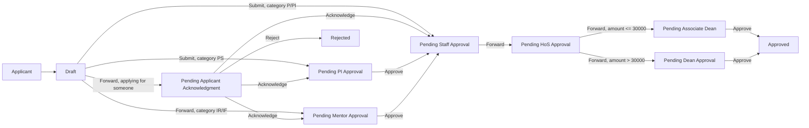
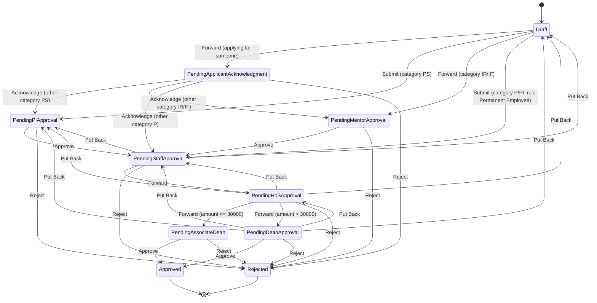

# Temporary Advance User Manual

> This manual documents the **Temporary Advance** DocType as it is actually configured in this Frappe/ERPNext installation (module `Rndopsapp`). It is based directly on the DocType schema, the controller (`temporary_advance.py`), the active Client Script, the (unregistered) custom permission controller, the live Workflow configuration, and the site's Role/Custom DocPerm records. Wherever the system's actual behavior is incomplete, inconsistent, or not enforced, this is called out explicitly with an **Important** or **Note** block instead of being assumed away.

---

## Table of Contents

1. [Overview](#1-overview)
2. [Business Process](#2-business-process)
3. [Workflow States](#3-workflow-states)
4. [Workflow Diagram](#4-workflow-diagram)
5. [Roles and Responsibilities](#5-roles-and-responsibilities)
6. [Permission Matrix](#6-permission-matrix)
7. [Navigation](#7-navigation)
8. [Getting Started](#8-getting-started)
9. [Creating a New Record](#9-creating-a-new-record)
10. [Screen-by-Screen Guide](#10-screen-by-screen-guide)
11. [Field Reference](#11-field-reference)
12. [Buttons and Actions](#12-buttons-and-actions)
13. [Approval Process](#13-approval-process)
14. [Notifications](#14-notifications)
15. [Attachments](#15-attachments)
16. [Reports](#16-reports)
17. [Audit Trail](#17-audit-trail)
18. [Business Rules](#18-business-rules)
19. [Frequently Asked Questions](#19-frequently-asked-questions)
20. [Common Errors](#20-common-errors)
21. [Best Practices](#21-best-practices)
22. [User Checklist](#22-user-checklist)
23. [Administrator Guide](#23-administrator-guide)
24. [Security](#24-security)
25. [Glossary](#25-glossary)
26. [Appendix](#26-appendix)

---

## 1. Overview

**Temporary Advance** is the ERP module used to request money **before** a project-related purchase is made — the opposite direction from Reimbursement, which claims money back *after* a purchase. The requester receives funds up front, uses them for the stated purpose, and is expected to settle/account for them afterward (via a separate `Advance Settlement` process) within the organization's stipulated period.

- **What it is:** A submittable request document (`Temporary Advance` DocType) that captures who needs the advance, how much, for which project/account head, why (justification), supporting documents, bank details for disbursal, and two compliance declarations.
- **Why it exists:** Some project expenses need cash in hand before a purchase can be made (e.g. field work, small vendors who need advance payment). Temporary Advance lets that be requested, routed through the right approval chain (which depends on who is asking), and tracked.
- **Business purpose:** To formally request, verify, and multi-level approve an advance of project funds, and to enforce a higher-value approval escalation (Associate Dean vs. Dean) based on amount.
- **Objectives:** Route the request to the correct first approver based on the requester's employee category, escalate amounts above a threshold to a more senior approver, and produce an auditable trail before money is disbursed.
- **Who should use it:** Any of Permanent Employee, Project Staff, Independent Researcher, Inspired Faculty, or Principal Investigator categories (see [§2](#2-business-process) for how the category drives routing) — or a Permanent Employee filing on behalf of someone else.
- **When it should be used:** Before the money is spent — this is an advance request, not a reimbursement.
- **Typical use case:** A Project Staff member needs ₹15,000 up front for field materials; they file a Temporary Advance, it is routed to their PI for approval, then to a staff/RnD verifier, then through the Head of Section and (since the amount is ≤ ₹30,000) the Associate Dean, before being Approved and disbursed.
- **Benefits:** A role-aware, multi-stage approval chain with amount-based escalation, plus (unlike Reimbursement) a working "Put Back for correction" loop and an actual email notification step.

> **Note**
>
> The form carries two compliance declarations that applicants must acknowledge:
> - Awareness that the advance must be **settled within 45 days** of the amount being transferred.
> - Awareness that items available under **rate contract cannot be purchased** using a temporary advance (with a link to the rate-contract item list).

---

## 2. Business Process

### 2.1 Written explanation

A Temporary Advance always starts as a **Draft**. Unlike Reimbursement, routing out of Draft is **not simply role-based** — it depends on the applicant's **employee category** (`applicant_category`, fetched from the `User.empclass` field) and on whether the request is being filed **for someone else** (`applying_for_select`):

- **Filing for yourself:** the Draft's `Submit`/`Forward` action routes based on your own category:
  - **Project Staff (PS)** → **Pending PI Approval**
  - **Independent Researcher (IR) / Inspired Faculty (IF)** → **Pending Mentor Approval**
  - **Permanent Employee (P) / Principal Investigator (PI)** → **Pending Staff Approval** directly (role-gated to the `Permanent Employee` role)
- **Filing for someone else** (`applying_for_select = "Yes"`, with `advance_for_id` set): the Draft instead routes to **Pending Applicant Acknowledgment**, so the actual beneficiary can review/edit and acknowledge before it proceeds — routed onward exactly the same way, but based on **their** category (`other_applicant_category`).

From there, the chain converges: **Pending PI Approval** or **Pending Mentor Approval** → (Approve) → **Pending Staff Approval** → (Forward) → **Pending HoS Approval**, which is where the **amount-based escalation** happens:

- Amount **≤ ₹30,000** → **Pending Associate Dean**
- Amount **> ₹30,000** → **Pending Dean Approval**

Either final approver can **Approve** (→ **Approved**) or **Reject** (→ **Rejected**). Both terminal states carry `doc_status = 1`, so — unlike Reimbursement — reaching Approved or Rejected actually **submits** the underlying Frappe document.

Real **"Put Back"** correction loops exist at three points: Dean → HoS/Staff/PI/Draft, HoS → Staff/PI/Draft, and Staff → PI/Draft. This is a working resubmission path, in contrast to Reimbursement's dead-end "Needs Correction" states.

> **Important**
>
> When applying **for someone else**, the acknowledgment step (`Pending Applicant Acknowledgment → Acknowledge`) only has transitions defined for `other_applicant_category` in {PS, IR, IF, P}. There is **no transition for category PI (`7orhr5qb5t`)**. If a Permanent Employee files a Temporary Advance on behalf of a **Principal Investigator**, the beneficiary will reach "Pending Applicant Acknowledgment" but have **no valid "Acknowledge" transition** to move forward — see [§20 Common Errors](#20-common-errors).

### 2.2 Numbered process

1. Applicant (or a Permanent Employee filing on someone's behalf) opens a new Temporary Advance.
2. Fills in project, amount (auto-converted to words), justification, supporting documents, bank details, and ticks both declarations.
3. Saves the Draft (repeatable).
4. Clicks the workflow action button shown for their state — its label and target depend on `applying_for_select` and `applicant_category`/`other_applicant_category` (see [§2.1](#21-written-explanation)).
5. If filed for someone else: the beneficiary receives an email, reviews/edits, and clicks **Acknowledge** (or **Reject**).
6. PI or Mentor approval (as applicable) → **Pending Staff Approval**.
7. Staff/RnD verification → **Pending HoS Approval**.
8. HoS forwards, with the system auto-selecting **Associate Dean** or **Dean** based on the amount.
9. Associate Dean or Dean → **Approved** (submits the document) or **Rejected**.
10. Money is disbursed (outside this DocType) and later settled through a separate `Advance Settlement` document.

### 2.3 Mermaid flowchart

---

## 3. Workflow States

| State | `doc_status` | Standard `allow_edit` Role | Available Actions | Next Possible States |
|---|---|---|---|---|
| Draft | 0 (Draft) | All_ProRnd_User | Submit / Forward (routing depends on applicant category — see [§2](#2-business-process)) | Pending Applicant Acknowledgment, Pending PI Approval, Pending Mentor Approval, Pending Staff Approval |
| Pending Applicant Acknowledgment | 0 (Draft) | All_ProRnd_User | Acknowledge, Reject | Pending PI Approval, Pending Mentor Approval, Pending Staff Approval, Rejected |
| Pending PI Approval | 0 (Draft) | All_ProRnd_User | Approve, Reject | Pending Staff Approval, Rejected |
| Pending Mentor Approval | 0 (Draft) | All_ProRnd_User | Approve, Reject | Pending Staff Approval, Rejected |
| Pending Staff Approval | 0 (Draft) | staff, RnD | Forward, Reject, Put Back | Pending HoS Approval, Rejected, Pending PI Approval, Draft |
| Pending HoS Approval | 0 (Draft) | Hos, RnD (Head of Section, RnD) | Forward (amount-based), Reject, Put Back | Pending Associate Dean, Pending Dean Approval, Rejected, Pending Staff Approval, Pending PI Approval, Draft |
| Pending Associate Dean | 0 (Draft) | Ado_RnD | Approve, Reject | Approved, Rejected |
| Pending Dean Approval | 0 (Draft) | Dean, RnD | Approve, Reject, Put Back | Approved, Rejected, Pending HoS Approval, Pending Staff Approval, Pending PI Approval, Draft |
| Approved | **1 (Submitted)** | Administrator | *(terminal)* | — |
| Rejected | **1 (Submitted)** | Administrator | *(terminal)* | — |

> **Important**
>
> Both **Approved** and **Rejected** are configured with `doc_status = 1`. Unlike Reimbursement, this workflow **does** actually submit the Frappe document once it reaches a terminal state, so standard "submitted document" protections (no ordinary delete; cancel-then-amend required to change it) genuinely apply here. See [§24 Security](#24-security).
>
> The `allow_edit` role shown for **Approved**/**Rejected** is literally **`Administrator`** — meaning even System Manager–role users are not the state's *designated* editor once it's terminal (though System Manager still has broad DocPerm-level access; see [§6](#6-permission-matrix)).
>
> **Assumption:** Per-state SLA/turnaround timelines are organizational policy and are not enforced or recorded by the system.

---

## 4. Workflow Diagram

> **Note**
>
> Two other `Workflow` records exist for this document type — `Temp_adv_workflow` and `Travel Apply` — but both have `is_active = 0`. Only **`Temp_Adv_Workflow_Through_Rest_API`** (diagrammed above) is active. If a form ever shows unexpected states/actions, confirm which workflow is active before assuming this diagram is stale.

---

## 5. Roles and Responsibilities

| Role | Responsibility in the Flow | Grants Base DocType Access? |
|---|---|---|
| All_ProRnd_User | Generic "logged-in ProRnd user" role — the `allow_edit`/`allowed` role for Draft, Acknowledgment, PI Approval, and Mentor Approval stages. | Yes (full CRUD via Custom DocPerm) |
| Permanent Employee | Submits directly to Staff Approval when the applicant's own category is P or PI; also files on behalf of others (`applying_for_select`). | Yes (full CRUD via Custom DocPerm) |
| staff, RnD | Verifies at **Pending Staff Approval**; forwards to HoS, rejects, or puts back. | Yes (full CRUD via Custom DocPerm) |
| Hos, RnD (Head of Section, RnD) | Reviews at **Pending HoS Approval**; forwards to Associate Dean or Dean based on amount, rejects, or puts back. | **No** — see the Important note below |
| Ado_RnD (Associate Dean) | Final approver for amounts **≤ ₹30,000**, at **Pending Associate Dean**. | Yes (full CRUD via Custom DocPerm) |
| Dean, RnD | Final approver for amounts **> ₹30,000**, at **Pending Dean Approval**; can also Put Back all the way to Draft. | **No** — see the Important note below |
| Independent Researcher | Files their own request; routed to Mentor Approval first. | Yes (full CRUD via Custom DocPerm) |
| Inspired Faculty | Same routing as Independent Researcher (Mentor Approval first). | Yes (full CRUD via Custom DocPerm) |
| project staff | Named in the base DocType permission set; category "PS" applicants are routed to PI Approval first regardless of this role. | Yes (full CRUD via Custom DocPerm) |
| System Manager | Administers the DocType/Workflow; full CRUD. | Yes |

> **Important — likely-broken approval step**
>
> `Hos, RnD (Head of Section, RnD)` and `Dean, RnD` are both **named as the state `allow_edit` role and as the transition `allowed` role** for their respective approval stages — but **neither role has a row in `DocPerm` or `Custom DocPerm` for `Temporary Advance`** (confirmed directly against the site database; see [§6](#6-permission-matrix)). The controller also defines a custom `has_permission()` function intended to grant these two roles access based on `workflow_state`, but **it is not registered in `hooks.py`** (`has_permission` mapping is commented out) — so it never runs. The `set_dynamic_permissions()` `DocShare` logic in `on_update()` also does **not** share the document with HoS/Dean/Associate-Dean-role users at their stage — it only shares with the owner, the `advance_for_id` beneficiary (during acknowledgment), and `pi_mentor_user` (during PI/Mentor approval).
>
> **Net effect:** as currently wired, a user who holds *only* the `Hos, RnD` or `Dean, RnD` role may not actually be able to open or act on a Temporary Advance sitting at `Pending HoS Approval` / `Pending Dean Approval` through the standard Frappe permission system — unless they also hold one of the roles in [§6](#6-permission-matrix) through some other assignment, or are a System Manager. **This should be verified and fixed with your Frappe administrator before relying on the HoS/Dean approval steps in production.**

---

## 6. Permission Matrix

Base permission set (`DocPerm` from the schema, extended by `Custom DocPerm` overrides in this site — the two tables currently agree):

| Role | Read | Write | Create | Submit | Cancel | Amend | Delete | Print | Email | Report | Export | Share |
|---|---|---|---|---|---|---|---|---|---|---|---|---|
| System Manager | ✔ | ✔ | ✔ | ✔ | ✔ | ✔ | ✔ | ✔ | ✔ | ✔ | ✔ | ✔ |
| All_ProRnd_User | ✔ | ✔ | ✔ | ✔ | ✔ | ✔ | ✔ | ✔ | ✔ | ✔ | ✔ | ✔ |
| Permanent Employee | ✔ | ✔ | ✔ | ✔ | ✔ | ✔ | ✔ | ✔ | ✔ | ✔ | ✔ | ✔ |
| staff, RnD | ✔ | ✔ | ✔ | ✔ | ✔ | ✔ | ✔ | ✔ | ✔ | ✔ | ✔ | ✔ |
| Independent Researcher | ✔ | ✔ | ✔ | ✔ | ✔ | ✔ | ✔ | ✔ | ✔ | ✔ | ✔ | ✔ |
| Inspired Faculty | ✔ | ✔ | ✔ | ✔ | ✔ | ✔ | ✔ | ✔ | ✔ | ✔ | ✔ | ✔ |
| project staff | ✔ | ✔ | ✔ | ✔ | ✔ | ✔ | ✔ | ✔ | ✔ | ✔ | ✔ | ✔ |
| Ado_RnD | ✔ | ✔ | ✔ | ✔ | ✔ | ✔ | ✔ | ✔ | ✔ | ✔ | ✔ | ✔ |
| **Hos, RnD (Head of Section, RnD)** | ✘ | ✘ | ✘ | ✘ | ✘ | ✘ | ✘ | ✘ | ✘ | ✘ | ✘ | ✘ |
| **Dean, RnD** | ✘ | ✘ | ✘ | ✘ | ✘ | ✘ | ✘ | ✘ | ✘ | ✘ | ✘ | ✘ |

**Why each permission exists:**

- Every role actively involved in filing or the early/mid approval chain (`All_ProRnd_User`, `Permanent Employee`, `staff, RnD`, `Independent Researcher`, `Inspired Faculty`, `project staff`, `Ado_RnD`) has broad CRUD access so they can create, edit within their allowed state, and act on transitions.
- `System Manager` retains full administrative access, including `cancel`/`amend` — appropriate here since Approved/Rejected genuinely reach `docstatus = 1` (unlike Reimbursement).
- `Hos, RnD` and `Dean, RnD` have **no row at all** — this is very likely a configuration gap given they are both load-bearing approval roles in the Workflow; see the Important note in [§5](#5-roles-and-responsibilities).

> **Note — additional list-visibility layer**
>
> A `permission_query_conditions` hook (`temporary_advance_permission_query`, in `rndopsapp/rndopsapp/delegate_user/delegate_user.py`) runs on top of the role-based rules above. If a **Permanent Employee** has set up an active **User Delegation** (self-service delegation of "View Only," "View and Edit," or "Workflow Action" access to another user, scoped to all/specific-projects/specific-applications), the delegate's list view is expanded to also show the delegator's Temporary Advance records — but only for roles whose *own* read access is `if_owner`-gated. Since most roles here already have unrestricted (`if_owner = 0`) read access (see table above), delegation mainly matters for a role that is read-restricted to its own records. See [§23](#23-administrator-guide) for how to manage delegations.

---

## 7. Navigation

- Temporary Advance is a standard DocType in the **Rndopsapp** module — reachable at `/app/temporary-advance`.
- **Search:** Global Search / Awesomebar → "Temporary Advance".
- **List view:** `/app/temporary-advance`, filtered per the permission rules in [§6](#6-permission-matrix) (plus any active delegation expansion).
- **Favorites / Recent Documents:** Standard Frappe Desk behavior.

> **Note**
>
> No dedicated Workspace record specific to Temporary Advance was found in this site at review time.

---

## 8. Getting Started

**Prerequisites**

- A Frappe user account with one of the roles in [§6](#6-permission-matrix) that has base access (noting the HoS/Dean gap above).
- Your `User` record must have `empclass` (employee category) set — the workflow's routing conditions depend on it, and the active Client Script explicitly warns: *"Your User Profile does not have an 'Employee Class' set. The form may not submit"* (in an older, now-commented revision of the script — the warning itself is not currently shown, but the underlying dependency is still real).
- Knowledge of the Project Registration the advance is for.
- Supporting justification/documents for the advance request.

**Master data required**

| Master Data | DocType | Purpose |
|---|---|---|
| Project Registration | `Project Registration` | Source project; `project_code` is resolved server-side to the project's real `project_no`. |
| EmployeeClass_prornd | `EmployeeClass_prornd` | Defines the categories (`P`, `PS`, `IR`, `IF`, `PI`) that drive workflow routing — see [§2](#2-business-process). |
| Budget Head | `Budget Head` | Source for `account_head` link options (note: the field itself is stored as free-text Data, not a Link — see [§11](#11-field-reference)). |
| Department_prornd / Designation_prornd | — | Source of department/designation auto-fill. |
| User Delegation | `User Delegation` | Optional — lets a Permanent Employee grant another user visibility/edit/workflow rights over their own advances. |

> **Important**
>
> Like Reimbursement, the bank-detail prefill path in `get_temporary_advance_fields()` looks up a **`User Bank`** doctype that **does not exist in this app** — the lookup is wrapped in a try/except and will always silently return nothing. **Bank name, account holder name, account number, and IFSC code must be entered manually.**

---

## 9. Creating a New Record

### Step 1 — Open a new Temporary Advance

- **Navigation:** `/app/temporary-advance/new`.
- On refresh, if the document is new and you are not applying on someone else's behalf, `applicant_webmail` is auto-set to your session user.

### Step 2 — Applying for yourself or someone else?

- **`applying_for_select`** ("Are you applying this for someone?") is a read-only-flagged Select field with options Yes/No, default "No" — but unlike Reimbursement's equivalent field, this one **is** actively driven by the Client Script (its `applying_for_select` handler toggles the `Applying For` section and the `advance_for_id` mandatory flag). Set it via the form control provided by your frontend.
- If **Yes**: fill `advance_for_id` (the beneficiary's User). Their department/designation/category and `pi_mentor_user` are fetched automatically (both client-side, immediately, and again server-side on save via `validate()`).
- If **No**: fill `applicant_webmail` (defaults to you); department/designation/category are fetched the same way.

### Step 3 — Bank Details

Fill in `bank_name`, `account` (account holder name), `bank_account_number`, `ifsc_code`. As noted in [§8](#8-getting-started), these are **not** reliably auto-filled — verify them manually.

### Step 4 — Project and Amount Details

- `project_code` / `project_name` — normally prefilled by the frontend from a Project Registration; the server resolves `project_code` to the project's real `project_no` on save.
- `account_head` — **mandatory** (`reqd = 1`, the only mandatory field on this DocType — see [§11](#11-field-reference)). Free-text; not validated against the Budget Head master at the schema level.
- `amount` — a proper **Currency** field. Typing a value automatically calls `get_amount_in_words()` and fills `amount_in_words`.
- `justification` — purpose/justification for the advance.
- `documents` — a single Attach field for supporting documents (contrast with Reimbursement's per-item attachments).
- `comments` — free-text.

### Step 5 — Declarations

Tick both:
- *"I am aware of the rule that temporary advance should be settled within 45 days from the date the advance amount is transferred."*
- *Rate contract declaration* (with a link to the rate-contract item list).

> **Note**
>
> An earlier (now commented-out) version of the Client Script actually **blocked** saving unless both declarations were ticked (`frappe.throw` in a `validate` handler). That validation is **currently disabled** — the live script does not enforce it, and neither does the server-side controller. Treat both declarations as organizationally required even though the system will let you save/submit without them.

### Step 6 — Save, then act

Save the Draft, then use the dynamically rendered workflow action button(s) under the **Actions** menu (added by the Client Script based on `get_temporary_advance_workflow_actions()`) — label and destination depend on your applicant category, per [§2](#2-business-process)/[§4](#4-workflow-diagram).

> **Warning**
>
> If you are filing this **for someone else** with `other_applicant_category` = **Principal Investigator (PI)**, the beneficiary will have no valid "Acknowledge" transition once it reaches Pending Applicant Acknowledgment (see the Important note in [§2](#2-business-process)). Confirm this scenario is supported before relying on it.

---

## 10. Screen-by-Screen Guide

| Screen Area | What It Shows |
|---|---|
| **Header** | Document name (see [§25 Glossary](#25-glossary) for the naming format), `workflow_state` badge (colored per state via the Client Script's `get_state_color()`), docstatus. |
| **Toolbar / Actions menu** | Dynamically rendered workflow buttons (Forward/Submit/Approve/Acknowledge/Reject/Put Back), styled by action (blue for forward-type actions, red for Reject, yellow for Put Back). |
| **Applying For / Applicant Details** | Conditional sections per `applying_for_select`. |
| **Bank Details** | Bank Name, Account Holder Name, Account Number, IFSC Code. |
| **Project and Amount Details** | Project Code/Name, Account Head, Amount (+ auto Amount in Words), Justification, Documents, Comments. |
| **Declarations** | Two checkboxes, bold section header. |
| **Acknowledgment banner** | Shown only to the `advance_for_id` beneficiary while in `Pending Applicant Acknowledgment` — a highlighted dashboard comment explaining the request was filed on their behalf and listing what to check before acknowledging. |
| **Comments / Timeline** | Standard Frappe comment thread and activity timeline. |
| **Print** | No dedicated Print Format exists for this DocType at review time — printing uses Frappe's generic default layout. |

---

## 11. Field Reference

### Parent fields (`Temporary Advance`)

| Field | Fieldname | Required | Data Type | Description | Default | Editable By |
|---|---|---|---|---|---|---|
| Are you applying this for someone? | `applying_for_select` | No | Select (Yes/No) | Drives Applying-For vs. Applicant Details section and routing. | No | Applicant (Draft), via Client Script |
| Webmail Id | `advance_for_id` | No | Link → User | The beneficiary, when applying for someone else. | — | Applicant (Draft) |
| Department | `advance_for_department` | No | Data (fetched, read-only) | From `advance_for_id.department_name`. | — | System |
| Designation | `advance_for_designation` | No | Data (fetched, read-only) | From `advance_for_id.designation_name`. | — | System |
| Other Applicant Category (Empclass) | `other_applicant_category` | No | Data (hidden, read-only) | Beneficiary's employee category — drives Acknowledge routing. | — | System |
| Webmail Id | `applicant_webmail` | No | Link → User | The applicant, when filing for self. | Session user | Applicant (Draft) |
| Department | `applicant_department` | No | Data (fetched, read-only) | From `applicant_webmail.department_name`. | — | System |
| Designation | `applicant_designation` | No | Data (fetched, read-only) | From `applicant_webmail.designation_name`. | — | System |
| Applicant Category (Empclass) | `applicant_category` | No | Data (hidden, read-only) | Applicant's own employee category — drives Draft routing. | — | System |
| PI/Mentor User | `pi_mentor_user` | No | Link → User (hidden, read-only) | Resolved from `User.piheadmentor_user_id`; determines who can act at PI/Mentor Approval. | — | System |
| Bank Name | `bank_name` | No | Data | Not reliably auto-filled — see [§8](#8-getting-started). | — | Applicant (Draft) |
| Account Holder Name | `account` | No | Data | — | — | Applicant (Draft) |
| Bank Account Number | `bank_account_number` | No | Data | — | — | Applicant (Draft) |
| IFSC Code | `ifsc_code` | No | Data | — | — | Applicant (Draft) |
| Project Code | `project_code` | No | Data (read-only) | Resolved server-side to `Project Registration.project_no` if a Project Registration name was passed in. | — | System/frontend prefill |
| Project Name | `project_name` | No | Data (read-only) | — | — | System/frontend prefill |
| Account Head | `account_head` | **Yes** (`reqd = 1`) | Data | The only server-mandatory field on this DocType. Free text, not a Link. | — | Applicant (Draft) |
| Amount | `amount` | No | **Currency** | The advance amount requested — proper numeric type (contrast Reimbursement's free-text amount). | — | Applicant (Draft) |
| Amount in words | `amount_in_words` | No | Data | Auto-filled via `get_amount_in_words()` when `amount` changes. | — | System (client-triggered) |
| Purpose/ Justification | `justification` | No | Small Text | — | — | Applicant (Draft) |
| Supporting documents | `documents` | No | Attach | Single attachment; see [§15](#15-attachments). | — | Applicant (Draft) |
| Comments | `comments` | No | Small Text | — | — | Applicant (Draft) |
| Declaration (45-day settlement) | `declaration_settlement` | No (not server-enforced) | Check | See [§9](#9-creating-a-new-record) for the disabled client-side enforcement. | 0 | Applicant (Draft) |
| Declaration Rate Contract | `declaration_rate_contract` | No (not server-enforced) | Check | Links to the rate-contract item list. | 0 | Applicant (Draft) |
| Amended From | `amended_from` | No | Link → Temporary Advance (hidden, read-only) | Standard Frappe amend-history link — genuinely reachable here since Approved/Rejected submit the document. | — | System |
| Workflow State | `workflow_state` | No | Data (read-only) | Current workflow state label. | — | System (workflow engine) |

> **Note**
>
> `account_head` is the **only** field flagged mandatory (`reqd`) on this DocType. Everything else — including amount, project, bank details, and both declarations — is not server-enforced. **Assumption:** confirm with your frontend team which fields their form additionally treats as required before publishing this as a compliance control.
>
> The Client Script references `amount_currency` and `rejection_reason` fields that **do not exist** in this DocType's schema. `amount_currency` triggers harmlessly (its handler just re-runs the amount-in-words conversion). `rejection_reason`, however, is set via `frm.set_value('rejection_reason', ...)` after a user types a reason into the Reject prompt — since the field doesn't exist, **that reason is silently discarded and never saved anywhere**. See [§20 Common Errors](#20-common-errors).

---

## 12. Buttons and Actions

| Button / Action | Shown When | Purpose | Result |
|---|---|---|---|
| Forward | Draft (applying for someone, or category IR/IF) | Advance the applicant-side routing | → Pending Applicant Acknowledgment / Pending Mentor Approval |
| Submit | Draft (category PS, or P/PI as Permanent Employee) | Advance the applicant-side routing | → Pending PI Approval / Pending Staff Approval |
| Acknowledge | Pending Applicant Acknowledgment | Beneficiary confirms/edits and proceeds | → PI/Mentor/Staff Approval, per `other_applicant_category` |
| Approve | Pending PI/Mentor/Associate Dean/Dean Approval | Move forward in the chain | → next state in [§4](#4-workflow-diagram) |
| Forward | Pending Staff Approval, Pending HoS Approval | Move to the next reviewer | → Pending HoS Approval, or Associate Dean/Dean by amount |
| Reject | Any active review stage | Stop the request | → Rejected (submits the document) |
| Put Back | Pending Staff/HoS/Dean Approval | Return for correction | → an earlier state, including Draft — see [§4](#4-workflow-diagram) |
| Print | Any role with `print` permission | Generate a printable form | Uses Frappe's generic default print layout (no custom Print Format exists) |

> **Note**
>
> The Reject action's frontend prompt asks for a "Reason for Rejection," but that value is **not persisted** — see the Important note in [§11](#11-field-reference). If a rejection reason is required by your process, communicate it outside the system for now (e.g. in a comment) until the field is added.

---

## 13. Approval Process

- **Approval hierarchy:** varies by applicant category — see [§2](#2-business-process)/[§4](#4-workflow-diagram) for the exact branching. Broadly: (optional Acknowledgment) → PI or Mentor Approval → Staff Approval → HoS Approval → Associate Dean **or** Dean Approval (by amount).
- **Approval sequence:** Sequential, single approver per stage.
- **Delegation:** Real delegation exists, but it is a **self-service, Permanent-Employee-only** mechanism (`User Delegation` doctype, managed via `delegate_user.py`) that expands **list visibility** (and, per its design, "View and Edit"/"Workflow Action" scopes) to a chosen delegate — it is not automatic escalation/OOO delegation for approvers. See [§6](#6-permission-matrix) and [§23](#23-administrator-guide).
- **Escalation:** The HoS → Associate Dean/Dean split **is** a real, system-enforced escalation rule based on amount (≤ ₹30,000 vs. > ₹30,000).
- **Parallel approvals:** Not implemented — every stage has exactly one active approver role.
- **Conditional approvals:** Routing conditions are evaluated with `frappe.safe_eval()` against `doc.applying_for_select`, `doc.advance_for_id`, `doc.applicant_category`/`doc.other_applicant_category`, and `doc.amount`.
- **Approval limits:** ₹30,000 is the actual, system-enforced threshold between Associate Dean and Dean approval.
- **Rejection:** Available at every active review stage; always moves to `Rejected` (docstatus becomes Submitted, per [§3](#3-workflow-states)).
- **Resubmission:** A **working** "Put Back" mechanism exists (Staff/HoS/Dean can send the document back to an earlier state, including Draft, for correction) — unlike Reimbursement.

---

## 14. Notifications

Unlike Reimbursement, this DocType has a **real, working notification**:

- When a Temporary Advance is filed **for someone else** and reaches **Pending Applicant Acknowledgment**, `send_acknowledgment_notification()` sends an email to the beneficiary (`advance_for_id`) with the application ID, amount, project, and a direct link to the document, asking them to review/edit and Acknowledge or Reject.
- This is triggered from `set_dynamic_permissions()`, called from `on_update()` — i.e., it fires whenever the document is saved while in that state (so it could in principle re-send on subsequent saves in that same state; there is no "already notified" guard visible in the reviewed code).

> **Note**
>
> Beyond the acknowledgment email, no `Notification`/Notification Alert record was found configured for this DocType, and the Workflow's `send_email_alert` flag is disabled. PI/Mentor and later-stage approvers are **not** emailed automatically when a document reaches their stage — they must check the list view (subject to the access caveats in [§5](#5-roles-and-responsibilities)/[§6](#6-permission-matrix)).

---

## 15. Attachments

- **Supporting documents (`documents`):** A single Attach field at the document level — unlike Reimbursement's per-item attachments, all supporting material for one Temporary Advance goes into this one field (or the standard Frappe attachment panel, for additional files).
- **Allowed Formats / Maximum File Size:** Governed by site-wide Frappe file-upload settings, not customized for this DocType.
- **Best Practice:** If multiple bills/quotes are needed to justify the amount, combine them into one document (e.g. a single PDF) or use the general attachment panel for the extras, since there is no itemized attachment table here.

---

## 16. Reports

No custom Report specific to Temporary Advance was found in this app at review time.

- **Available today:** Standard Frappe List View and Report View, subject to the permission and delegation rules in [§6](#6-permission-matrix).
- **Typical use cases:** Filtering by `workflow_state`, `project_code`/`project_name`, or `applicant_category` to see pending approvals per stage or per project.
- **Settlement tracking:** Whether/how a Temporary Advance was settled is tracked in the separate `Advance Settlement` DocType (see [§26 Appendix](#26-appendix)) — not on this DocType itself.

---

## 17. Audit Trail

- **Timeline:** Standard Frappe Timeline captures saves, workflow-state changes, and comments.
- **Workflow History:** No dedicated history child table; state transitions are visible only via the Timeline/Version log as `workflow_state` is updated and saved.
- **Version History:** Standard Frappe version tracking, if enabled site-wide.
- **DocShare-based access log:** Because `set_dynamic_permissions()` clears and re-creates `DocShare` records on every save, the `DocShare` list for a given document at any moment reflects *current* stage-based sharing only — it is **not** a historical log of who had access at each past stage.
- **Errors:** Save/action failures are logged to the Frappe Error Log under titles including `Temporary Advance Save Error`, `Temporary Advance Action Error`, `Temporary Advance Permissions`, and `Temporary Advance Notification`.

---

## 18. Business Rules

| Rule | Detail | Enforced by System? |
|---|---|---|
| Account Head is mandatory | `account_head` has `reqd = 1`. | **Yes** — the only server-mandatory field. |
| Amount-based approver escalation | ≤ ₹30,000 → Associate Dean; > ₹30,000 → Dean. | **Yes** — enforced by the HoS-stage transition conditions. |
| Category-based routing | PS → PI Approval; IR/IF → Mentor Approval; P/PI → Staff Approval directly. | **Yes** — enforced by transition conditions and, for the P/PI path, the `Permanent Employee` role gate. |
| 45-day settlement awareness | Declaration checkbox. | **No** — not server- or (currently) client-enforced; see [§9](#9-creating-a-new-record). |
| No rate-contract items via advance | Declaration checkbox. | **No** — not enforced. |
| Acknowledgment required when filed for someone else | Beneficiary must Acknowledge before the request proceeds. | **Yes** for categories PS/IR/IF/P — **No functioning path** for category PI (see [§2](#2-business-process)). |
| Bank/amount not cross-validated | No check that bank details are complete before approval, or that `amount` matches any external budget check. | **No.** |

> **Assumption:** Any organization-specific budget-availability check (e.g. against the project's remaining Budget Head balance) should be confirmed separately; none was found implemented in this DocType or its controller.

---

## 19. Frequently Asked Questions

1. **What is Temporary Advance used for?**
   Requesting project funds **before** a purchase, as opposed to Reimbursement, which claims money back after a purchase.

2. **Who approves my request first?**
   It depends on your employee category: Project Staff → your PI; Independent Researcher/Inspired Faculty → your Mentor; Permanent Employee/PI → directly to staff verification. See [§2](#2-business-process).

3. **Can someone else file this on my behalf?**
   Yes — a Permanent Employee can file it for you (`applying_for_select = Yes`); you'll then need to review and **Acknowledge** it via email before it proceeds (except if your category is Principal Investigator — see the Important note in [§2](#2-business-process)).

4. **Is there an amount limit?**
   Not a hard cap, but amounts above ₹30,000 are routed to the Dean instead of the Associate Dean for final approval.

5. **Do I need to settle the advance afterward?**
   Yes — within 45 days of the funds being transferred, per the declaration you tick when filing. Settlement itself is tracked in a separate `Advance Settlement` document.

6. **Can I buy rate-contract items with this advance?**
   No — this is explicitly disallowed by the second declaration.

7. **Will I be notified if my request needs my acknowledgment?**
   Yes — this is one of the few automatic emails in this app; you'll receive one when someone files on your behalf and it reaches Pending Applicant Acknowledgment.

8. **Will I be notified at every other approval stage?**
   No — only the acknowledgment step sends an email. Other stages require checking the list view manually.

9. **Can my request be sent back for correction?**
   Yes — Staff, HoS, and Dean approvers can all "Put Back" the request to an earlier state, including all the way back to Draft.

10. **What happens once it's Approved?**
    The document is actually submitted (`docstatus = 1`) at that point — unlike Reimbursement, this is a genuine framework-level submission.

11. **Why isn't my bank information auto-filled?**
    The lookup depends on a `User Bank` doctype that isn't installed in this app — enter it manually.

12. **I gave a reason when rejecting — where did it go?**
    Nowhere, currently — the rejection-reason prompt doesn't map to a real field on this DocType (see [§11](#11-field-reference)/[§20](#20-common-errors)).

13. **What print format is used?**
    None specific to this DocType — it uses Frappe's default/generic print layout.

14. **Is the amount validated as a number?**
    Yes — `amount` is a proper Currency field (unlike Reimbursement's free-text amount field).

15. **Can I delegate my Temporary Advance requests to an assistant?**
    Permanent Employees can set up a `User Delegation` to let another user view (or, per its scope, edit/act on) their own applications — see [§6](#6-permission-matrix)/[§23](#23-administrator-guide).

16. **My Head of Section/Dean can't open the document at their approval stage — why?**
    This is a known configuration gap — see the Important note in [§5](#5-roles-and-responsibilities). Escalate to your System Manager.

17. **How is the document ID generated?**
    Automatically, in the format `{Year}{Month}6A{Day}{####}` — see [§25 Glossary](#25-glossary).

18. **Do both declarations need to be ticked before I can submit?**
    Organizationally, yes — but the system does not currently block submission if they're left unticked.

19. **What's the difference between "Submit" and "Forward" buttons at the Draft stage?**
    They're just different labels for the two possible outgoing Draft transitions, chosen automatically based on your applicant category — functionally, both move the document out of Draft.

20. **Can I still edit after Acknowledgment/approval starts?**
    Only if you're the owner while still in Draft, the beneficiary during Acknowledgment, or the PI/Mentor during their approval stage — later stages are governed by whichever role/DocShare rules apply, per [§5](#5-roles-and-responsibilities)/[§6](#6-permission-matrix).

---

## 20. Common Errors

| Problem | Possible Cause | Solution |
|---|---|---|
| "No valid transition found for action '…' from state '…' matching your role and conditions." | Your role isn't `allowed` on that transition, or the transition's `condition` (category/amount) doesn't match the document. | Check [§4](#4-workflow-diagram) for the exact condition; confirm `applicant_category`/`other_applicant_category`/`amount` are set correctly. |
| Beneficiary applied for is a Principal Investigator (PI) and can never Acknowledge | No `Acknowledge` transition exists for `other_applicant_category = PI`. | File the request for yourself instead, or escalate to your workflow administrator to add the missing transition. |
| HoS or Dean can't open the document at their stage | No base DocType permission and no DocShare exists for these roles — see [§5](#5-roles-and-responsibilities). | Escalate to your System Manager; likely needs a Custom DocPerm entry, a registered `has_permission` hook, or added DocShare logic. |
| Rejection reason seems to disappear | `rejection_reason` isn't a real field on this DocType — the value is discarded. | Record the reason in a Comment instead until the field is added. |
| Bank details not auto-filled | `User Bank` doctype doesn't exist in this installation. | Enter bank details manually every time. |
| Amount-in-words doesn't update | Client-side `amount` trigger didn't fire (e.g., value set via bulk import rather than the form UI). | Re-enter the amount in the form, or trigger a save/reload. |
| Document stuck and neither party seems to have edit access | The DocShare set by `set_dynamic_permissions()` only covers owner/beneficiary/PI-Mentor — approvers rely purely on role-based DocPerm. | Confirm the acting user's role actually has a DocPerm/Custom DocPerm row (see [§6](#6-permission-matrix)). |

---

## 21. Best Practices

- **Recommended workflow:** Confirm your `User.empclass` is set correctly *before* filing — it silently determines your entire approval path.
- **Common mistakes to avoid:** Assuming the declarations are enforced (they aren't); assuming a typed rejection reason is saved (it isn't); filing on behalf of a Principal Investigator without checking the Acknowledge path first.
- **Data quality tips:** Enter bank details manually and double-check them, since auto-fill doesn't work.
- **Compliance recommendation:** Treat the 45-day settlement rule and rate-contract restriction as mandatory in practice, and follow up on settlement outside the system if needed.
- **Process recommendation:** If your organization relies on HoS/Dean approvals, verify those roles can actually open documents at their stage (see [§5](#5-roles-and-responsibilities)) before depending on this workflow for real approvals.

---

## 22. User Checklist

Before submitting/forwarding out of Draft, verify:

- [ ] `applying_for_select` correctly reflects whether this is for you or someone else.
- [ ] Your (or the beneficiary's) `empclass`/category is set on the User record — this drives all routing.
- [ ] Project Code/Name is correct.
- [ ] Account Head is filled in (server-mandatory).
- [ ] Amount is correct and Amount in Words matches.
- [ ] Justification clearly explains the need for the advance.
- [ ] Supporting documents are attached.
- [ ] Bank details are entered and correct — not auto-verified.
- [ ] Both declarations are ticked truthfully.

---

## 23. Administrator Guide

**Configuration**

- DocType: `rndopsapp/rndopsapp/doctype/temporary_advance/temporary_advance.json`
- Controller: `rndopsapp/rndopsapp/doctype/temporary_advance/temporary_advance.py`
- Client Script: `temp_adv_script` (Form view, enabled) — the **only** active section is the code at the top of the script; a large amount of superseded logic is preserved below it as comments.
- Server Script: `Temporary_Advance_server_script` (After Save) — **entirely commented out**, effectively inert.
- Active Workflow: `Temp_Adv_Workflow_Through_Rest_API` (`is_active = 1`). Two other Workflow records for this doctype (`Temp_adv_workflow`, `Travel Apply`) exist but are inactive.
- Delegation module: `rndopsapp/rndopsapp/delegate_user/delegate_user.py`, wired via `permission_query_conditions` in `hooks.py`.

**Key server-side APIs (all `@frappe.whitelist()`)**

| API | Purpose |
|---|---|
| `get_amount_in_words(amount, currency=None)` | Converts a numeric amount to words. |
| `get_temporary_advance_fields(project_code=None)` | Returns field metadata, prefill data, link options, and any enabled Client Scripts for the form. |
| `get_user_details(user_email)` | Resolves a User's department/employee-class links to display names. |
| `save_temporary_advance(doc_data)` | Creates/updates a Temporary Advance (note: saves with `ignore_permissions=True`, bypassing standard permission checks). |
| `get_temporary_advance_by_project(project_code, limit, start)` | Lists Temporary Advance records for a given project. |
| `get_temporary_advance_workflow_actions(docname)` | Returns available workflow actions for the current user/state, evaluating `condition` expressions via `frappe.safe_eval`. |
| `perform_temporary_advance_action(docname, action)` | Executes a workflow transition, re-checking role and condition server-side. |
| `submit_temporary_advance(docname)` | Convenience wrapper — calls `perform_temporary_advance_action(docname, "Submit")`. |

> **Important**
>
> `submit_temporary_advance()` hardcodes `action = "Submit"`. Per [§4](#4-workflow-diagram), several Draft-stage and later transitions are actually named **"Forward"**, not "Submit" (e.g. applying for someone else, or category IR/IF at Draft). Any external caller using this convenience wrapper directly (rather than the Desk Client Script, which always looks up and uses the exact action name via `get_temporary_advance_workflow_actions`) will get "No valid transition found" for those paths.

**Known gaps to review with the workflow/product owner**

1. `Hos, RnD` and `Dean, RnD` have no base DocType permission and no DocShare at their approval stage — likely blocks the approval chain for users who hold only those roles.
2. The custom `has_permission()` function in the controller is dead code (not registered in `hooks.py`).
3. No Acknowledge transition exists for beneficiaries in the Principal Investigator (PI) category.
4. Declarations are not enforced server-side (client-side enforcement was written, then commented out).
5. `rejection_reason` is referenced by the Client Script but has no backing field — rejection reasons are lost.
6. `submit_temporary_advance()`'s hardcoded `"Submit"` action doesn't cover "Forward"-labeled transitions.
7. `save_temporary_advance()` saves with `ignore_permissions=True` — any caller of this whitelisted API can create/update records regardless of role, relying entirely on the API being called correctly by trusted frontend code.
8. Bank auto-fill depends on a non-existent `User Bank` doctype (shared with Reimbursement — see that manual's [§8](REIMBURSEMENT_USER_MANUAL.md#8-getting-started)).

---

## 24. Security

- **Access Control:** Role/`Custom DocPerm` (see [§6](#6-permission-matrix)), Workflow transition `allowed` roles, dynamic `DocShare` grants from `set_dynamic_permissions()`, and (for list visibility only) the delegation-aware `permission_query_conditions` hook.
- **Role Restrictions:** Broad CRUD for most workflow-participant roles; `Hos, RnD` and `Dean, RnD` currently have none (see [§5](#5-roles-and-responsibilities)).
- **`ignore_permissions=True` usage:** Both `save_temporary_advance()` and the workflow-action APIs save with permission checks bypassed at the Frappe ORM level, after doing their own role checks in Python. This is consistent with the app's overall pattern but means a bug in the Python-level role check has no ORM-level backstop.
- **Confidential Data:** Bank account number and IFSC code are stored as plain `Data` fields — no field-level encryption or masking.
- **Data Ownership:** Standard Frappe `owner`/`modified_by` tracking, plus the app's own dynamic `DocShare` records reflecting current-state access.
- **Audit Compliance:** Standard Frappe Timeline/Version history only; DocShare history is not retained (see [§17](#17-audit-trail)).
- **Retention Policy:** Not configured at the DocType level.

> **Important**
>
> Because Approved/Rejected genuinely reach `docstatus = 1` here, standard Frappe submitted-document protections **do** apply (no plain delete; amend requires cancel first) — a meaningfully stronger security posture than Reimbursement's equivalent states. This is a positive to preserve if this Workflow is ever revised.

---

## 25. Glossary

| Term | Meaning |
|---|---|
| **Applicant Category (`empclass`)** | The requester's employee class (P = Permanent Employee, PS = Project Staff, IR = Independent Researcher, IF = Inspired Faculty, PI = Principal Investigator), sourced from `EmployeeClass_prornd` via the `User` record — the primary driver of workflow routing. |
| **`applying_for_select`** | Yes/No flag for whether this Temporary Advance is being filed on someone else's behalf. |
| **Pending Applicant Acknowledgment** | The state a "filed for someone else" request sits in until the actual beneficiary reviews and acknowledges it. |
| **PI/Mentor User** | The resolved approver (`pi_mentor_user`, from `User.piheadmentor_user_id`) responsible for the PI/Mentor Approval stage. |
| **Put Back** | A working transition (unlike Reimbursement) that returns the document to an earlier stage, including Draft, for correction. |
| **DocShare** | Frappe's per-document sharing mechanism; used here by `set_dynamic_permissions()` to grant temporary, stage-specific access to the owner, beneficiary, and PI/Mentor. |
| **User Delegation** | A separate, Permanent-Employee-only self-service feature letting a user grant another user visibility/edit/workflow rights over their own project/application records — see [§6](#6-permission-matrix)/[§23](#23-administrator-guide). |
| **`permission_query_conditions`** | A Frappe hook type that filters *list-level* visibility; used here to fold in delegation-based access without altering per-document read/write rules. |
| **docstatus** | Framework lifecycle flag: 0 = Draft, 1 = Submitted, 2 = Cancelled — genuinely reaches 1 at Approved/Rejected on this DocType. |
| **Advance Settlement** | A separate DocType (referenced in the delegation registry) used to account for/settle a disbursed Temporary Advance — not covered by this manual. |

---

## 26. Appendix

**Workflow Summary:** Draft → (optional Acknowledgment) → PI or Mentor Approval → Staff Approval → HoS Approval → Associate Dean or Dean Approval (by amount) → Approved/Rejected, with working Put Back loops at Staff/HoS/Dean. Full detail in [§3](#3-workflow-states)/[§4](#4-workflow-diagram).

**Role Summary:** Broad CRUD for `All_ProRnd_User`, `Permanent Employee`, `staff, RnD`, `Independent Researcher`, `Inspired Faculty`, `project staff`, `Ado_RnD`, `System Manager`; **no base access** currently configured for `Hos, RnD` or `Dean, RnD` (flagged as a likely gap). Full detail in [§5](#5-roles-and-responsibilities)/[§6](#6-permission-matrix).

**Quick Navigation:** `/app/temporary-advance` (list), `/app/temporary-advance/new` (new record).

**Quick Reference — Naming:** Document names follow `{YYYY}{MM}6A{DD}{####}` — the literal `6A` segment is a fixed internal form-type code embedded in the autoname pattern (distinct from Reimbursement, which has no such code).

**Related Modules:** Project Registration, Budget Head, EmployeeClass_prornd, User Delegation, and — downstream — Advance Settlement (for accounting for how the advance was used) and Reimbursement (the opposite-direction claim-back process, see `REIMBURSEMENT_USER_MANUAL.md`).

**References:**
- `apps/rndopsapp/rndopsapp/rndopsapp/doctype/temporary_advance/temporary_advance.json`
- `apps/rndopsapp/rndopsapp/rndopsapp/doctype/temporary_advance/temporary_advance.py`
- `apps/rndopsapp/rndopsapp/rndopsapp/doctype/temporary_advance/temporary_advance.js` *(placeholder only — the real logic lives in the DB-stored Client Script `temp_adv_script`)*
- `apps/rndopsapp/rndopsapp/rndopsapp/delegate_user/delegate_user.py`
- `apps/rndopsapp/rndopsapp/hooks.py` (`permission_query_conditions` registration; note the commented-out `has_permission` mapping)
- Live `Workflow`, `Workflow Document State`, `Workflow Transition`, `DocPerm`, `Custom DocPerm`, `Client Script`, and `Server Script` records for `Temporary Advance` in this site's database.

**Support Contact:** *(Assumption: add your organization's actual ERP support contact/desk here — not available in the reviewed code/config.)*
