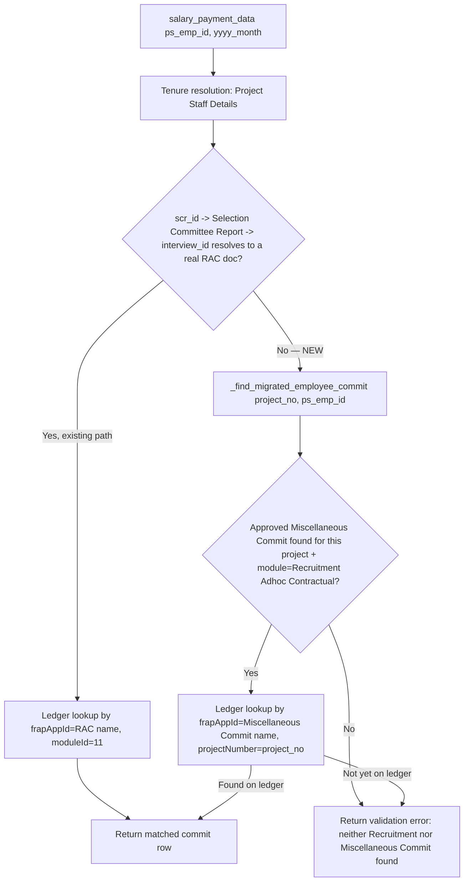

# Implementation Plan — Miscellaneous Commit Fallback for Migrated-Employee Salary Payments

> **Status: PROPOSAL — not implemented.** Nothing in this document has been coded yet.
> Review and approve before any change lands in `commitPayment.py` or elsewhere.

---

## 1. Problem Statement

Salary generation for a Project Staff employee currently **requires** an unbroken
chain: `Project Staff Details → scr_id → Selection Committee Report → interview_id
→ Recruitment Adhoc Contractual`. If that chain is broken, the eligibility check
(`salary_payment_data`) returns nothing usable and the PI sees "No committed
budget-head entry found" — even though the employee is legitimately on payroll.

Employees migrated from the legacy system never had a `Recruitment Adhoc
Contractual` record or a `Selection Committee Report` created in this system (their
recruitment happened before this app existed). Their `Project Staff Details` record
*does* exist (it was created during migration), but `scr_id` is blank or doesn't
resolve. Today this **hard-blocks** salary payment for every migrated employee.

**Requirement:** when the Recruitment/SCR chain is missing, fall back to searching
`Miscellaneous Commit` for an approved, project-level commit and use its
Account Head / Budget Head as the funding source instead. If neither source exists,
fail with a clear validation message — don't silently degrade.

---

## 2. Current Implementation — How Salary Payment Actually Works Today

*(Condensed from [`salary-payment-workflow.md`](salary-payment-workflow.md) and
[`salary-module-full-flow.md`](salary-module-full-flow.md), verified against
[`commitPayment.py`](commitPayment.py) and
[`recruitment_adhoc_contractual.py`](doctype/recruitment_adhoc_contractual/recruitment_adhoc_contractual.py).)*

### 2.1 The two independent Kafka events

```
Recruitment Adhoc Contractual → workflow_state = "Approved"
        │
        ▼ (hooks.py: doc_events["*"]["on_update"] fires on EVERY doctype save)
check_workflow_and_publish(doc)                              [commitPayment.py:780]
        │ finds a "Kafka Commit Staging" row staged earlier by submit_commit_data
        │ (called from RAC's own approval-transition code), whose trigger_state
        │ ("Approved") now matches doc.workflow_state
        ▼
kafka_publish_commit(...) → topic "account-head-commit-events"   (status always "COMMITTED")
        │
        ▼
External ledger microservice (172.16.134.81:18080, outside this repo) ingests it,
keyed by (projectNumber, frapAppId=<RAC doc name>, moduleId=11)
```

Separately, at pay time:

```
PI clicks "Pay Selected" → submit_payment_data(...)           [commitPayment.py:1112]
        │ _is_recruitment_salary_payment() routes into the salary branch
        ▼
AccountHeadPayment inserted + kafka_publish_payment(...) → topic "account-head-payment-events"
```

**The payment event and the commit event are correlated only by
`frapAppId` + `projectNumber` + `moduleId`** — there is no foreign key between
`AccountHeadPayment` and the commit row. This matters a lot for the fallback design
in §4.

### 2.2 The eligibility check — `salary_payment_data(ps_emp_id, yyyy_month)` — [`commitPayment.py:132-345`](commitPayment.py#L132)

This is the read-only endpoint the frontend calls per-employee before allowing a
"Pay" action (Salary Module UI, Step 4). In order:

1. **Duplicate-submission guard** — checks this month's `Salary Staging` doc for
   an existing entry for this `ps_emp_id`; if found, returns `[{"status": "Pending
   Approval in Account Portal", ...}]` immediately.
2. **Tenure resolution** — loads every `Project Staff Details` row for
   `ps_emp_id`, walks each row's `table_ymed` tenure child table (falling back to
   the parent doc's own `ps_joining_date`/`ps_term_completion_date`/
   `ps_basic_salary` if the child table is empty), and keeps the tenure with the
   latest `(joining_date, term_completion_date)` whose completion date is still in
   the future. This step works identically for migrated employees — **it is not
   the failure point**.
3. **Recruitment linkage — THE CURRENT FAILURE POINT** ([`commitPayment.py:258-274`](commitPayment.py#L258)):
   ```python
   scr_id = staff_doc.get("scr_id")
   project_no = staff_doc.get("project_no")
   interview_id = None

   if scr_id and frappe.db.exists("Selection Committee Report", scr_id):
       interview_id = frappe.db.get_value("Selection Committee Report", scr_id, "interview_id")

   recruitment_doc_name = interview_id
   ...
   if not recruitment_doc_name or not frappe.db.exists("Recruitment Adhoc Contractual", recruitment_doc_name):
       return []          # ← migrated employees always land here
   ```
   For a migrated employee, `scr_id` is empty (or the `Selection Committee Report`
   it points to doesn't exist, or its `interview_id` doesn't resolve to a real
   `Recruitment Adhoc Contractual` doc) — any of these collapses to the same
   `return []` at line 274.
4. **External commit lookup** — only reached if step 3 succeeded. Queries the
   ledger REST API (`GET .../account-head-commit/by-status/{status}` for
   `status ∈ {COMMITTED, PARTIALLY_PAID, OVERPAYMENT}`, three requests in
   parallel), then filters to rows where `moduleId=="11"` **and**
   `frapAppId==recruitment_doc_name` **and** `projectNumber==project_no`.
5. Returns the filtered/enriched rows (or `[]`).

Because step 3 already returns `[]` for a migrated employee, step 4 never even
runs — there's no ledger call, no commit lookup, nothing. The frontend then tries
its own client-side fallback (Step 4b: direct ledger call filtered to
`moduleId==11`), which also finds nothing, because **no commit was ever published
for this employee at all** — there's no RAC document, so there was never anything
to reach `workflow_state=="Approved"` and trigger `check_workflow_and_publish` in
the first place. The employee has *no budget commitment on the ledger whatsoever*,
under either code path.

### 2.3 The payment submission — `submit_payment_data(...)` — [`commitPayment.py:1112-1503`](commitPayment.py#L1112)

Reached only after step 2.2 has produced a "commit found" row and the PI has
confirmed via the BMR modal. Salary detection
(`_is_recruitment_salary_payment`, [`commitPayment.py:970-982`](commitPayment.py#L970))
is a simple `OR` of five checks — critically, **it does not require `frapAppId` to
resolve to a real RAC document**; `moduleName=="11"` or `moduleId=="11"` alone is
enough, and the frontend always hardcodes `moduleId: "11"` when building a salary
commit payload. This means the payment phase is **already agnostic to what kind of
document `frapAppId` points to** — a fact the fallback design in §4 relies on.

Once routed into the salary branch, it: stages an audit copy into `Salary Staging`
(locked per month via `GET_LOCK`), resolves `project_ref_number`/`budget_head` from
whatever the frontend sent, creates a new `AccountHeadPayment`, and immediately
publishes it to Kafka via `kafka_publish_payment`. **Nothing here re-validates that
a commit actually exists** for the given `frapAppId`/project — that validation is
assumed to have already happened in step 2.2 (`salary_payment_data`). This is a
pre-existing property of the system, not something this plan changes.

### 2.4 How `Miscellaneous Commit` already reaches the ledger

From [`MISCELLANEOUS_COMMIT.md`](doctype/miscellaneous_commit/MISCELLANEOUS_COMMIT.md)
and [`miscellaneous_commit.py`](doctype/miscellaneous_commit/miscellaneous_commit.py):

- The doctype already has a `module` Select field whose option list explicitly
  includes `"Recruitment Adhoc Contractual"`, and a `linked_application` field
  that becomes **mandatory** exactly when `module == "Recruitment Adhoc
  Contractual"` (`mandatory_depends_on` in the JSON) — this field was clearly
  built to let ops record a free-standing commit tied to recruitment/salary
  activity when there's no natural document to link to. It is the natural place
  to record an approved funding pool for migrated employees.
- When such a document's `workflow_state` reaches `"Approved"`,
  `perform_miscellaneous_commit_action` ([`miscellaneous_commit.py:219-309`](doctype/miscellaneous_commit/miscellaneous_commit.py#L219))
  calls `submit_commit_data(doctype="Miscellaneous Commit", frapAppId=doc.name,
  name=doc.name, project_name=<project_no>, commit_amount=±doc.commit_amount,
  budget_head=doc.budget_head, commitParticular=doc.commit_particular,
  trigger_state="Approved")` — i.e. it stages a commit **exactly the same way**
  RAC does, just with `frapAppId = the Miscellaneous Commit's own document name`
  instead of an RAC document name.
- The same global `on_update` hook (`check_workflow_and_publish`) then publishes
  it to the **same** `account-head-commit-events` Kafka topic once
  `workflow_state=="Approved"`, and the external ledger ingests it exactly like
  any other commit — just keyed by `frapAppId = <Miscellaneous Commit name>`
  rather than an RAC name.

**This is the key insight the fallback design builds on:** once a `Miscellaneous
Commit` is Approved, it produces a real, ledger-visible commit row — structurally
identical to what an RAC approval produces — just addressed by a different
`frapAppId`. The fallback doesn't need to invent anything; it needs to *look in the
right place* for it.

---

## 3. Why This Currently Fails End-to-End for Migrated Employees

| Step | Migrated employee outcome |
|---|---|
| `Project Staff Details` lookup | ✅ exists (created during migration) |
| Tenure resolution | ✅ works normally |
| `scr_id` → `Selection Committee Report` → `interview_id` | ❌ blank/missing/unresolvable |
| `salary_payment_data` recruitment-linkage check | ❌ returns `[]` at [`commitPayment.py:274`](commitPayment.py#L274) |
| Frontend ledger fallback (Step 4b, `by-status/COMMITTED`, `moduleId==11`) | ❌ no match — no commit was ever published for this employee (no RAC doc ever existed to approve) |
| Result shown to PI | "No committed budget-head entry found" — **payment blocked** |

There is currently **no code path anywhere** that considers `Miscellaneous Commit`
as an alternative funding source for salary. This plan adds exactly one.

---

## 4. Proposed Fallback Design

### 4.1 Where it hooks in

Single insertion point: inside `salary_payment_data`, at the exact spot that
currently does `return []` for a broken recruitment chain
([`commitPayment.py:266-274`](commitPayment.py#L266)). Nothing before that point
changes. Employees whose recruitment chain resolves successfully are **completely
unaffected** — the new code only runs when the existing chain has already failed.

```python
if not recruitment_doc_name or not frappe.db.exists("Recruitment Adhoc Contractual", recruitment_doc_name):
    fallback_result = _find_migrated_employee_commit(project_no, ps_emp_id)
    if fallback_result:
        return fallback_result          # NEW — same shape as a normal commit row
    return [{
        "status": "error",
        "message": (
            f"No Recruitment/Selection Committee record found for employee "
            f"'{ps_emp_id}', and no approved Miscellaneous Commit exists for "
            f"project '{project_no}'. Salary payment cannot proceed."
        ),
    }]
```

### 4.2 New helper — `_find_migrated_employee_commit(project_no, ps_emp_id)`

Proposed logic (in `commitPayment.py`, near the other private helpers at the top
of the file):

1. **Resolve `project_no` → `Project Registration` doc name.** `Miscellaneous
   Commit.project_number` is a Link field storing the Frappe doc name, not the
   human `project_no` string — same resolution pattern already used for
   `_sal_project` in `submit_payment_data`
   ([`commitPayment.py:1235`](commitPayment.py#L1235)):
   ```python
   project_ref = frappe.db.get_value("Project Registration", {"project_no": project_no}, "name") or project_no
   ```

2. **Query `Miscellaneous Commit`** for candidates:
   ```python
   candidates = frappe.get_all(
       "Miscellaneous Commit",
       filters={
           "project_number": project_ref,
           "module": "Recruitment Adhoc Contractual",
           "commit_decommit": "Commit",          # exclude De-Commit rows
           "workflow_state": "Approved",
       },
       fields=["name", "budget_head", "project_number", "commit_amount", "linked_application", "modified"],
       order_by="modified desc",
       ignore_permissions=True,   # this endpoint is allow_guest=True; Misc Commit
                                   # has no guest/broad read grant, same reasoning
                                   # as get_commit_staging_status's ignore_permissions
       limit_page_length=0,
   )
   if not candidates:
       return None
   ```
   - **Filtering by `module == "Recruitment Adhoc Contractual"` is required, not
     optional** — a project can have `Miscellaneous Commit` rows for unrelated
     purposes (equipment, travel, etc.). Without this filter the fallback could
     silently draw salary funds from a budget head meant for something else.
   - **Tie-break when multiple candidates exist:** prefer an exact match on
     `linked_application == ps_emp_id` first (an ops-entered, employee-specific
     commit); otherwise fall back to the most recently approved project-level
     entry (`order_by="modified desc"`, first row). *(See §6 — this tie-break rule
     is an assumption, flagged for confirmation.)*

3. **Look up the real ledger row** for the chosen candidate, exactly the way step
   2.2/§4 already does for RAC — reuse `_fetch_account_head_commits_by_status`
   across `SALARY_COMMIT_STATUSES`, then filter to
   `frapAppId == candidate.name` **and** `projectNumber == project_no`:
   ```python
   merged = []
   with ThreadPoolExecutor(max_workers=len(SALARY_COMMIT_STATUSES)) as executor:
       futures = {executor.submit(_fetch_account_head_commits_by_status, s): s for s in SALARY_COMMIT_STATUSES}
       for f in as_completed(futures):
           merged.extend(f.result())

   for row in merged:
       if str(row.get("frapAppId")) == candidate.name and str(row.get("projectNumber")) == str(project_no):
           row["projectTitle"] = _get_project_title_by_number(row.get("projectNumber"))
           row["source"] = "miscellaneous_commit"                 # additive, informational
           row["linked_miscellaneous_commit"] = candidate.name    # additive, informational
           return [row]
   return None   # Misc Commit is Approved locally but not (yet) visible on the ledger
   ```

4. **Why re-fetch from the ledger instead of building the row from the local
   doc?** Because the frontend's `buildCommitData` (per existing docs, §9 in
   `salary-module-full-flow.md`) requires `transactionCommitNumber` — a value the
   *ledger* assigns on ingestion, which does not exist on the local
   `Miscellaneous Commit` document. By returning the **real ledger row** (same
   shape the RAC path already returns), the frontend needs **zero changes** — it
   receives a row with exactly the fields it already knows how to consume. This
   is the same reasoning that makes the RAC path work today; the fallback just
   points the same mechanism at a different `frapAppId`.

5. **Result if the Misc Commit is Approved locally but the ledger hasn't ingested
   it yet** (still `PENDING`, or the Kafka publish hasn't completed/succeeded):
   `_find_migrated_employee_commit` returns `None`, and the caller falls through
   to the "no valid entry found" error message (§4.1). This mirrors the existing,
   already-documented `PENDING`-commit gotcha (§10.1 of
   `salary-module-full-flow.md`) — it is a pre-existing limitation of the ledger
   integration, not something this plan introduces or needs to solve. It does mean
   ops needs to allow a short delay between approving the Miscellaneous Commit and
   the migrated employee becoming payable.

### 4.3 Why `submit_payment_data` needs **no changes**

`_is_recruitment_salary_payment` already routes into the salary branch based on
`moduleName`/`moduleId=="11"` (which the frontend always sends for any salary
commit payload, regardless of source), **not** on `frapAppId` resolving to a real
RAC document. So when the frontend submits a payment built from our fallback row
(`frapAppId = <Miscellaneous Commit name>`), it is still correctly detected and
processed as a salary payment. The resulting `AccountHeadPayment` and its Kafka
event carry `frapAppId = <Miscellaneous Commit name>`, correlating correctly with
the commit event the Miscellaneous Commit itself already published (§2.4). No
code path in `submit_payment_data` assumes `frapAppId` is an RAC document — this
was confirmed by reading the full function body.

### 4.4 Data flow — before vs. after



---

## 5. Files Requiring Modification

| File | Change |
|---|---|
| [`commitPayment.py`](commitPayment.py) | **Primary change.** Add `_find_migrated_employee_commit(...)` helper; modify `salary_payment_data` at the recruitment-linkage check (§4.1) to call it before returning `[]`; add the new validation-failure message. `submit_payment_data` / `_is_recruitment_salary_payment`: **no change** (§4.3). |
| [`doctype/miscellaneous_commit/miscellaneous_commit.py`](doctype/miscellaneous_commit/miscellaneous_commit.py) | **No code change.** Existing `module`/`linked_application` fields already support this use case. |
| [`doctype/miscellaneous_commit/MISCELLANEOUS_COMMIT.md`](doctype/miscellaneous_commit/MISCELLANEOUS_COMMIT.md) | Documentation update: add a section describing this doctype's role as a migrated-employee salary funding source. |
| [`salary-payment-workflow.md`](salary-payment-workflow.md) | Documentation update: add the fallback branch to the eligibility-check walkthrough (§2.1) and error table (§8). |
| [`salary-module-full-flow.md`](salary-module-full-flow.md) | Documentation update: add fallback branch to Step 4 and the error/gotcha tables (§9, §10). |

No DocType JSON changes, no new doctypes, no migrations/patches required — every
field this design needs (`module`, `linked_application`, `commit_decommit`,
`workflow_state`, `budget_head`, `project_number`) already exists on
`Miscellaneous Commit`.

---

## 6. Assumptions & Open Questions (need confirmation before implementation)

1. **Tie-break rule when a project has multiple Approved, `module="Recruitment
   Adhoc Contractual"` Miscellaneous Commits.** Proposed: prefer an exact
   `linked_application == ps_emp_id` match, else most-recently-approved. This
   needs confirmation from whoever owns the migration data — is one
   project-level pool meant to fund *all* migrated employees on that project, or
   is ops expected to create one Miscellaneous Commit per migrated employee (with
   `linked_application` set to their `ps_emp_id`)?
2. **"Approved" as the terminal workflow state name for `Miscellaneous Commit`.**
   Confirmed as the assumption the existing code itself already makes
   (`trigger_state="Approved"` default in `miscellaneous_commit.py`'s own commit
   staging call) — not a new assumption introduced here, but worth a final check
   against the live site's actual `Workflow` document for `Miscellaneous Commit`
   before shipping, since that document lives in site data, not this repo.
3. **`ignore_permissions=True` on the `Miscellaneous Commit` read.**
   `salary_payment_data` is `@frappe.whitelist(allow_guest=True)`. The existing
   `get_commit_staging_status` function documents exactly this problem for
   `Kafka Commit Staging` (locked-down doctype, non-admin roles get silent 403s).
   `Miscellaneous Commit` itself grants read to several roles (`All_ProRnd_User`,
   `Permanent Employee`, `staff, RnD`, `Hos, RnD`, `Dean, RnD`) per its
   permissions table, but a guest session calling this endpoint would still be
   denied without `ignore_permissions=True`. Recommend using it, consistent with
   the existing pattern in this file.
4. **Frontend compatibility.** `SalaryModule.tsx` lives outside this repo. This
   plan is designed so the frontend needs **no changes** (§4.2 point 4), but that
   can only be fully confirmed by whoever owns that code — worth a quick
   cross-check with the frontend team before considering this "done," in case
   `buildCommitData` does something stricter than documented (e.g. rejects rows
   whose `frapAppId` doesn't look like an RAC document name format).
5. **Should the `PENDING` ledger-status gotcha (§10.1 in the existing docs) be
   fixed at the same time?** Out of scope for this plan — it's a pre-existing,
   documented limitation affecting both RAC and (now) Miscellaneous-Commit-backed
   employees equally, and its root cause is in the external ledger service, not
   this codebase.

---

## 7. Edge Cases & Validation Scenarios

| Scenario | Expected behavior |
|---|---|
| Employee has valid Recruitment/SCR chain | **Unchanged** — existing path, fallback never invoked |
| Employee migrated, no Recruitment/SCR, project has an Approved Misc Commit (`module="Recruitment Adhoc Contractual"`) already published to the ledger | Fallback finds it, returns the real ledger row, payment proceeds normally |
| Employee migrated, project has an Approved Misc Commit but it hasn't been published to the ledger yet (still `PENDING`/staged) | Fallback returns nothing usable → validation error asking to retry once the commit settles |
| Employee migrated, project has Misc Commits but none with `module="Recruitment Adhoc Contractual"` | Not matched (by design) → validation error — prevents accidentally funding salary from an unrelated commit |
| Employee migrated, project has a Misc Commit with `commit_decommit="De-Commit"` only | Not matched (excluded) → validation error |
| Employee migrated, project has a Misc Commit still in `Draft`/not yet Approved | Not matched (`workflow_state` filter) → validation error |
| Employee migrated, **no** Misc Commit at all for the project | Validation error: "No Recruitment/Selection Committee record found ... and no approved Miscellaneous Commit exists ..." |
| Multiple Approved Misc Commits, one with `linked_application` matching this `ps_emp_id` | That one is preferred (§6, point 1) |
| Multiple Approved Misc Commits, none tagged to this employee | Falls back to most-recently-approved project-level entry (§6, point 1 — needs confirmation) |
| `salary_payment_data` called for a migrated employee already staged this month | **Unchanged** — duplicate-submission guard (step 1) runs before recruitment linkage, so this still short-circuits correctly regardless of source |
| Payment submitted (`submit_payment_data`) for a migrated employee | **Unchanged code path** — works because `frapAppId` doesn't need to be an RAC doc (§4.3); `AccountHeadPayment` created and published with `frapAppId = <Miscellaneous Commit name>` |
| `search_salary_records` / `publish_salary_staging` admin tools | **Unaffected** — they operate on already-staged `Salary Staging` records regardless of how the original commit was sourced |

---

## 8. Implementation Steps (for after approval)

1. Add `_find_migrated_employee_commit(project_no, ps_emp_id)` helper to
   `commitPayment.py`, placed near the other private helpers
   (`_fetch_account_head_commits_by_status`, `_get_project_title_by_number`).
2. Modify `salary_payment_data`'s recruitment-linkage branch
   ([`commitPayment.py:266-274`](commitPayment.py#L266)) to call the new helper
   and return its result, or the new validation-error dict, instead of the bare
   `[]`.
3. Add Mattermost observability for the fallback path (consistent with the
   existing `_mm_notify` pattern elsewhere in this file) — e.g. a `:information_source:`
   notification when the fallback is used successfully, and a distinct message
   when it fails to find anything, so ops can see migrated-employee activity in
   the "Salary Module" Mattermost channel without digging through logs.
4. Update the three documentation files listed in §5.
5. Manual verification (no automated test harness currently exists for this
   flow, per the existing `test_miscellaneous_commit.py` being a stub):
   - Create a `Project Staff Details` row with no `scr_id` (or a dangling one).
   - Create and approve a `Miscellaneous Commit` for the same project with
     `module="Recruitment Adhoc Contractual"`, a valid `budget_head`, and
     `commit_decommit="Commit"`.
   - Confirm it reaches the ledger (`Kafka Commit Staging` row → `PUBLISHED`).
   - Call `salary_payment_data(ps_emp_id, yyyy_month)` directly (e.g. via
     `bench execute` or the whitelisted endpoint) and confirm it returns the
     ledger row instead of `[]`.
   - Call `submit_payment_data(...)` with that row's fields and confirm an
     `AccountHeadPayment` is created and published, with `frapAppId` equal to
     the Miscellaneous Commit's name.
   - Negative test: repeat with no Miscellaneous Commit present at all, confirm
     the new validation-error message is returned.
6. No schema/migration changes needed — confirm no `bench migrate` step is
   required before this ships.

---

## 9. Non-Goals

- Not fixing the external ledger's `PENDING`-status behavior (§6, point 5).
- Not adding per-employee budget draw-down accounting for a shared project-level
  Miscellaneous Commit — that reconciliation is the external ledger's job, same
  as it already is for RAC-funded employees sharing a project budget.
- Not changing any frontend (`SalaryModule.tsx`) code — this repo doesn't own it,
  and the design is intentionally shaped to avoid needing to.
- Not touching `publish_salary_staging`, `search_salary_records`,
  `delete_salary_record`, or any of the admin/recovery endpoints — they operate
  downstream of staging and are agnostic to how the commit was sourced.
